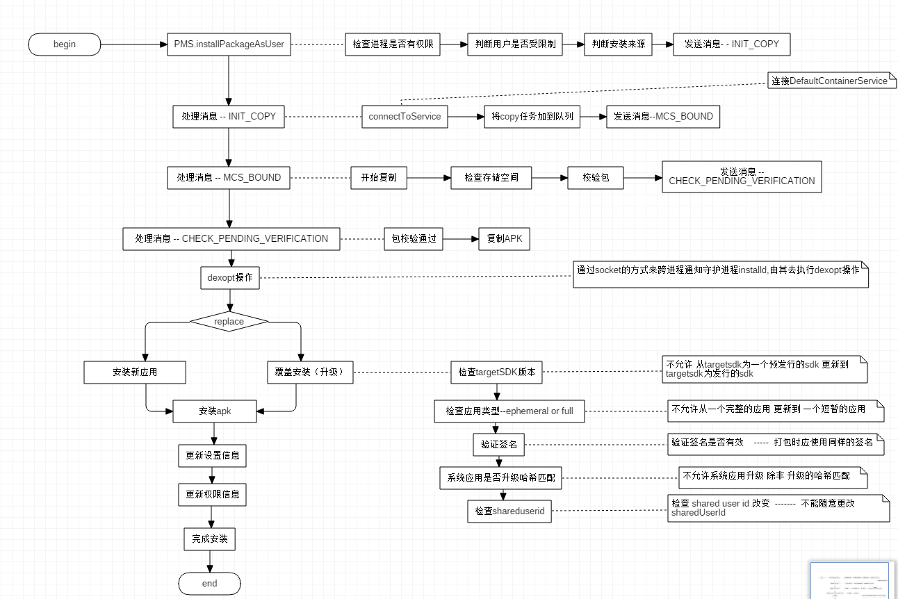

# APK 安装与升级


## android apk 安装

#### apk 安装方式

 - 系统应用安装 ：开机时加载系统的APK和应用，没有安装界面

 - 网络下载应用安装 ： 通过各种market应用完成，没有安装界面

 - ADB工具安装 ： 即通过Android的SDK开发tools里面的adb.exe程序安装，没有安装界面

 - 第三方应用安装 ： 通过SD卡里的APK文件安装(比如双击APK文件触发)，有安装界面，系统默认已经安装了一个安装卸载应用的程序，即由packageinstaller.apk应用处理安装及卸载过程的界面

 - 通过Intent安装APK文件

#### 涉及到的路径
 - sysytem/app ， 系统自带应用程序，获得root权限才可以删除

 - data/app ， 用户程序安装目录，安装时把 apk复制到这个目录

 - data/data ， 存放应用程序数据

 - data/dalvik-cache ， 存放 apk 中的 dex文件

 - data/system

 	该目录下的packages.xml文件，类似于Windows的注册表，这个文件是在解析apk时由writeLP()创建的，里面记录了系统的permissions，以及每个apk的name,codePath,flags,ts,version,uesrid等信息，这些信息主要通apk的AndroidManifest.xml解析获取，解析完apk后将更新信息写入这个文件并保存到flash，下次开机直接从里面读取相关信息添加到内存相关列表中。当有apk升级，安装或删除时会更新这个文件

#### 安装过程

分析<code>PackageManagerService</code> 源码

 - 将 apk 文件复制到 <code>data/app</code> 目录

 - dexopt 操作

 - 安装apk

 - 更新权限信息

 - 完成安装， 发送 <code>POST_INSTALL</code> 消息



## 99U更新过程

 - 强制更新，下载更新包，默认更新，下载增量包

 - 通过Intent安装APK文件 ， <code>application/vnd.android.package-archive</code> 是 APK文件的 MIME 类型
```java
  	  File apkfile = new File(path);
		if (!apkfile.exists()) {
			return;
		}
 	   Intent i = new Intent(Intent.ACTION_VIEW)
		i.setDataAndType(Uri.parse("file://" + apkfile.toString()), "application/vnd.android.package-archive");
		i.setFlags(Intent.FLAG_ACTIVITY_NEW_TASK);
		c.startActivity(i);
 ```
这个过程启动了 <code>PackageInstallerActivity</code> ， [源码地址](https://www.google.com.sg/url?sa=t&rct=j&q=&esrc=s&source=web&cd=4&ved=0ahUKEwiMzP-f8PvVAhUBi5QKHVDSA9UQFgg3MAM&url=http%3A%2F%2Fgrepcode.com%2Ffile%2Frepository.grepcode.com%2Fjava%2Fext%2Fcom.google.android%2Fandroid-apps%2F2.0_r1%2Fcom%2Fandroid%2Fpackageinstaller%2FPackageInstallerActivity.java&usg=AFQjCNEEsFIYnp7i_H6LM85Dlb4G19G5uw)

 -  PackageInstallerActivity ， 显示安装，有两个按钮，安装和取消
  ```java
	 public void onClick(View v) {
        if (v == mOk) {
            // Start subactivity to actually install the application
            Intent newIntent = new Intent()
            newIntent.putExtra(PackageUtil.INTENT_ATTR_APPLICATION_INFO,
                    mPkgInfo.applicationInfo);
            newIntent.setData(mPackageURI)
            newIntent.setClass(this, InstallAppProgress.class);
            String installerPackageName = getIntent().getStringExtra(Intent.EXTRA_INSTALLER_PACKAGE_NAME);
            if (installerPackageName != null) {
                newIntent.putExtra(Intent.EXTRA_INSTALLER_PACKAGE_NAME, installerPackageName);
            }
            finish();
        } else if (v == mCancel) {
            // Cancel and finish
            finish();
        }
    }
```
点击安装时，则进入 <code>InstallAppProgress</code>

 - InstallAppProgress , 这也是一个Activity，显示安装的进度， [源码](http://grepcode.com/file/repository.grepcode.com/java/ext/com.google.android/android-apps/2.0_r1/com/android/packageinstaller/InstallAppProgress.java#InstallAppProgress)
```java
    public void onCreate(Bundle icicle) {
        super.onCreate(icicle);
        Intent intent = getIntent();
        mAppInfo = intent.getParcelableExtra(PackageUtil.INTENT_ATTR_APPLICATION_INFO);
        mPackageURI = intent.getData();
        initView();
    }

    class PackageInstallObserver extends IPackageInstallObserver.Stub {
        public void packageInstalled(String packageName, int returnCode) {
            Message msg = mHandler.obtainMessage(INSTALL_COMPLETE);
            msg.arg1 = returnCode;
            mHandler.sendMessage(msg);
        }
    }

    public void initView() {
        requestWindowFeature(Window.FEATURE_NO_TITLE);
        setContentView(R.layout.op_progress);
        // Initialize views
        PackageUtil.initSnippetForInstalledApp(this, mAppInfo, R.id.app_snippet);
		...
        ...
        String installerPackageName = getIntent().getStringExtra(Intent.EXTRA_INSTALLER_PACKAGE_NAME);
        PackageInstallObserver observer = new PackageInstallObserver();
        pm.installPackage(mPackageURI, observer, installFlags, installerPackageName);
    }
```
<code>pm.installPackage(mPackageURI, observer, installFlags, installerPackageName);</code> 调用PackageManager的安装服务，最终由 PackageManagerService 实现

#### PMS相关


## 常见问题

根据上图中的流程，可总结如下

 - 签名不一致， 当更新包的签名与原来的包签名不一致的话，会安装失败

 - sharedUserId不同，安装更新之前，会检查sharedUserId是否有变化，如果变化，那就安装失败

 - targetSdk版本 ， 不允许 从targetsdk为一个预发行的sdk 更新到 targetsdk为发行的sdk

 - 应用类型 ， 不允许从一个完整的应用(full) 更新到 一个短暂的应用(ephemeral)

以上错误都会导致安装失败，但是失败的状态有所不同

 - 5.0以下的设备，使用了so文件，安装失败后再次打开应用，会报错，会提示so文件找不到

 - 5.0以上的设备，没有使用so文件，安装失败后再次打开应用，应用正常

**原因：** 一次正常（成功）的升级过程

 - 1、/data/app-lib/com.nd.app.factory.appcqtest-1会被删除

 - 2、链接/data/data/com.nd.app.factory.appcqtest lib到 /data/app-lib/com.nd.app.factory.appcqtest-2

 - 3、从APK中释放so到/data/app-lib/com.nd.app.factory.appcqtest-2

查询4.4的PMS的源码发现，在安装apk的时候 lib的路径已经变为 <code>/data/app-lib/com.nd.app.factory.appcqtest-2</code>，也就是说，步骤1是在一系列验证之前， 步骤2，3 是在一系列验证完成之后才进行的，而我们出错就是在验证的时候，安装失败，再次打开应用，报错 <code>UnsatisfiedLinkError</code>

## APK 差分升级

#### 原理

将应用的旧版本Apk与新版本Apk做差分，得到更新的部分的补丁patch，下载patch到手机上，通过补丁获取一个已安装应用的新的安装apk

#### 如何生成差分包

使用<mark>xdelta3 </mark>来制作差分包 , 一般在服务端生成，下发到客户端，使用C实现， [源码](https://github.com/jmacd/xdelta)

```
xdelta3 -s SOURCE TARGET > OUT
```

#### 合并生成新的apk

使用<mark>xdelta3</mark> ， android在data/app目录下会有原APK的备份，用原apk的备份和服务器的patch包可以合成新的apk。

```
xdelta3 -d -s SOURCE OUT > TARGET
```

参考使用文档 [doc](https://github.com/jmacd/xdelta/blob/wiki/CommandLineSyntax.md)

## App 安装详解

参考android7.0源码，对安装的过程做了如下的解析

##### 将 apk 文件复制到 <code>data/app</code> 目录


 - 判断安装权限 installPackageAsUser()
```java
mContext.enforceCallingOrSelfPermission(android.Manifest.permission.INSTALL_PACKAGES, null);
```

 - 判断安装来源 , 有三种 ： Shell , Root,  All_User
```java
   	 final int callingUid = Binder.getCallingUid();
        enforceCrossUserPermission(callingUid, userId,
                true /* requireFullPermission */, true /* checkShell */, "installPackageAsUser");

        if ((callingUid == Process.SHELL_UID) || (callingUid == Process.ROOT_UID)) {
            installFlags |= PackageManager.INSTALL_FROM_ADB;
        } else {
            // Caller holds INSTALL_PACKAGES permission, so we're less strict
            // about installerPackageName.
            installFlags &= ~PackageManager.INSTALL_FROM_ADB;
            installFlags &= ~PackageManager.INSTALL_ALL_USERS;
        }
    ```

 - 复制 apk 到 <code>data/app</code> 目录
```java
	    final Message msg = mHandler.obtainMessage(INIT_COPY);
        final VerificationInfo verificationInfo = new VerificationInfo(
                null /*originatingUri*/, null /*referrer*/, -1 /*originatingUid*/, callingUid);
        final InstallParams params = new InstallParams(origin, null /*moveInfo*/, observer,
                installFlags, installerPackageName, null /*volumeUuid*/, verificationInfo, user,
                null /*packageAbiOverride*/, null /*grantedPermissions*/,
                null /*certificates*/);
        params.setTraceMethod("installAsUser").setTraceCookie(System.identityHashCode(params));
        msg.obj = params;   // 这里的 params 是  InstallParams
        mHandler.sendMessage(msg);
```

 - handleMessage---- INIT_COPY ， 连接 DefaultContainerService

 ```java
		void doHandleMessage(Message msg) {
            switch (msg.what) {
                case INIT_COPY: {   // 初始化copy任务
                    HandlerParams params = (HandlerParams) msg.obj;  // 这里的 params 是  InstallParams
                    int idx = mPendingInstalls.size();
                    // mBound 判断服务是否被连接  如果连接则为true
                    // need to do anything. The pending install will be processed later on.
                    if (!mBound) {
                        // 未连接到 DefaultContainerService
                        // 这个服务主要用来复制文件 实现APK等相关资源文件在内部或外部存储器上的存储工作
                        if (!connectToService()) {
                            Slog.e(TAG, "Failed to bind to media container service");
                            params.serviceError();
                            return;
                        } else {
                            // 服务连接成功 则将copy的参数加到队列
                            mPendingInstalls.add(idx, params);
                        }
                    } else {
                    // 服务已连接
                        mPendingInstalls.add(idx, params);
                        // Already bound to the service. Just make
                        // sure we trigger off processing the first request.
                        if (idx == 0) {
                            mHandler.sendEmptyMessage(MCS_BOUND);
                        }
                    }
                    break;
                }
            }
        }

       class DefaultContainerConnection implements ServiceConnection {
            public void onServiceConnected(ComponentName name, IBinder service) {
                IMediaContainerService imcs = IMediaContainerService.Stub.asInterface(service);
                mHandler.sendMessage(mHandler.obtainMessage(MCS_BOUND, imcs));
                // 服务连接之后 会发送一个消息  MCS_BOUND
            }
            public void onServiceDisconnected(ComponentName name) {
                if (DEBUG_SD_INSTALL) Log.i(TAG, "onServiceDisconnected");
            }
        }

        private boolean connectToService() {
            Intent service = new Intent().setComponent(DEFAULT_CONTAINER_COMPONENT);
            Process.setThreadPriority(Process.THREAD_PRIORITY_DEFAULT);
            if (mContext.bindServiceAsUser(service, mDefContainerConn,Context.BIND_AUTO_CREATE, UserHandle.SYSTEM)) {
                Process.setThreadPriority(Process.THREAD_PRIORITY_BACKGROUND);
                mBound = true;   // 连接成功 mBound为true
                return true;
            }
            Process.setThreadPriority(Process.THREAD_PRIORITY_BACKGROUND);
            return false;
        }
 ```

 - handleMessage---- MCS_BOUND ， 开始copy文件

 ```java
 	  void doHandleMessage(Message msg) {
            switch (msg.what) {
                case MCS_BOUND: {   // 开始copy文件
                    if (msg.obj != null) {
                        mContainerService = (IMediaContainerService) msg.obj;
                    }
                    if (mContainerService == null) {
                        if (!mBound) {  // 服务未连接
                            // Something seriously wrong since we are not bound and we are not
                            // waiting for connection. Bail out.
                            for (HandlerParams params : mPendingInstalls) {
                                params.serviceError();
                                return;
                            }
                            mPendingInstalls.clear();
                        } else {
                            Slog.w(TAG, "Waiting to connect to media container service");
                        }
                    } else if (mPendingInstalls.size() > 0) {
                        HandlerParams params = mPendingInstalls.get(0);
                        if (params != null) {
                            if (params.startCopy()) {  //  ***  startCopy() 开始复制文件 *****
                                // Delete pending install ， 移除队列第一个
                                if (mPendingInstalls.size() > 0) {
                                    mPendingInstalls.remove(0);
                                }
                                if (mPendingInstalls.size() == 0) {
                                    if (mBound) { // 如果队列为空 但是服务已经连接，断开服务 发送延迟消息MCS_UNBIND
                                        removeMessages(MCS_UNBIND);// 先移除 MCS_UNBIND， 再发送MCS_UNBIND
                                        Message ubmsg = obtainMessage(MCS_UNBIND);
                                        sendMessageDelayed(ubmsg, 10000);
                                    }
                                } else {
                                    // 如果队列中有多个安装任务 ， 那就发送一个空消息 ，进行下一个安装
                                    mHandler.sendEmptyMessage(MCS_BOUND);
                                }
                            }
                        }
                    } else {
                        // Should never happen ideally.
                        Slog.w(TAG, "Empty queue");
                    }
                    break;
                }
            }
        }
```

 - startCopy
```java
		final boolean startCopy() {
            boolean res;
            try {
                if (++mRetries > MAX_RETRIES) {
                    Slog.w(TAG, "Failed to invoke remote methods on default container service. Giving up");
                    mHandler.sendEmptyMessage(MCS_GIVE_UP);
                    handleServiceError();
                    return false;
                } else {
                    handleStartCopy();  // 真正开始Copy
                    res = true;
                }
            } catch (RemoteException e) {
                mHandler.sendEmptyMessage(MCS_RECONNECT);
                res = false;
            }
            handleReturnCode();  // 复制结果的返回
            return res;
        }
```

 - handleStartCopy ， 真正开始复制文件 ， InstallParams.handleStartCopy()
```java
		@Override
		void handleStartCopy() throws RemoteException {
             int ret = PackageManager.INSTALL_SUCCEEDED;
            final boolean onSd = (installFlags & PackageManager.INSTALL_EXTERNAL) != 0;
            final boolean onInt = (installFlags & PackageManager.INSTALL_INTERNAL) != 0;
            final boolean ephemeral = (installFlags & PackageManager.INSTALL_EPHEMERAL) != 0;
            PackageInfoLite pkgLite = null;
            if (onInt && onSd) {
                // Check if both bits are set.
                ret = PackageManager.INSTALL_FAILED_INVALID_INSTALL_LOCATION;
            } else if (onSd && ephemeral) {
                Slog.w(TAG,  "Conflicting flags specified for installing ephemeral on external");
                ret = PackageManager.INSTALL_FAILED_INVALID_INSTALL_LOCATION;
            } else {
                pkgLite = mContainerService.getMinimalPackageInfo(origin.resolvedPath, installFlags,
                        packageAbiOverride);
				// 检查存储空间 ， 如果空间很小，释放缓存
                mInstaller.freeCache(null, sizeBytes + lowThreshold);
                ...
                int loc = pkgLite.recommendedInstallLocation;
                // Override with defaults if needed.
                loc = installLocationPolicy(pkgLite);
                ...
                ...
                final InstallArgs args = createInstallArgs(this);
            	mArgs = args;
                // 判断是否需要校验包 如果需要的话 -- 发送广播：ACTION_PACKAGE_NEEDS_VERIFICATION
                if （需要校验包）{
                    final Intent verification = new Intent(Intent.ACTION_PACKAGE_NEEDS_VERIFICATION);
                    mContext.sendOrderedBroadcastAsUser(verification, verifierUser,
                                    android.Manifest.permission.PACKAGE_VERIFICATION_AGENT,
                                    new BroadcastReceiver() {
                                        @Override
                                        public void onReceive(Context context, Intent intent) {
                                            final Message msg = mHandler
                                                    .obtainMessage(CHECK_PENDING_VERIFICATION);
                                            msg.arg1 = verificationId;
                                            mHandler.sendMessageDelayed(msg, getVerificationTimeout());
                                        }
                                    }, null, 0, null, null);
                }
            } else {
            	// 直接copy --- 复制文件
            	ret = args.copyApk(mContainerService, true);
            }
        }
 ```

 - handleReturnCode, 返回复制的结果，会调用到 processPendingInstall，开始准备安装了
```java
 		@Override
        void handleReturnCode() {
            // If mArgs is null, then MCS couldn't be reached. When it
            // reconnects, it will try again to install. At that point, this
            // will succeed.
            if (mArgs != null) {
                processPendingInstall(mArgs, mRet);
            }
        }
```

##### 解析 apk信息

 - processPendingInstall
```java
	private void processPendingInstall(final InstallArgs args, final int currentStatus) {
        // Queue up an async operation since the package installation may take a little while.
        mHandler.post(new Runnable() {
            public void run() {
                mHandler.removeCallbacks(this);
                 // Result object to be returned
                PackageInstalledInfo res = new PackageInstalledInfo();
                res.setReturnCode(currentStatus);
                res.uid = -1;
                res.pkg = null;
                res.removedInfo = null;
                if (res.returnCode == PackageManager.INSTALL_SUCCEEDED) {
                    // 做一些安装前的准备工作 -- cleanUp() ，Clean up both app data and code
                    // destroyAppData， remove code path
                    args.doPreInstall(res.returnCode);
                    synchronized (mInstallLock) {
                        installPackageTracedLI(args, res);  //  安装
                    }
                    args.doPostInstall(res.returnCode, res.uid);
                }

                // 恢复操作会被执行 （1）安装状态是成功 （2）当前操作不是更新apk（第一次安装应用） （3）backup没有被关闭
                final boolean update = res.removedInfo != null && res.removedInfo.removedPackage != null;
                final int flags = (res.pkg == null) ? 0 : res.pkg.applicationInfo.flags;
                boolean doRestore = !update && ((flags & ApplicationInfo.FLAG_ALLOW_BACKUP) != 0);
                // Set up the post-install work request bookkeeping.  This will be used
                // and cleaned up by the post-install event handling regardless of whether
                // there's a restore pass performed.  Token values are >= 1.
                int token;
                if (mNextInstallToken < 0) NextInstallToken = 1;
                token = mNextInstallToken++;
                PostInstallData data = new PostInstallData(args, res);
                mRunningInstalls.put(token, data);
                if (res.returnCode == PackageManager.INSTALL_SUCCEEDED && doRestore) {
                    IBackupManager bm = IBackupManager.Stub.asInterface(
                            ServiceManager.getService(Context.BACKUP_SERVICE));
                    if (bm != null) {
                        try {
                            if (bm.isBackupServiceActive(UserHandle.USER_SYSTEM)) {
                            	//
                                bm.restoreAtInstall(res.pkg.applicationInfo.packageName, token);
                                // 最终会调用 PMS 的 finishPackageInstall()
                            } else {
                                doRestore = false;
                            }
                        } catch (RemoteException e) {
                            // can't happen; the backup manager is local
                        } catch (Exception e) {
                            Slog.e(TAG, "Exception trying to enqueue restore", e);
                            doRestore = false;
                        }
                    } else {
                        Slog.e(TAG, "Backup Manager not found!");
                        doRestore = false;
                    }
                }
                if (!doRestore) {
                    // 没有恢复 或者 backUp是关闭状态 -- >  直接发送消息 POST_INSTALL
                    Message msg = mHandler.obtainMessage(POST_INSTALL, token, 0);
                    mHandler.sendMessage(msg);
                }
            }
        });
    }
    ```

 - installPackageLI() ， 解析package包，做一些检查工作，包名，签名，版本，CpuAbi,targetsdk
```java
    // 代码太长， 不做展示
    private void installPackageLI(InstallArgs args, PackageInstalledInfo res) {
  	  boolean replace = false;
    	....
        synchronized (mPackages) {
            // Check if installing already existing package
            if ((installFlags & PackageManager.INSTALL_REPLACE_EXISTING) != 0) {
                String oldName = mSettings.mRenamedPackages.get(pkgName);
                if (pkg.mOriginalPackages != null && pkg.mOriginalPackages.contains(oldName) && mPackages.containsKey(oldName)) {
                    pkg.setPackageName(oldName);
                    pkgName = pkg.packageName;
                    replace = true;
                } else if (mPackages.containsKey(pkgName)) {
                    // This package, under its official name, already exists
                    // on the device; we should replace it.
                    replace = true;
                }
                // Child packages are installed through the parent package
                if (pkg.parentPackage != null) {
                    res.setError(PackageManager.INSTALL_PARSE_FAILED_BAD_PACKAGE_NAME,
                            "Package " + pkg.packageName + " is child of package "
                                    + pkg.parentPackage.parentPackage + ". Child packages "
                                    + "can be updated only through the parent package.");
                    return;
                }
                if (replace) {
                    // Prevent apps opting out from runtime permissions
                    PackageParser.Package oldPackage = mPackages.get(pkgName);
                    final int oldTargetSdk = oldPackage.applicationInfo.targetSdkVersion;
                    final int newTargetSdk = pkg.applicationInfo.targetSdkVersion;
                    if (oldTargetSdk > Build.VERSION_CODES.LOLLIPOP_MR1
                            && newTargetSdk <= Build.VERSION_CODES.LOLLIPOP_MR1) {
                        res.setError(PackageManager.INSTALL_FAILED_PERMISSION_MODEL_DOWNGRADE,
                                "Package " + pkg.packageName + " new target SDK " + newTargetSdk
                                        + " doesn't support runtime permissions but the old"
                                        + " target SDK " + oldTargetSdk + " does.");
                        return;
                    }
                    // Prevent installing of child packages
                    if (oldPackage.parentPackage != null) {
                        res.setError(PackageManager.INSTALL_PARSE_FAILED_BAD_PACKAGE_NAME,
                                "Package " + pkg.packageName + " is child of package "
                                        + oldPackage.parentPackage + ". Child packages "
                                        + "can be updated only through the parent package.");
                        return;
                    }
                }
            }
        ....
        // dexopt操作 : 6.0 是在 scanPackageDirtyLI()中 ， 7.0 是在installPackageLI()中
        mPackageDexOptimizer.performDexOpt(pkg, pkg.usesLibraryFiles,
                    null /* instructionSets */, false /* checkProfiles */,
                    getCompilerFilterForReason(REASON_INSTALL));
        ...
        try (PackageFreezer freezer = freezePackageForInstall(pkgName, installFlags, "installPackageLI")) {
                if (replace) {
                	// 替换一个apk ， 覆盖安装
                    replacePackageLIF(pkg, parseFlags, scanFlags | SCAN_REPLACING, args.user, installerPackageName, res);
                } else {
                	// 安装一个不存在的apk
                    installNewPackageLIF(pkg, parseFlags, scanFlags | SCAN_DELETE_DATA_ON_FAILURES,
                            args.user, installerPackageName, volumeUuid, res);
                }
            }
        ....
        ....
    }

    ```

##### dexopt操作

 - performDexOptLI , 对所有指定路径下的代码和库执行dexopt操作
```java
		private int performDexOptLI(PackageParser.Package pkg, String[] sharedLibraries,
            String[] targetInstructionSets, boolean checkProfiles, String targetCompilerFilter) {
            final List<String> paths = pkg.getAllCodePathsExcludingResourceOnly();
            final String[] dexCodeInstructionSets = getDexCodeInstructionSets(instructionSets);
            for (String dexCodeInstructionSet : dexCodeInstructionSets) {
                for (String path : paths) {
					mInstaller.dexopt(path, sharedGid, pkg.packageName, dexCodeInstructionSet,
                            dexoptNeeded, oatDir, dexFlags, targetCompilerFilter, pkg.volumeUuid,
                            sharedLibrariesPath);
                    performedDexOpt = true;
                }
            }
        }
```

 - dexopt()
```java
  	public void dexopt(String apkPath, int uid, String pkgName, String instructionSet, int dexoptNeeded, String outputPath, int dexFlags, String compilerFilter, String volumeUuid, String sharedLibraries) throws InstallerException {
        execute("dexopt",
                apkPath,
                uid,
                pkgName,
                instructionSet,
                dexoptNeedd,
                outputPath,
                dexFlags,
                compilerFilter,
                volumeUuid,
                sharedLibraries);
    }

    public String[] execute(String cmd, Object... args) throws InstallerException {
    	final String[] resRaw = transact(builder.toString()).split(" ");
    }

    public synchronized String transact(String cmd) {
    	if (!connect()) {
            Slog.e(TAG, "connection failed");
            return "-1";
        }
        if (!writeCommand(cmd)) {
            if (!connect() || !writeCommand(cmd)) {
                return "-1";
            }
        }
    }
    private boolean connect() {
        if (mSocket != null) {
            return true;
        }
        Slog.i(TAG, "connecting...");
        try {
            mSocket = new LocalSocket();
            LocalSocketAddress address = new LocalSocketAddress("installd",
                    LocalSocketAddress.Namespace.RESERVED);
            mSocket.connect(address);
            mIn = mSocket.getInputStream();
            mOut = mSocket.getOutputStream();
        } catch (IOException ex) {
            disconnect();
            return false;
        }
        return true;
    }
```
最终dexopt操作是通过socket的方式来跨进程通知守护进程installd,由其去执行dexopt操作

##### 安装新应用

 - installNewPackageLIF() ，**安装新应用，**  安装一个不存在的apk
```java
	private void installNewPackageLIF(PackageParser.Package pkg, final int policyFlags,
            int scanFlags, UserHandle user, String installerPackageName, String volumeUuid,
            PackageInstalledInfo res) {
        // Remember this for later, in case we need to rollback this install
        String pkgName = pkg.packageName;
        synchronized(mPackages) {
            if (mSettings.mRenamedPackages.containsKey(pkgName)) {
                // 有个跟pkgName 相同包名的应用已被安装，但是这个应用的包名已被更改，现在要安装 pkgName这个应用的话 是不能成功的
                res.setError(INSTALL_FAILED_ALREADY_EXISTS, "Attempt to re-install " + pkgName
                        + " without first uninstalling package running as "
                        + mSettings.mRenamedPackages.get(pkgName));
                return;
            }
            if (mPackages.containsKey(pkgName)) {
                // 不允许安装一个已经存在的应用
                res.setError(INSTALL_FAILED_ALREADY_EXISTS, "Attempt to re-install " + pkgName
                        + " without first uninstalling.");
                return;
            }
        }
        try { //  浏览package信息--- 安装package
            PackageParser.Package newPackage = scanPackageTracedLI(pkg, policyFlags, scanFlags,    System.currentTimeMillis(), user);
            updateSettingsLI(newPackage, installerPackageName, null, res, user);
            if (res.returnCode == PackageManager.INSTALL_SUCCEEDED) {
            	//  在安装之后准备 app 数据
                prepareAppDataAfterInstallLIF(newPackage);
            } else {
            	// 安装失败的话 就删除package
                // Remove package from internal structures, but keep around any
                // data that might have already existed
                deletePackageLIF(pkgName, UserHandle.ALL, false, null, PackageManager.DELETE_KEEP_DATA, res.removedInfo, true, null);
            }
        } catch (PackageManagerException e) {
            res.setError("Package couldn't be installed in " + pkg.codePath, e);
        }
    }
```

 - scanPackageLI() , 真正安装package ， 最终会调用到 <code>scanPackageDirtyLI()</code> , 代码太长，就不展示了

	- 设置系统App的一些参数

    - 校验签名

    - 解析app的provider,校验是否与已有的provider冲突

    - 32/64位abi的一些设置

    - 四大组件的解析，注册

 - updateSettingsLI() , 完成安装后设置信息的更新

 - updatePermissionsLPw() ， 更新权限信息

##### 完成安装

前面的 <code>processPendingInstall()</code> 在执行 <code>installPackageTracedLI</code>之后，会执行

 - restoreAtInstall()

```java
	if(res.returnCode==PackageManager.INSTALL_SUCCEEDED&&doRestore){
        IBackupManager bm=IBackupManager.Stub.asInterface(ServiceManager.getService(Context.BACKUP_SERVICE));
        if(bm.isBackupServiceActive(UserHandle.USER_SYSTEM)){
            bm.restoreAtInstall(res.pkg.applicationInfo.packageName,token);
        }
    }
    // BackupManagerService
    public void restoreAtInstall(String packageName, int token) {
    	// PMS的完成安
    	mPackageManagerBinder.finishPackageInstall(token, false);
    }
    ```

 - finishPackageInstall(), 完成安装，发送POST_INSTALL消息

```java
    @Override
    public void finishPackageInstall(int token, boolean didLaunch) {
        enforceSystemOrRoot("Only the system is allowed to finish installs");
        final Message msg = mHandler.obtainMessage(POST_INSTALL, token, didLaunch ? 1 : 0);
        mHandler.sendMessage(msg);
    }
```

##### 覆盖更新

 - replacePackageLIF() ， 覆盖安装的前奏 ， 检查各种配置 ： sdk版本， 应用类型， 签名升级限制哈希 sharedUserId
```java
	private void replacePackageLIF(PackageParser.Package pkg, final int policyFlags, int scanFlags,
            UserHandle user, String installerPackageName, PackageInstalledInfo res) {
        //  isEphemeral 是否是短暂的应用 （？？ 这样翻译）
        final boolean isEphemeral = (policyFlags & PackageParser.PARSE_IS_EPHEMERAL) != 0;
        final PackageParser.Package oldPackage;
        final String pkgName = pkg.packageName;
        final int[] allUsers;
        final int[] installedUsers;

        synchronized(mPackages) {
            oldPackage = mPackages.get(pkgName);   // 旧的包名
            // android 不允许 从targetsdk为一个预发行的sdk 更新到 targetsdk为发行的sdk
            final boolean oldTargetsPreRelease = oldPackage.applicationInfo.targetSdkVersion
                    == android.os.Build.VERSION_CODES.CUR_DEVELOPMENT;
            final boolean newTargetsPreRelease = pkg.applicationInfo.targetSdkVersion
                    == android.os.Build.VERSION_CODES.CUR_DEVELOPMENT;
            if (oldTargetsPreRelease
                    && !newTargetsPreRelease
                    && ((policyFlags & PackageParser.PARSE_FORCE_SDK) == 0)) {
                Slog.w(TAG, "Can't install package targeting released sdk")
                res.setReturnCode(PackageManager.INSTALL_FAILED_UPDATE_INCOMPATIBLE);
                return;
            }

            // don't allow an upgrade from full to ephemeral
            // 不允许从一个完整的应用 更新到 一个短暂的应用
            final boolean oldIsEphemeral = oldPackage.applicationInfo.isEphemeralApp();
            if (isEphemeral && !oldIsEphemeral) {
                Slog.w(TAG, "Can't replace app with ephemeral: " + pkgName);
                res.setReturnCode(PackageManager.INSTALL_FAILED_EPHEMERAL_INVALID);
                return;
            }

            // 验证签名是否有效    -----  打包时应使用同样的签名
            final PackageSetting ps = mSettings.mPackages.get(pkgName);
            if (shouldCheckUpgradeKeySetLP(ps, scanFlags)) { // 是否应该检查 keyset
                if (!checkUpgradeKeySetLP(ps, pkg)) {
                	// keyset 不匹配
                    res.setError(INSTALL_FAILED_UPDATE_INCOMPATIBLE,
                            "New package not signed by keys specified by upgrade-keysets: " + pkgName);
                    return;
                }
            } else {
                // 签名校验
                if (compareSignatures(oldPackage.mSignatures, pkg.mSignatures)
                        != PackageManager.SIGNATURE_MATCH) {
                    res.setError(INSTALL_FAILED_UPDATE_INCOMPATIBLE,
                            "New package has a different signature: " + pkgName);
                    return;
                }
            }

            // 不允许系统应用升级 除非 升级的哈希匹配
            if (oldPackage.restrictUpdateHash != null && oldPackage.isSystemApp()) {
                byte[] digestBytes = null;
                try {
                    final MessageDigest digest = MessageDigest.getInstance("SHA-512");
                    updateDigest(digest, new File(pkg.baseCodePath));
                    if (!ArrayUtils.isEmpty(pkg.splitCodePaths)) {
                        for (String path : pkg.splitCodePaths) {
                            updateDigest(digest, new File(path));
                        }
                    }
                    digestBytes = digest.digest();
                } catch (NoSuchAlgorithmException | IOException e) {
                    res.setError(INSTALL_FAILED_INVALID_APK,
                            "Could not compute hash: " + pkgName);
                    return;
                }
                if (!Arrays.equals(oldPackage.restrictUpdateHash, digestBytes)) {
                    res.setError(INSTALL_FAILED_INVALID_APK,
                            "New package fails restrict-update check: " + pkgName);
                    return;
                }
                // retain upgrade restriction  保持升级限制
                pkg.restrictUpdateHash = oldPackage.restrictUpdateHash;
            }

            // 检查 shared user id 改变  -------  不能随意更改 sharedUserId
            String invalidPackageName =
                    getParentOrChildPackageChangedSharedUser(oldPackage, pkg);
            if (invalidPackageName != null) {
                res.setError(INSTALL_FAILED_SHARED_USER_INCOMPATIBLE
                        "Package " + invalidPackageName + " tried to change user "
                                + oldPackage.mSharedUserId);
                return;
            }
            // In case of rollback, remember per-user/profile install state
            allUsers = sUserManager.getUserIds();
            installedUsers = ps.queryInstalledUsers(allUsers, true);
        }

        // 更新被移除的信息
        res.removedInfo = new PackageRemovedInfo();
        res.removedInfo.uid = oldPackage.applicationInfo.uid;
        res.removedInfo.removedPackage = oldPackage.packageName;
        res.removedInfo.isUpdate = true;
        res.removedInfo.origUsers = installedUsers;
        final int childCount = (oldPackage.childPackages != null) ? oldPackage.childPackages.size() : 0;
        for (int i = 0; i < childCount; i++) {
            boolean childPackageUpdated = false;
            PackageParser.Package childPkg = oldPackage.childPackages.get(i);
            if (res.addedChildPackages != null) {
                PackageInstalledInfo childRes = res.addedChildPackages.get(childPkg.packageName);
                if (childRes != null) {
                    childRes.removedInfo.uid = childPkg.applicationInfo.uid;
                    childRes.removedInfo.removedPackage = childPkg.packageName;
                    childRes.removedInfo.isUpdate = true;
                    childPackageUpdated = true;
                }
            }

            if (!childPackageUpdated) {
                PackageRemovedInfo childRemovedRes = new PackageRemovedInfo();
                childRemovedRes.removedPackage = childPkg.packageName;
                childRemovedRes.isUpdate = false;
                childRemovedRes.dataRemoved = true;
                synchronized (mPackages) {
                    PackageSetting childPs = mSettings.peekPackageLPr(childPkg.packageName);
                    if (childPs != null) {
                        childRemovedRes.origUsers = childPs.queryInstalledUsers(allUsers, true);
                    }
                }
                if (res.removedInfo.removedChildPackages == null) {
                    res.removedInfo.removedChildPackages = new ArrayMap<>();
                }
                res.removedInfo.removedChildPackages.put(childPkg.packageName, childRemovedRes);
            }
        }

        // 前面的所有都是在检查各种配置
        boolean sysPkg = (isSystemApp(oldPackage));
        if (sysPkg) { //  如果是 系统应用
            // Set the system/privileged flags as needed
            final boolean privileged =
                    (oldPackage.applicationInfo.privateFlags
                            & ApplicationInfo.PRIVATE_FLAG_PRIVILEGED) != 0;
            final int systemPolicyFlags = policyFlags
                    | PackageParser.PARSE_IS_SYSTEM
                    | (privileged ? PackageParser.PARSE_IS_PRIVILEGED : 0);
			//  替换package ， 真正的替换包
            replaceSystemPackageLIF(oldPackage, pkg, systemPolicyFlags, scanFlags,
                    user, allUsers, installerPackageName, res);
        } else {
        	//  普通应用， 替换
            replaceNonSystemPackageLIF(oldPackage, pkg, policyFlags, scanFlags,
                    user, allUsers, installerPackageName, res);
        }
    }
```

 - replaceNonSystemPackageLIF（）， 替换package中的内容
```java
	private void replaceNonSystemPackageLIF(PackageParser.Package deletedPackage,
            PackageParser.Package pkg, final int policyFlags, int scanFlags, UserHandle user,
            int[] allUsers, String installerPackageName, PackageInstalledInfo res) {
        String pkgName = deletedPackage.packageName;
        boolean deletedPkg = true;
        boolean addedPkg = false;        boolean updatedSettings = false;
        final boolean killApp = (scanFlags & SCAN_DONT_KILL_APP) == 0;
        final int deleteFlags = PackageManager.DELETE_KEEP_DATA
                | (killApp ? 0 : PackageManager.DELETE_DONT_KILL_APP);

        final long origUpdateTime = (pkg.mExtras != null)
                ? ((PackageSetting)pkg.mExtras).lastUpdateTime : 0;

        // 首先删除现有的包，同时保留数据目录
        if (!deletePackageLIF(pkgName, null, true, allUsers, deleteFlags,
                res.removedInfo, true, pkg)) {
            // 如果现有的包没有被成功删除
            res.setError(INSTALL_FAILED_REPLACE_COULDNT_DELETE, "replaceNonSystemPackageLI")
            deletedPkg = false;
        } else {
            // 成功删除旧包; 继续更换
            // 如果已删除的包存在于一个容器当中 ， 给用户一个机会在被杀之前放弃资源
            if (deletedPackage.isForwardLocked() || isExternal(deletedPackage)) {
                final int[] uidArray = new int[] { deletedPackage.applicationInfo.uid };
                final ArrayList<String> pkgList = new ArrayList<String>(1);
                pkgList.add(deletedPackage.applicationInfo.packageName);
                sendResourcesChangedBroadcast(false, true, pkgList, uidArray, null);
            }

            clearAppDataLIF(pkg, UserHandle.USER_ALL, StorageManager.FLAG_STORAGE_DE
                    | StorageManager.FLAG_STORAGE_CE | Installer.FLAG_CLEAR_CODE_CACHE_ONLY);
            clearAppProfilesLIF(deletedPackage, UserHandle.USER_ALL);

            try {
            	//  安装 -- 真正的安装在这里进行 scanPackageTracedLI
                final PackageParser.Package newPackage = scanPackageTracedLI(pkg, policyFlags,
                        scanFlags | SCAN_UPDATE_TIME, System.currentTimeMillis(), user);
				// 完成安装后的设置信息更新
                updateSettingsLI(newPackage, installerPackageName, allUsers, res, user);

                // 更新以前代码路径在内存中的副本
                PackageSetting ps = mSettings.mPackages.get(pkgName);
                if (!killApp) {
                    if (ps.oldCodePaths == null) {
                        ps.oldCodePaths = new ArraySet<>();
                    }
                    Collections.addAll(ps.oldCodePaths, deletedPackage.baseCodePath);
                    if (deletedPackage.splitCodePaths != null) {
                        Collections.addAll(ps.oldCodePaths, deletedPackage.splitCodePaths);
                    }
                } else {
                    ps.oldCodePaths = null;
                }
                if (ps.childPackageNames != null) {
                    for (int i = ps.childPackageNames.size() - 1; i >= 0; --i) {
                        final String childPkgName = ps.childPackageNames.get(i);
                        final PackageSetting childPs = mSettings.mPackages.get(childPkgName);
                        childPs.oldCodePaths = ps.oldCodePaths;
                    }
                }

                // 准备 app数据 在安装或者更新之后
                prepareAppDataAfterInstallLIF(newPackage);
                addedPkg = true;
            } catch (PackageManagerException e) {
                res.setError("Package couldn't be installed in " + pkg.codePath, e);
            }
        }

		// 如果安装失败
        if (res.returnCode != PackageManager.INSTALL_SUCCEEDED) {
            // 恢复所有的内部状态变动，为失败的安装添加文件夹 ， 重新安装旧的包
            if (addedPkg) {
                deletePackageLIF(pkgName, null, true, allUsers, deleteFlags,
                        res.removedInfo, true, null);
            }

            // 恢复旧的安装包
            if (deletedPkg) {
                File restoreFile = new File(deletedPackage.codePath);
                // 解析旧的安装包
                boolean oldExternal = isExternal(deletedPackage);
                int oldParseFlags  = mDefParseFlags | PackageParser.PARSE_CHATTY |
                        (deletedPackage.isForwardLocked() ? PackageParser.PARSE_FORWARD_LOCK : 0) |
                        (oldExternal ? PackageParser.PARSE_EXTERNAL_STORAGE : 0);
                int oldScanFlags = SCAN_UPDATE_SIGNATURE | SCAN_UPDATE_TIME;
                try {
                    scanPackageTracedLI(restoreFile, oldParseFlags, oldScanFlags, origUpdateTime,
                            null);
                } catch (PackageManagerException e) {
                    Slog.e(TAG, "Failed to restore package : " + pkgName + " after failed upgrade:  + e.getMessage());
                    return;
                }

                synchronized (mPackages) {
                    // 确保安装程序包名是最新的
                    setInstallerPackageNameLPw(deletedPackage, installerPackageName);

                    // 为恢复的包更新权限
                    updatePermissionsLPw(deletedPackage, UPDATE_PERMISSIONS_ALL);

                    mSettings.writeLPr();
                }
            }
        } else {
        	// 安装成功
            synchronized (mPackages) {
                PackageSetting ps = mSettings.peekPackageLPr(pkg.packageName);
                if (ps != null) {
                    res.removedInfo.removedForAllUsers = mPackages.get(ps.name) == null;
                    if (res.removedInfo.removedChildPackages != null) {
                        final int childCount = res.removedInfo.removedChildPackages.size()
                        // Iterate in reverse as we may modify the collection
                        for (int i = childCount - 1; i >= 0; i--) {
                            String childPackageName = res.removedInfo.removedChildPackages.keyAt(i)
                            if (res.addedChildPackages.containsKey(childPackageName)) {
                                res.removedInfo.removedChildPackages.removeAt(i);
                            } else {
                                PackageRemovedInfo childInfo = res.removedInfo
                                        .removedChildPackages.valueAt(i);
                                childInfo.removedForAllUsers = mPackages.get(
                                        childInfo.removedPackage) == null;
                            }
                        }
                    }
                }
            }
        }
    }
```

## 参考文档

[Android安装APK详解](http://cstsinghua.github.io/2016/06/13/Android%E5%AE%89%E8%A3%85APK%E8%AF%A6%E8%A7%A3/)

[Android权限之sharedUserId和签名](http://www.cnblogs.com/bigben0123/p/4308372.html)

[Android Framework之PMS篇](http://www.jianshu.com/p/6769d1a9f4ad)

