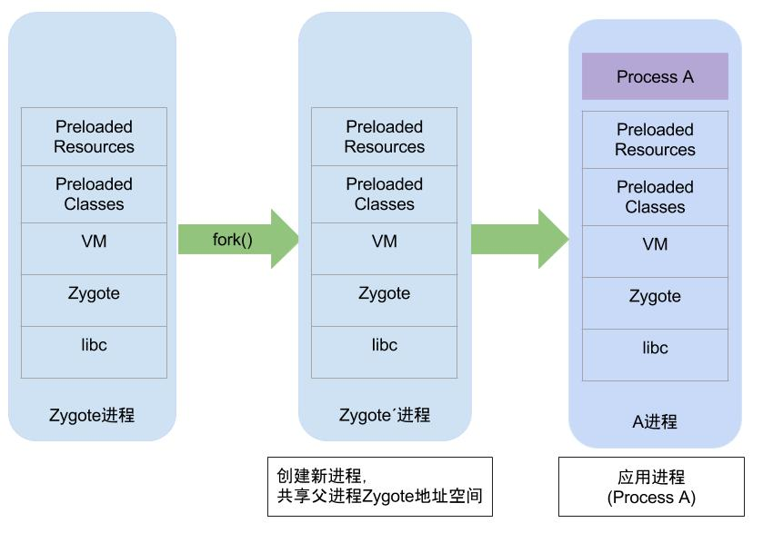

# Activity 启动流程

## 启动方式

 - launcher 启动 ， 启动 app进程

 - App进程内启动 ， 不用启动 app进程

下面以lanucher启动 Activity 为例

## 启动相关的类

### User 进程

 - ApplicationThread ，`ApplicationThread extends ApplicationThreadNative` , ActivityThread 的内部类 ， 继承 ApplicationThreadNative， 实现 ApplicationThreadNative

 - ApplicationThreadNative ， `abstract class ApplicationThreadNative extends Binder implements IApplicationThread` ，是一个 Binder 对象 ， 里面有各种 AMS 接口，主要负责与 AMS 通信

 - ActivityThread ， 有 app进程 主线程的入口， 管理住下合成的的执行， 调度和执行 Activity， Broadcasts，响应 AMS 的请求

 - Instrumentation ， 一个包装好的统一管理类， 里面有 `callActivityOnCreate` ， `callApplicationOnCreate` ， `newActivity` ， `callActivityOnNewIntent`等基本上在 application 和Activity的所有生命周期调用中的方法

### AMS 进程

 - ActivityManagerService ， Activity管理机制的服务端， 属于系统服务，用于管理activity的各种行为，控制 activity 的生命周期，派发消息事件，低内存管理等，实现了`IBinder`接口，进行进程间通信
    `ActivityManagerService extends ActivityManagerNative implements Watchdog.Monitor, BatteryStatsImpl.BatteryCallback`

 - ActivityStack , activity栈

 - ActivityStackSuperVisor ， ActivityStack的管理者 ， 宏观上把一群sleep、visible、stop 的 Activity 汇集起来。也负责Activity生命周期的一些方法调度

### 数据结构

 - ActivityRecord ， 保存 Activity 的信息 ， 如宿主进程、 component信息等

 - ProcessRecord ， 保存进程的一些信息， ActivityRecord 、ServiceRecord、ContentProviderRecord 、 ReceiverList等

 - TaskRecord ， task信息


## Zygote 进程
有四个 Daemon子线程

 - HeapTaskDaemon ， Java 堆整理线程

 - HeapTaskDaemon ， 引用队列线程

 - FinalizerDaemon ， 析构线程

 - FinalizerWatchdogDaemon ， 析构监控线程

### fork

fork采用 copy on write 技术 ， 这是Linux创建进程的标准方式 ， 调用一次 ， 返回两次

  - 父进程的返回值 ， fork 返回新创建子进程的pid
  - 子进程的返回值 ， fork 返回 0
  - 出现错误返回 负数

将子进程的pid返回给父进程的原因：

 - 对于子进程 ， fork返回 0 给它， 是因为它随时可以调用 getPid() 来获取自己的pid ， 也可以获取父进程的pid
 - 对于父进程 ， 因为一个进程的子进程可以是多个 ， 但没有一个函数可以是一个进程获取他所有的子进程的pid


fork() 的主要工作是寻找空闲的进程号pid ， 然后从父进程中copy 进程信息，例如数据段和代码段，以及fork()后要执行的代码等。
Zygote进程是所有Android进程的母体，包括 system_server 和 各个app进程



copy-on-write过程 ：当父子进程任一方修改内存数据时（on-write时机） ， 才发生缺页中断 ， 从而分配新的物理内存（copy操作）

copy-on-write原理：写时拷贝 是指 子进程与父进程的页表都指向同一块物理内存，fork过程中拷贝父进程的页表，并标记这些页表是 只读的。 父子进程同用一份物理内存，如果父子任一方要修改这一物理内存，那么会触发缺页中断 ， Linux收到该中断便会创建新的物理内存 ，并将两个物理内存标记设置为 可写 ， 从而父子双方都拥有各自独立的物理内存

## 源码分析

以 7.0 的源码为例

### 1、Activity.startActivity

### 2、Activity.startActivityForResult
```java
    public void startActivityForResult(@RequiresPermission Intent intent, int requestCode,
            @Nullable Bundle options) {
        if (mParent == null) {
        	// 通过 Instrumentation 来启动
            Instrumentation.ActivityResult ar =
                mInstrumentation.execStartActivity(
                    this, mMainThread.getApplicationThread(), mToken, this,
                    intent, requestCode, options);
            if (ar != null) {
                mMainThread.sendActivityResult(
                    mToken, mEmbeddedID, requestCode, ar.getResultCode(),
                    ar.getResultData());
            }
            if (requestCode >= 0) {
                mStartedActivity = true;
            }
            cancelInputsAndStartExitTransition(options);
        }
    }
```

### 3、Instrumentation.execStartActivity
```java
    public ActivityResult execStartActivity(
            Context who, IBinder contextThread, IBinder token, Activity target,
            Intent intent, int requestCode, Bundle options) {
        IApplicationThread whoThread = (IApplicationThread) contextThread;
		...
        try {
            intent.migrateExtraStreamToClipData();
            intent.prepareToLeaveProcess(who);
            // 跨进程 luancher进程 -> system进程
            int result = ActivityManagerNative.getDefault()
                .startActivity(whoThread, who.getBasePackageName(), intent,
                        intent.resolveTypeIfNeeded(who.getContentResolver()),
                        token, target != null ? target.mEmbeddedID : null,
                        requestCode, 0, null, options);
            // 检查是否启动成功
            checkStartActivityResult(result, intent);
        } catch (RemoteException e) {
            throw new RuntimeException("Failure from system", e);
        }
        return null;
    }
```
这里通过 `ActivityManagerNative.getDefault()` 进入 AMS，具体怎么进入的看下面

#### 3.1 ActivityManagerNative.getDefault
```java
	// 返回系统默认的 Activity manager 即 ActivityManagerService
    static public IActivityManager getDefault() {
        return gDefault.get();
    }
	// getDefault
    private static final Singleton<IActivityManager> gDefault = new Singleton<IActivityManager>() {
        protected IActivityManager create() {
            IBinder b = ServiceManager.getService("activity");
            IActivityManager am = asInterface(b);
            return am;
        }
    };
```

gDefault.get()返回的就是IActivityManager，如果实在客户端调用就是返回的ActivityManagerProxy，
而当远程调用过来后，ActivityManagerNative会在onTransact中处理 ， 看一下怎么做到的

##### 3.1.1 Singleton
看一下 Singleton 这个数据结构的源码
```java
    public abstract class Singleton<T> {
        private T mInstance;
        protected abstract T create();
        public final T get() {
            synchronized (this) {
                if (mInstance == null) {
                    mInstance = create();
                }
                return mInstance;
            }
        }
    }
```
由此可知，3.1中gDefualt.get 实际上执行了 Create方法 ， 看一下 `asInterface`

##### 3.1.2 ActivityManagerNative.asInterface
```java
    static public IActivityManager asInterface(IBinder obj) {
        if (obj == null) {
            return null;
        }
        // 将 IBinder对象 转换为 IActivityManager 接口
		// descriptor = "android.app.IActivityManager"
        IActivityManager in =
            (IActivityManager)obj.queryLocalInterface(descriptor); [3.1.3]
        if (in != null) {
            return in;
        }
        return new ActivityManagerProxy(obj);
    }
```
看一下Binder源码

##### 3.1.3 IBinder.queryLocalInterface
```java
public class Binder implements IBinder {
    //对于Binder对象的调用,则返回值不为空
    public IInterface queryLocalInterface(String descriptor) {
        //mDescriptor的初始化在attachInterface()过程中赋值
        if (mDescriptor.equals(descriptor)) {
            return mOwner;
        }
        return null;
    }
}
final class BinderProxy implements IBinder {
    public IInterface queryLocalInterface(String descriptor) {
        return null;
    }
}
```
对于Binder IPC的过程中,
 - 同一个进程的调用则会是asInterface()方法返回的便是本地的Binder对象;
 - 对于不同进程的调用则会是远程代理对象BinderProxy.

因此这里返回的是 null ， 所以 3.1.2中会返回 `ActivityManagerProxy`

##### 3.1.4 new ActivityManagerProxy(obj)
```java
	public ActivityManagerProxy(IBinder remote){
        mRemote = remote;
    }
```

### 4、ActivityManagerProxy.startActivity
```java
	public int startActivity(IApplicationThread caller, String callingPackage, Intent intent,
            String resolvedType, IBinder resultTo, String resultWho, int requestCode,
            int startFlags, ProfilerInfo profilerInfo, Bundle options) throws RemoteException {
        ...
        // code=START_SERVICE_TRANSACTION 
        // data保存了descriptor，caller, intent, resolvedType, callingPackage, userId这6项信息
        mRemote.transact(START_ACTIVITY_TRANSACTION, data, reply, 0);
        reply.readException();
        int result = reply.readInt();
        reply.recycle();
        data.recycle();
        return result;
    }
```

##### 4.1 mRemote.transact
```java
final class BinderProxy implements IBinder {
    public IInterface queryLocalInterface(String descriptor) {
        return null;
    }
    public boolean transact(int code, Parcel data, Parcel reply, int flags) throws RemoteException {
        Binder.checkParcel(this, code, data, "Unreasonably large binder buffer");
        if (Binder.isTracingEnabled()) { Binder.getTransactionTracker().addTrace(); }
        return transactNative(code, data, reply, flags);
    }
}
```
这里 transactNative 是 native 方法，经过层层调用，最终回到 AMN.onTransact

##### 4.2 AMN.onTransact
ActivityManagerNative.java
```java
    @Override
    public boolean onTransact(int code, Parcel data, Parcel reply, int flags)
            throws RemoteException {
        switch (code) {
        case START_ACTIVITY_TRANSACTION:
        {
            data.enforceInterface(IActivityManager.descriptor);
            IBinder b = data.readStrongBinder();
            IApplicationThread app = ApplicationThreadNative.asInterface(b);
            String callingPackage = data.readString();
            Intent intent = Intent.CREATOR.createFromParcel(data);
            String resolvedType = data.readString();
            IBinder resultTo = data.readStrongBinder();
            String resultWho = data.readString();
            int requestCode = data.readInt();
            int startFlags = data.readInt();
            ProfilerInfo profilerInfo = data.readInt() != 0
                    ? ProfilerInfo.CREATOR.createFromParcel(data) : null;
            Bundle options = data.readInt() != 0
                    ? Bundle.CREATOR.createFromParcel(data) : null;
            // 这里调用 ActivityManagerNative的 startActivity ， 实际上是AMS的startActivity
            int result = startActivity(app, callingPackage, intent, resolvedType,
                    resultTo, resultWho, requestCode, startFlags, profilerInfo, options);
            reply.writeNoException();
            reply.writeInt(result);
            return true;
        }
    }
```
终于到了 AMS 的 startActivity
Instrumentation -> ActivityManagerNative -> Binder -> ActivityManagerProxy -> Binder -> ActivityManagerNative -> ActivityManagerService

### 5、AMS.startActivity
### 6、AMS.startActivityAsUser
### 7、ActivityStarter.startActivityMayWait
程序运行到这里时, ASS.startActivityMayWait的各个参数取值如下:

-    caller = ApplicationThreadProxy, 用于跟调用者进程ApplicationThread进行通信的binder代理类.
-   callingUid = -1;
-    callingPackage = ContextImpl.getBasePackageName(),获取调用者Activity所在包名
-    intent: 这是启动Activity时传递过来的参数;
-    resolvedType = intent.resolveTypeIfNeeded
-    voiceSession = null;
-    voiceInteractor = null;
-    resultTo = Activity.mToken, 其中Activity是指调用者所在Activity, mToken对象保存自己所处的ActivityRecord信息
-    resultWho = Activity.mEmbeddedID, 其中Activity是指调用者所在Activity
-    requestCode = -1;
-    startFlags = 0;
-    profilerInfo = null;
-    outResult = null;
-    config = null;
-    options = null;
-    ignoreTargetSecurity = false;
-    userId = AMS.handleIncomingUser, 当调用者userId跟当前处于同一个userId,则直接返回该userId;当不相等时则根据调用者userId来决定是否需要将callingUserId转换为mCurrentUserId.
-    iContainer = null;
-    inTask = null;

```java
final int startActivityMayWait(IApplicationThread caller, int callingUid,
            String callingPackage, Intent intent, String resolvedType,
            IVoiceInteractionSession voiceSession, IVoiceInteractor voiceInteractor,
            IBinder resultTo, String resultWho, int requestCode, int startFlags,
            ProfilerInfo profilerInfo, IActivityManager.WaitResult outResult, Configuration config,
            Bundle bOptions, boolean ignoreTargetSecurity, int userId,
            IActivityContainer iContainer, TaskRecord inTask) {
            ...
            //收集Intent所指向的Activity信息  [7.1]
            ResolveInfo rInfo = mSupervisor.resolveIntent(intent, resolvedType, userId);
            ...
            // 收集Intent所指向的Activity信息, 当存在多个可供选择的Activity, 选择最合适的Activity  [7.2]
            ActivityInfo aInfo = mSupervisor.resolveActivity(intent, rInfo, startFlags, profilerInfo);
            ...
            //
            rInfo = mSupervisor.resolveIntent(intent, null /*resolvedType*/, userId);
            ...
            final ActivityStack stack;
            if (container == null || container.mStack.isOnHomeDisplay()) {
                stack = mSupervisor.mFocusedStack;
            } else {
                stack = container.mStack;
            }
            //此时mConfigWillChange = false
            stack.mConfigWillChange = config != null && mService.mConfiguration.diff(config) != 0;
            final long origId = Binder.clearCallingIdentity();
            if (aInfo != null &&
                (aInfo.applicationInfo.privateFlags
                        &ApplicationInfo.PRIVATE_FLAG_CANT_SAVE_STATE) != 0) {
            	// heavy-weight进程处理流程, 一般情况下不进入该分支
                if (aInfo.processName.equals(aInfo.applicationInfo.packageName)) {
                    ...
                }
        	}
            ...
            int res = startActivityLocked(caller, intent, ephemeralIntent, resolvedType,
                    aInfo, rInfo, voiceSession, voiceInteractor,
                    resultTo, resultWho, requestCode, callingPid,
                    callingUid, callingPackage, realCallingPid, realCallingUid, startFlags,
                    options, ignoreTargetSecurity, componentSpecified, outRecord, container,
                    inTask);
            }
```

#### 7.1 ActivityStackSupervisor.resolveIntent
ActivityStackSupervisor.java
```java
    ResolveInfo resolveIntent(Intent intent, String resolvedType, int userId, int flags) {
        try {   [7.1.3]
            return AppGlobals.getPackageManager().resolveIntent(intent, resolvedType,
                    PackageManager.MATCH_DEFAULT_ONLY | flags
                    | ActivityManagerService.STOCK_PM_FLAGS, userId);
        } catch (RemoteException e) {
        }
        return null;
    }
```

##### 7.1.1 AppGlobals.getPackageManager
AppGlobal.java
```java
	public static IPackageManager getPackageManager() {
        return ActivityThread.getPackageManager(); [7.1.2]
    }
```

##### 7.1.2 ActivityThread.getPackageManager
ActivityThread.java
```java
    public static IPackageManager getPackageManager() {
        if (sPackageManager != null) {
            return sPackageManager;
        }
        // 获取 PackageManagerService
        IBinder b = ServiceManager.getService("package");
        sPackageManager = IPackageManager.Stub.asInterface(b);
        return sPackageManager;
    }
```

##### 7.1.3 PackageManagerService.resolveIntent
PackageManagerService.java
```java
@Override
    public ResolveInfo resolveIntent(Intent intent, String resolvedType,
            int flags, int userId) {
        try {
            if (!sUserManager.exists(userId)) return null;
            flags = updateFlagsForResolve(flags, userId, intent);
            enforceCrossUserPermission(Binder.getCallingUid(), userId,
                    false /*requireFullPermission*/, false /*checkShell*/, "resolve intent");
            // 获取 [7.1.4]
            final List<ResolveInfo> query = queryIntentActivitiesInternal(intent, resolvedType,
                    flags, userId);
			// 选择最优的Activity [7.1.6]
            final ResolveInfo bestChoice =
                    chooseBestActivity(intent, resolvedType, flags, query, userId);
            ...
            return bestChoice;
        } finally {
            Trace.traceEnd(TRACE_TAG_PACKAGE_MANAGER);
        }
    }
```

##### 7.1.4 PackageManagerService.queryIntentActivitiesInternal
PackageManagerService.java
```java
    private @NonNull List<ResolveInfo> queryIntentActivitiesInternal(Intent intent,
            String resolvedType, int flags, int userId) {
        ...
        if (comp != null) {
            final List<ResolveInfo> list = new ArrayList<ResolveInfo>(1);
            // 获取 Activity 信息 [7.1.5]
            final ActivityInfo ai = getActivityInfo(comp, flags, userId);
            if (ai != null) {
                final ResolveInfo ri = new ResolveInfo();
                ri.activityInfo = ai;
                list.add(ri);
            }
            return list;
        }
        ...
    }
```
这个方法获取Activity信息

##### 7.1.5 PackageManagerService.getActivityInfo
PackageManagerService.java
```java
    @Override
    public ActivityInfo getActivityInfo(ComponentName component, int flags, int userId) {
        ...
        synchronized (mPackages) {
            PackageParser.Activity a = mActivities.mActivities.get(component);

            if (DEBUG_PACKAGE_INFO) Log.v(TAG, "getActivityInfo " + component + ": " + a);
            if (a != null && mSettings.isEnabledAndMatchLPr(a.info, flags, userId)) {
                PackageSetting ps = mSettings.mPackages.get(component.getPackageName());
                if (ps == null) return null;
                // 这里正在获取 ActivityInfo
                return PackageParser.generateActivityInfo(a, flags, ps.readUserState(userId),
                        userId);
            }
            if (mResolveComponentName.equals(component)) {
                return PackageParser.generateActivityInfo(mResolveActivity, flags,
                        new PackageUserState(), userId);
            }
        }
        return null;
    }
```

##### 7.1.6 PackageManagerService.chooseBestActivity
PackageManagerService.java
```java
private ResolveInfo chooseBestActivity(Intent intent, String resolvedType,
            int flags, List<ResolveInfo> query, int userId) {
	...
    // 如果有为这个 Intent 保存过偏爱的Activity，那就使用那个Activity
	ResolveInfo ri = findPreferredActivity(intent, resolvedType,
                        flags, query, r0.priority, true, false, debug, userId);
	if (ri != null) {
		return ri;
	}
}
```

#### 7.2 ActivityStackSuperVisor.resolveActivity
ActivityStackSuperVisor.java
```java
 ActivityInfo resolveActivity(Intent intent, ResolveInfo rInfo, int startFlags,
            ProfilerInfo profilerInfo) {
        final ActivityInfo aInfo = rInfo != null ? rInfo.activityInfo : null;
        if (aInfo != null) {
            intent.setComponent(new ComponentName(
                    aInfo.applicationInfo.packageName, aInfo.name));
            // Don't debug things in the system process
            if (!aInfo.processName.equals("system")) {
                if ((startFlags & ActivityManager.START_FLAG_DEBUG) != 0) {
                    mService.setDebugApp(aInfo.processName, true, false);
                }

                if ((startFlags & ActivityManager.START_FLAG_NATIVE_DEBUGGING) != 0) {
                    mService.setNativeDebuggingAppLocked(aInfo.applicationInfo, aInfo.processName);
                }

                if ((startFlags & ActivityManager.START_FLAG_TRACK_ALLOCATION) != 0) {
                    mService.setTrackAllocationApp(aInfo.applicationInfo, aInfo.processName);
                }

                if (profilerInfo != null) {
                    mService.setProfileApp(aInfo.applicationInfo, aInfo.processName, profilerInfo);
                }
            }
        }
        return aInfo;
    }
```
ActivityManager类有如下4个flags用于调试：
-    START_FLAG_DEBUG：用于调试debug app
-    START_FLAG_OPENGL_TRACES：用于调试OpenGL tracing
-    START_FLAG_NATIVE_DEBUGGING：用于调试native
-    START_FLAG_TRACK_ALLOCATION: 用于调试allocation tracking

### 8、ActivityStarter.startActivityLocked
ActivityStarter.java
```java
final int startActivityLocked(IApplicationThread caller, Intent intent, Intent ephemeralIntent,
            String resolvedType, ActivityInfo aInfo, ResolveInfo rInfo,
            IVoiceInteractionSession voiceSession, IVoiceInteractor voiceInteractor,
            IBinder resultTo, String resultWho, int requestCode, int callingPid, int callingUid,
            String callingPackage, int realCallingPid, int realCallingUid, int startFlags,
            ActivityOptions options, boolean ignoreTargetSecurity, boolean componentSpecified,
            ActivityRecord[] outActivity, ActivityStackSupervisor.ActivityContainer container,
            TaskRecord inTask) {
        int err = ActivityManager.START_SUCCESS;
        // 获取调用者的进程记录对象
        ProcessRecord callerApp = null;
        if (caller != null) {
            callerApp = mService.getRecordForAppLocked(caller);
            if (callerApp != null) {
                callingPid = callerApp.pid;
                callingUid = callerApp.info.uid;
            }
        }
        final int userId = aInfo != null ? UserHandle.getUserId(aInfo.applicationInfo.uid) : 0;
        ActivityRecord sourceRecord = null;
        ActivityRecord resultRecord = null;
        if (resultTo != null) {
            //获取调用者所在的Activity
            sourceRecord = isInAnyStackLocked(resultTo);
            if (sourceRecord != null) {
                if (requestCode >= 0 && !sourceRecord.finishing) {
                    ... //requestCode = -1 则不进入
                }
            }
        }
        ...
        // 权限检查
        boolean abort = !mSupervisor.checkStartAnyActivityPermission(intent, aInfo, resultWho,
                requestCode, callingPid, callingUid, callingPackage, ignoreTargetSecurity, callerApp,
                resultRecord, resultStack, options);
        abort |= !mService.mIntentFirewall.checkStartActivity(intent, callingUid,
                callingPid, resolvedType, aInfo.applicationInfo);
		...
        // 检查权限失败
        if (abort) {
            if (resultRecord != null) {
                resultStack.sendActivityResultLocked(-1, resultRecord, resultWho, requestCode,
                        RESULT_CANCELED, null);
            }
            ActivityOptions.abort(options);
            return START_SUCCESS;
        }
        ...
        // 创建 ActivityRecord
        ActivityRecord r = new ActivityRecord(mService, callerApp, callingUid, callingPackage,
                intent, resolvedType, aInfo, mService.mConfiguration, resultRecord, resultWho,
                requestCode, componentSpecified, voiceSession != null, mSupervisor, container,
                options, sourceRecord);
		if (outActivity != null) {
            outActivity[0] = r;
        }

        if (r.appTimeTracker == null && sourceRecord != null) {
            r.appTimeTracker = sourceRecord.appTimeTracker;
        }
        // 将mFocusedStack赋予当前stack
        final ActivityStack stack = mFocusedStack;
        if (voiceSession == null && (stack.mResumedActivity == null
                || stack.mResumedActivity.info.applicationInfo.uid != callingUid)) {
            // 前台stack还没有resume状态的Activity时, 则检查app切换是否允许
            if (!mService.checkAppSwitchAllowedLocked(callingPid, callingUid,
                    realCallingPid, realCallingUid, "Activity start")) {
                PendingActivityLaunch pal =
                        new PendingActivityLaunch(r, sourceRecord, startFlags, stack);
                // 当不允许切换,则把要启动的Activity添加到mPendingActivityLaunches对象, 并且直接返回.
                mPendingActivityLaunches.add(pal);
                ActivityOptions.abort(options);
                return ActivityManager.START_SWITCHES_CANCELED;
            }
        }

        if (mService.mDidAppSwitch) {
            //从上次禁止app切换以来,这是第二次允许app切换,因此将允许切换时间设置为0,则表示可以任意切换app
            mService.mAppSwitchesAllowedTime = 0;
        } else {
            mService.mDidAppSwitch = true;
        }

        //处理 pendind Activity的启动, 这些Activity是由于app switch禁用从而被hold的等待启动activity
        doPendingActivityLaunchesLocked(false);
		// [9] 见下
        err = startActivityUncheckedLocked(r, sourceRecord, voiceSession, voiceInteractor,
                startFlags, true, options, inTask);

        if (err < 0) {
            notifyActivityDrawnForKeyguard();
        }
        return err;
}
```
这个方法主要检查权限等

### 9、ActivityStarter.startActivityUnchecked
ActivityStarter.java
```java
    private int startActivityUnchecked(final ActivityRecord r, ActivityRecord sourceRecord,
            IVoiceInteractionSession voiceSession, IVoiceInteractor voiceInteractor,
            int startFlags, boolean doResume, ActivityOptions options, TaskRecord inTask) {
            ...
            // 这个只是 将Activity移至栈顶
            mTargetStack.startActivityLocked(mStartActivity, newTask, mKeepCurTransition, mOptions);
            if (mDoResume) {
                final ActivityRecord topTaskActivity = mStartActivity.task.topRunningActivityLocked();
                if (!mTargetStack.isFocusable()
                        || (topTaskActivity != null && topTaskActivity.mTaskOverlay
                        && mStartActivity != topTaskActivity)) {
                    mTargetStack.ensureActivitiesVisibleLocked(null, 0, !PRESERVE_WINDOWS);
                    mWindowManager.executeAppTransition();
                } else {
                    // 从这里进去 [10]
                    mSupervisor.resumeFocusedStackTopActivityLocked(mTargetStack, mStartActivity,
                            mOptions);
                }
            } else {
                mTargetStack.addRecentActivityLocked(mStartActivity);
            }
            ...
    }
```

### 10、 ActivityStackSuperVisor.resumeFocusedStackTopActivityLocked
ActivityStackSuperVisor.java
```java
	boolean resumeFocusedStackTopActivityLocked(
            ActivityStack targetStack, ActivityRecord target, ActivityOptions targetOptions) {
        if (targetStack != null && isFocusedStack(targetStack)) {
        	// [11]
            return targetStack.resumeTopActivityUncheckedLocked(target, targetOptions);
        }
        final ActivityRecord r = mFocusedStack.topRunningActivityLocked();
        if (r == null || r.state != RESUMED) {
            mFocusedStack.resumeTopActivityUncheckedLocked(null, null);
        }
        return false;
    }
```

### 11、ActivityStack.resumeTopActivityUncheckedLocked
ActivityStack.java
```java
    boolean resumeTopActivityUncheckedLocked(ActivityRecord prev, ActivityOptions options) {
        if (mStackSupervisor.inResumeTopActivity) {
            // Don't even start recursing.
            return false;
        }

        boolean result = false;
        try {
            // Protect against recursion.
            mStackSupervisor.inResumeTopActivity = true;
            if (mService.mLockScreenShown == ActivityManagerService.LOCK_SCREEN_LEAVING) {
                mService.mLockScreenShown = ActivityManagerService.LOCK_SCREEN_HIDDEN;
                mService.updateSleepIfNeededLocked();
            }
            result = resumeTopActivityInnerLocked(prev, options);
        } finally {
            mStackSupervisor.inResumeTopActivity = false;
        }
        return result;
    }
```

#### 12 ActivityStack.resumeTopActivityInnerLocked
ActivityStack.java
```java
    private boolean resumeTopActivityInnerLocked(ActivityRecord prev, ActivityOptions options) {
    	if (!mService.mBooting && !mService.mBooted) {
            //  系统没有进入booting或booted状态，则不允许启动Activity
            return false;
        }
		//找到第一个没有finishing的栈顶activity
        final ActivityRecord next = topRunningActivityLocked(null);

        final boolean userLeaving = mStackSupervisor.mUserLeaving;
        mStackSupervisor.mUserLeaving = false;

        final TaskRecord prevTask = prev != null ? prev.task : null;
        if (next == null) { //不会进入
            final String reason = "noMoreActivities";
            final int returnTaskType = prevTask == null || !prevTask.isOverHomeStack()
                    ? HOME_ACTIVITY_TYPE : prevTask.getTaskToReturnTo();
             //当该栈没有全屏，则尝试聚焦到下一个可见的stack
            if (!mFullscreen && adjustFocusToNextFocusableStackLocked(returnTaskType, reason)) {
                return mStackSupervisor.resumeFocusedStackTopActivityLocked(
                        mStackSupervisor.getFocusedStack(), prev, null);
            }
            ActivityOptions.abort(options);
            final int returnTaskType = prevTask == null || !prevTask.isOverHomeStack() ?
                    HOME_ACTIVITY_TYPE : prevTask.getTaskToReturnTo();
            //启动home桌面activity
            return isOnHomeDisplay() &&
                    mStackSupervisor.resumeHomeStackTask(returnTaskType, prev, reason);
        }
		...
        // 睡眠 ， 并且没有resumed Activity ， 栈顶Activity被暂停 ， 走下面
        if (mService.isSleepingOrShuttingDownLocked()
                && mLastPausedActivity == next
                && mStackSupervisor.allPausedActivitiesComplete()) {
            mWindowManager.executeAppTransition();
            mNoAnimActivities.clear();
            ActivityOptions.abort(options);
            return false;
        }
		...
        final boolean dontWaitForPause = (next.info.flags & FLAG_RESUME_WHILE_PAUSING) != 0;
        // 暂停其他的Activity [12.1 ]
        boolean pausing = mStackSupervisor.pauseBackStacks(userLeaving, true, dontWaitForPause);
        if (mResumedActivity != null) {
        	// 暂停当前的Activity [12.1 ]
            pausing |= startPausingLocked(userLeaving, false, true, dontWaitForPause);
        }

        ...
        if (next.app != null && next.app.thread != null) {
       	  // 不走这里   因为 从luancher启动的话  next.app.thread == null
        } else {
            // Whoops, need to restart this activity!
            if (!next.hasBeenLaunched) {
                next.hasBeenLaunched = true;
            } else {
                if (SHOW_APP_STARTING_PREVIEW) {
                    next.showStartingWindow(null, true);
                }
            }
            //
            mStackSupervisor.startSpecificActivityLocked(next, true, true);
        }
    }
```

#### 12.1 ActivityStackSuperVisor.pauseBackStacks
ActivitySuperVisor.java
```java
    boolean pauseBackStacks(boolean userLeaving, boolean resuming, boolean dontWait) {
        boolean someActivityPaused = false;
        for (int displayNdx = mActivityDisplays.size() - 1; displayNdx >= 0; --displayNdx) {
            ArrayList<ActivityStack> stacks = mActivityDisplays.valueAt(displayNdx).mStacks;
            for (int stackNdx = stacks.size() - 1; stackNdx >= 0; --stackNdx) {
                final ActivityStack stack = stacks.get(stackNdx);
                if (!isFocusedStack(stack) && stack.mResumedActivity != null) {
                    // 
                    someActivityPaused |= stack.startPausingLocked(userLeaving, false, resuming,
                            dontWait);
                }
            }
        }
        return someActivityPaused;
    }
```
暂停所有的 Activity

##### 12.1.1 ActivityStack.startPausingLocked
ActivityStack.java
```java
final boolean startPausingLocked(boolean userLeaving, boolean uiSleeping, boolean resuming, boolean dontWait) {

        // Enqueueing pending pause:
        // 调用 schedulePauseActivity 来暂停 prev
        if (prev.app != null && prev.app.thread != null) {
            try {
                mService.updateUsageStats(prev, false);
                prev.app.thread.schedulePauseActivity(prev.appToken, prev.finishing,
                        userLeaving, prev.configChangeFlags, dontWait);
       }

       // 完成 pause
       if (dontWait) {
                // 如果调用者是立即完成暂停 -- dontwait == true
                completePauseLocked(false);
                return false;
            } else {
                // 否则 等待 500ms 再执行暂停
                Message msg = mHandler.obtainMessage(PAUSE_TIMEOUT_MSG);
                msg.obj = prev;
                prev.pauseTime = SystemClock.uptimeMillis();
                mHandler.sendMessageDelayed(msg, PAUSE_TIMEOUT);
                return true;
            }
  }
```

### 13、 ActivityStackSuperVisor.startSpecificActivityLocked

这里开始进入真正启动 Activity ， `realStartActivityLocked()` 和 创建 app进程

 - app进程不村子的情况下 ， 如 从Luacher启动 Activity ， 则创建 app进程 ， 然后再 realStartActivityLocked

 - app进程存在的情况下 ， 如 从一个activity跳到另一个Activity ， 那么直接进入 realStartActivityLocked
 - 
ActivityStackSuperVisor.java
```java
    void startSpecificActivityLocked(ActivityRecord r,
            boolean andResume, boolean checkConfig) {
        // Is this activity's application already running?
        ProcessRecord app = mService.getProcessRecordLocked(r.processName,
                r.info.applicationInfo.uid, true);

        r.task.stack.setLaunchTime(r);
		//  从Luancher启动Activity    app.thread == null
        if (app != null && app.thread != null) {
            try {
                    app.addPackage(r.info.packageName, r.info.applicationInfo.versionCode,
                            mService.mProcessStats);
                }
                // 真正启动Activity
                realStartActivityLocked(r, app, andResume, checkConfig);
                return;
            } catch (RemoteException e) {
                Slog.w(TAG, "Exception when starting activity "
                        + r.intent.getComponent().flattenToShortString(), e);
            }
        }
		// 新建app_进程  见下文 ## app进程的创建
        mService.startProcessLocked(r.processName, r.info.applicationInfo, true, 0,
                "activity", r.intent.getComponent(), false, false, true);
```
#### 13.1 ActivityStackSuperVisor.realStartActivityLocked
`ActivityStackSuperVisor.java`
```java
    final boolean realStartActivityLocked(ActivityRecord r, ProcessRecord app,
            boolean andResume, boolean checkConfig) throws RemoteException {
         // ...
        app.thread.scheduleLaunchActivity(new Intent(r.intent), r.appToken,
            System.identityHashCode(r), r.info, new Configuration(mService.mConfiguration),
            new Configuration(task.mOverrideConfig), r.compat, r.launchedFromPackage,
            task.voiceInteractor, app.repProcState, r.icicle, r.persistentState, results,
            newIntents, !andResume, mService.isNextTransitionForward(), profilerInfo);
		// ...
	}
```

#### 13.2 ActivityThead.scheduleLaunchActivity
`ActivityThread.java`
```java
    @Override
    public final void scheduleLaunchActivity(Intent intent, IBinder token, int ident,
        ActivityInfo info, Configuration curConfig, Configuration overrideConfig,
        CompatibilityInfo compatInfo, String referrer, IVoiceInteractor voiceInteractor,
        int procState, Bundle state, PersistableBundle persistentState,
        List<ResultInfo> pendingResults, List<ReferrerIntent> pendingNewIntents,
        boolean notResumed, boolean isForward, ProfilerInfo profilerInfo) {

		updateProcessState(procState, false);
        sendMessage(H.LAUNCH_ACTIVITY, r);
    }
```

### 14  ActivityThead.handleLaunchActivity
`ActivityThread.java`
```java
    private void handleLaunchActivity(ActivityClientRecord r, Intent customIntent, String reason) {
    	...
        // 见 14.1
        Activity a = performLaunchActivity(r, customIntent);
        if (a != null) {
        // 见 14.2
        	handleResumeActivity(r.token, false, r.isForward,
                    !r.activity.mFinished && !r.startsNotResumed, r.lastProcessedSeq, reason);
		}
	}
```
#### 14.1 ActivityThread.performLaunchActivity
`ActivityTHread.java`
```java
    private Activity performLaunchActivity(ActivityClientRecord r, Intent customIntent) {
    	...
        // 加载 Activity
        Activity activity = null;
        try {
            java.lang.ClassLoader cl = r.packageInfo.getClassLoader();
            // 见 14.1.1
            activity = mInstrumentation.newActivity(
                    cl, component.getClassName(), r.intent);
            StrictMode.incrementExpectedActivityCount(activity.getClass());
            r.intent.setExtrasClassLoader(cl);
            r.intent.prepareToEnterProcess();
            if (r.state != null) {
                r.state.setClassLoader(cl);
            }
        } catch (Exception e) {
            if (!mInstrumentation.onException(activity, e)) {
                throw new RuntimeException(
                    "Unable to instantiate activity " + component
                    + ": " + e.toString(), e);
            }
       }
       ...
       try {
       		// 见 14.1.2  加载自定义的 Application
            Application app = r.packageInfo.makeApplication(false, mInstrumentation);
            if (activity != null) {
            	// 见 14.1.3
                Context appContext = createBaseContextForActivity(r, activity);
                ...
                // 调用Activity的 attach（）
                activity.attach(appContext, this, getInstrumentation(), r.token,
                        r.ident, app, r.intent, r.activityInfo, title, r.parent,
                        r.embeddedID, r.lastNonConfigurationInstances, config,
                        r.referrer, r.voiceInteractor, window);
				...
                // 设置主题
                int theme = r.activityInfo.getThemeResource();
                if (theme != 0) {
                    activity.setTheme(theme);
                }
                ...
                // 见 14.1.4
                if (r.isPersistable()) {
                    mInstrumentation.callActivityOnCreate(activity, r.state, r.persistentState);
                } else {
                    mInstrumentation.callActivityOnCreate(activity, r.state);
                }
                ...
                // 见 14.1.6 执行 onStart
                if (!r.activity.mFinished) {
                    activity.performStart();
                    r.stopped = false;
                }
                ...
    }
```

#### 14.1.1 Instrumentation.newActivity
`Instrumentation.java`
```java
    public Activity newActivity(ClassLoader cl, String className,
            Intent intent)
            throws InstantiationException, IllegalAccessException,
            ClassNotFoundException {
        return (Activity)cl.loadClass(className).newInstance();
    }
```
加载要启动的Activity

#### 14.1.2 LoadedApk.makeApplication
`LoadedApk.java`
```java
    public Application makeApplication(boolean forceDefaultAppClass,
            Instrumentation instrumentation) {
        if (mApplication != null) {
            return mApplication;
        }
        Application app = null;

        String appClass = mApplicationInfo.className;
        // forceDefaultAppClass == false
        if (forceDefaultAppClass || (appClass == null)) {
            appClass = "android.app.Application";
        }

        try {
            java.lang.ClassLoader cl = getClassLoader();
            if (!mPackageName.equals("android")) {
                Trace.traceBegin(Trace.TRACE_TAG_ACTIVITY_MANAGER,
                        "initializeJavaContextClassLoader");
                initializeJavaContextClassLoader();
                Trace.traceEnd(Trace.TRACE_TAG_ACTIVITY_MANAGER);
            }
            ContextImpl appContext = ContextImpl.createAppContext(mActivityThread, this);
            // 加载自定义的 Application ， 并且 执行 application.attach()
            app = mActivityThread.mInstrumentation.newApplication(
                    cl, appClass, appContext);
            appContext.setOuterContext(app);
        } catch (Exception e) {
            ...
        }
        mActivityThread.mAllApplications.add(app);
        mApplication = app;

        if (instrumentation != null) {
            try {
            	// 调用 application的 onCreate
                instrumentation.callApplicationOnCreate(app);
            } catch (Exception e) {
                ...
            }
        }
		...
        return app;
    }
```
这里主要是加载自定义的Application

#### 14.1.3 ActivityThread.createBaseContextForActivity
`ActivityThread.java`
```java
    private Context createBaseContextForActivity(ActivityClientRecord r, final Activity activity) {
        int displayId = Display.DEFAULT_DISPLAY;
        try {
            displayId = ActivityManagerNative.getDefault().getActivityDisplayId(r.token);
        } catch (RemoteException e) {
            throw e.rethrowFromSystemServer();
        }
		// 见下
        ContextImpl appContext = ContextImpl.createActivityContext(
                this, r.packageInfo, r.token, displayId, r.overrideConfig);
        appContext.setOuterContext(activity);
        Context baseContext = appContext;
		...
        return baseContext;
    }
    // ContextImpl.class
    static ContextImpl createActivityContext(ActivityThread mainThread,
            LoadedApk packageInfo, IBinder activityToken, int displayId,
            Configuration overrideConfiguration) {
        if (packageInfo == null) throw new IllegalArgumentException("packageInfo");
        return new ContextImpl(null, mainThread, packageInfo, activityToken, null, 0,
                null, overrideConfiguration, displayId);
    }
```

#### 14.1.4 Instrumentation.callActivityOnCreate
`Instrumentation.java`
```java
    public void callActivityOnCreate(Activity activity, Bundle icicle) {
        prePerformCreate(activity);
        activity.performCreate(icicle);
        postPerformCreate(activity);
    }
    // 添加 addIdleHandler
    private void prePerformCreate(Activity activity) {
        if (mWaitingActivities != null) {
            synchronized (mSync) {
                final int N = mWaitingActivities.size();
                for (int i=0; i<N; i++) {
                    final ActivityWaiter aw = mWaitingActivities.get(i);
                    final Intent intent = aw.intent;
                    if (intent.filterEquals(activity.getIntent())) {
                        aw.activity = activity;
                        mMessageQueue.addIdleHandler(new ActivityGoing(aw));
                    }
                }
            }
        }
    }
    // ..
    private void postPerformCreate(Activity activity) {
        if (mActivityMonitors != null) {
            synchronized (mSync) {
                final int N = mActivityMonitors.size();
                for (int i=0; i<N; i++) {
                    final ActivityMonitor am = mActivityMonitors.get(i);
                    am.match(activity, activity, activity.getIntent());
                }
            }
        }
    }
```

#### 14.1.5 Activity.performCreate
`Activity.java`
```java
    final void performCreate(Bundle icicle) {
        restoreHasCurrentPermissionRequest(icicle);
        onCreate(icicle);
        mActivityTransitionState.readState(icicle);
        performCreateCommon();
    }

    // FragmentCotroller.java
    // 执行Fragment的 Create
    final void performCreateCommon() {
        mVisibleFromClient = !mWindow.getWindowStyle().getBoolean(
                com.android.internal.R.styleable.Window_windowNoDisplay, false);
        // 执行Fragment的 onActivityCreated
        mFragments.dispatchActivityCreated();
        mActivityTransitionState.setEnterActivityOptions(this, getActivityOptions());
    }
```

#### 14.1.6 Activity.performStart
`Activity.java`
```java
    final void performStart() {
        mActivityTransitionState.setEnterActivityOptions(this, getActivityOptions());
        mFragments.noteStateNotSaved();
        mCalled = false;
        mFragments.execPendingActions();
        // 执行 Activity的 onStart
        mInstrumentation.callActivityOnStart(this);
        ...
        // 执行 Fragment的 onStart
        mFragments.dispatchStart();
        mFragments.reportLoaderStart();

        ...

        mActivityTransitionState.enterReady(this);
    }
```

#### 14.2 ActivityThread.handleResumeActivity
`ActivityThread.java`
```java
    final void handleResumeActivity(IBinder token,
            boolean clearHide, boolean isForward, boolean reallyResume, int seq, String reason) {
			ActivityClientRecord r = mActivities.get(token);
			r = performResumeActivity(token, clearHide, reason);
	}
```
#### 14.3 ActivityThread.performResumeActivity
`ActivityThread.java`
```java
    public final ActivityClientRecord performResumeActivity(IBinder token,
            boolean clearHide, String reason) {
        ActivityClientRecord r = mActivities.get(token);
        if (r != null && !r.activity.mFinished) {
        	// 见 14.3.1
        	r.activity.performResume();
        }
	}
```

#### 14.3.1 Activity.performResume
`Activity.java`
```java
    final void performResume() {
    	// 如果有暂停 先 Restart
    	performRestart();
        // 执行 onResume
    	mInstrumentation.callActivityOnResume(this);

        // 执行 Fragment的 onResume
        mFragments.dispatchResume();

        onPostResume();
    }
```

## app进程的创建

点击 Luancher 进入 app ， app进程的创建如下

### 入口
`ActivityStackSupervisor.startSpecificActivityLocked()`

```java
    void startSpecificActivityLocked(ActivityRecord r,
            boolean andResume, boolean checkConfig) {
        // Is this activity's application already running?
        ProcessRecord app = mService.getProcessRecordLocked(r.processName,
                r.info.applicationInfo.uid, true);

        r.task.stack.setLaunchTime(r);

        if (app != null && app.thread != null) {
            try {
                // app进程存在的情况下
                realStartActivityLocked(r, app, andResume, checkConfig);
                return;
            } catch (RemoteException e) {
                Slog.w(TAG, "Exception when starting activity "
                        + r.intent.getComponent().flattenToShortString(), e);
            }

            // If a dead object exception was thrown -- fall through to
            // restart the application.
        }
		// 创建 app进程
        mService.startProcessLocked(r.processName, r.info.applicationInfo, true, 0,
                "activity", r.intent.getComponent(), false, false, true);
    }
```

### 创建过程分析

#### 1、ActivityManagerService.startProcessLocked
`ActivityManagerService.java`

```java
final ProcessRecord startProcessLocked(String processName, ApplicationInfo info,
            boolean knownToBeDead, int intentFlags, String hostingType, ComponentName hostingName,
            boolean allowWhileBooting, boolean isolated, int isolatedUid, boolean keepIfLarge,
            String abiOverride, String entryPoint, String[] entryPointArgs, Runnable crashHandler) {
        long startTime = SystemClock.elapsedRealtime();
        ProcessRecord app;
        if (!isolated) {  // isolated false
        	// 根据 processName 获取要启动的 ProcessRecord
            app = getProcessRecordLocked(processName, info.uid, keepIfLarge);
            checkTime(startTime, "startProcess: after getProcessRecord");
        }
        // .....
        // creating new process record ,上面拿到的 ProcessRecord 是 null ， 这里创建 ProcessRecord
        if (app == null) {
            checkTime(startTime, "startProcess: creating new process record");
            // 见 1.1 ActivityManagerService.newProcessRecordLocked
            app = newProcessRecordLocked(info, processName, isolated, isolatedUid);
            if (app == null) {
                Slog.w(TAG, "Failed making new process record for "
                        + processName + "/" + info.uid + " isolated=" + isolated);
                return null;
            }
            app.crashHandler = crashHandler;
            checkTime(startTime, "startProcess: done creating new process record");
        } else {
            // If this is a new package in the process, add the package to the list
            app.addPackage(info.packageName, info.versionCode, mProcessStats);
            checkTime(startTime, "startProcess: added package to existing proc");
        }
        // ....
        checkTime(startTime, "startProcess: stepping in to startProcess");
        startProcessLocked(
                app, hostingType, hostingNameStr, abiOverride, entryPoint, entryPointArgs);
        checkTime(startTime, "startProcess: done starting proc!");
        return (app.pid != 0) ? app : null;
}
```
##### 1.1 ActivityManagerService.newProcessRecordLocked
`ActivityManagerService.java`
```java
final ProcessRecord newProcessRecordLocked(ApplicationInfo info, String customProcess,
            boolean isolated, int isolatedUid) {
        String proc = customProcess != null ? customProcess : info.processName;
        BatteryStatsImpl stats = mBatteryStatsService.getActiveStatistics();
        final int userId = UserHandle.getUserId(info.uid);
        int uid = info.uid;
        if (isolated) {  // isolated is false
            //  不走这里
        }
        final ProcessRecord r = new ProcessRecord(stats, info, proc, uid);
        if (!mBooted && !mBooting
                && userId == UserHandle.USER_SYSTEM
                && (info.flags & PERSISTENT_MASK) == PERSISTENT_MASK) {
            r.persistent = true;
        }
        // 见 1.1.1 ActivityManagerService.addProcessNameLocked
        addProcessNameLocked(r);
        return r;
    }
```

##### 1.1.1 ActivityManagerService.addProcessNameLocked
`ActivityManagerService.java`
```java
    private final void addProcessNameLocked(ProcessRecord proc) {
        // 移除 这个proc.processsName 所关联的 ProcessRecord
        ProcessRecord old = removeProcessNameLocked(proc.processName, proc.uid);
        if (old == proc && proc.persistent) {
            // We are re-adding a persistent process.  Whatevs!  Just leave it there.
            Slog.w(TAG, "Re-adding persistent process " + proc);
        } else if (old != null) {
            Slog.wtf(TAG, "Already have existing proc " + old + " when adding " + proc);
        }
        UidRecord uidRec = mActiveUids.get(proc.uid);
        if (uidRec == null) {
            uidRec = new UidRecord(proc.uid);
            // Creating new process uid
            mActiveUids.put(proc.uid, uidRec);
            noteUidProcessState(uidRec.uid, uidRec.curProcState);
            enqueueUidChangeLocked(uidRec, -1, UidRecord.CHANGE_ACTIVE);
        }
        proc.uidRecord = uidRec;
        uidRec.numProcs++;
        // 将processName uid proc 放在 mProcessNames
        mProcessNames.put(proc.processName, proc.uid, proc);
        if (proc.isolated) {
            mIsolatedProcesses.put(proc.uid, proc);
        }
    }
```
这里主要做的事情

 - 创建uid
 - 将 proc 放入 mProcessNames

#### 2、 ActivityManagerService.startProcessLocked
`ActivityManagerService.java`
```java
    private final void startProcessLocked(ProcessRecord app, String hostingType,
            String hostingNameStr, String abiOverride, String entryPoint, String[] entryPointArgs) {
        long startTime = SystemClock.elapsedRealtime();
        // 从 pid map 中移除 app的 pid
        if (app.pid > 0 && app.pid != MY_PID) {
            checkTime(startTime, "startProcess: removing from pids map");
            synchronized (mPidsSelfLocked) {
                mPidsSelfLocked.remove(app.pid);
                mHandler.removeMessages(PROC_START_TIMEOUT_MSG, app);
            }
            checkTime(startTime, "startProcess: done removing from pids map");
            app.setPid(0);
        }
        // 从 onHold 中移除
        mProcessesOnHold.remove(app);
        // 更新 cpu 状态
        updateCpuStats();
        // 构建参数
        app.gids = gids;
        app.requiredAbi = requiredAbi;
		app.instructionSet = instructionSet;
        // 在这里 entryPoint 传入的时候是 null --> 那这里意思就是说 要启动的是一个 ActivityProcess
        boolean isActivityProcess = (entryPoint == null);
        if (entryPoint == null) entryPoint = "android.app.ActivityThread";
        // 开始 Start process
        // asking zygote to start proc
        Process.ProcessStartResult startResult = Process.start(entryPoint,
                app.processName, uid, uid, gids, debugFlags, mountExternal,
                app.info.targetSdkVersion, app.info.seinfo, requiredAbi, instructionSet,
                app.info.dataDir, entryPointArgs);
        // 从 Zygote 中返回的 startResult
        // 更新电源状态
        mBatteryStatsService.noteProcessStart(app.processName, app.info.uid);
        ....
        app.setPid(startResult.pid);
        app.usingWrapper = startResult.usingWrapper;
        app.removed = false;
        app.killed = false;
        app.killedByAm = false;
        // starting to update pids map 开始更新pid maps
        synchronized (mPidsSelfLocked) {
        	this.mPidsSelfLocked.put(startResult.pid, app);
        }
```
这里最关键的是 Process.start 和 更新 pid maps
`entryPoint = "android.app.ActivityThread";`

#### 3、Process.start
`Process.java`
```java
    public static final ProcessStartResult start(final String processClass,
                                  final String niceName,
                                  int uid, int gid, int[] gids,
                                  int debugFlags, int mountExternal,
                                  int targetSdkVersion,
                                  String seInfo,
                                  String abi,
                                  String instructionSet,
                                  String appDataDir,
                                  String[] zygoteArgs) {
        try {
            return startViaZygote(processClass, niceName, uid, gid, gids,
                    debugFlags, mountExternal, targetSdkVersion, seInfo,
                    abi, instructionSet, appDataDir, zygoteArgs);
        } catch (ZygoteStartFailedEx ex) {
            Log.e(LOG_TAG,
                    "Starting VM process through Zygote failed");
            throw new RuntimeException(
                    "Starting VM process through Zygote failed", ex);
        }
    }
```
注意 这里的 processClass 是  "android.app.ActivityThread"

#### 4、Process.startViaZygote
`Process.java`
```java
    private static ProcessStartResult startViaZygote(final String processClass,
                                  final String niceName,
                                  final int uid, final int gid,
                                  final int[] gids,
                                  int debugFlags, int mountExternal,
                                  int targetSdkVersion,
                                  String seInfo,
                                  String abi,
                                  String instructionSet,
                                  String appDataDir,
                                  String[] extraArgs)
                                  throws ZygoteStartFailedEx {
        synchronized(Process.class) {
            ArrayList<String> argsForZygote = new ArrayList<String>();

            // --runtime-args, --setuid=, --setgid=,
            // and --setgroups= must go first
            argsForZygote.add("--runtime-args");
            argsForZygote.add("--setuid=" + uid);
            argsForZygote.add("--setgid=" + gid);
            if ((debugFlags & Zygote.DEBUG_ENABLE_JNI_LOGGING) != 0) {
                argsForZygote.add("--enable-jni-logging");
            }
            if ((debugFlags & Zygote.DEBUG_ENABLE_SAFEMODE) != 0) {
                argsForZygote.add("--enable-safemode");
            }
            if ((debugFlags & Zygote.DEBUG_ENABLE_DEBUGGER) != 0) {
                argsForZygote.add("--enable-debugger");
            }
            if ((debugFlags & Zygote.DEBUG_ENABLE_CHECKJNI) != 0) {
                argsForZygote.add("--enable-checkjni");
            }
            if ((debugFlags & Zygote.DEBUG_GENERATE_DEBUG_INFO) != 0) {
                argsForZygote.add("--generate-debug-info");
            }
            if ((debugFlags & Zygote.DEBUG_ALWAYS_JIT) != 0) {
                argsForZygote.add("--always-jit");
            }
            if ((debugFlags & Zygote.DEBUG_NATIVE_DEBUGGABLE) != 0) {
                argsForZygote.add("--native-debuggable");
            }
            if ((debugFlags & Zygote.DEBUG_ENABLE_ASSERT) != 0) {
                argsForZygote.add("--enable-assert");
            }
            if (mountExternal == Zygote.MOUNT_EXTERNAL_DEFAULT) {
                argsForZygote.add("--mount-external-default");
            } else if (mountExternal == Zygote.MOUNT_EXTERNAL_READ) {
                argsForZygote.add("--mount-external-read");
            } else if (mountExternal == Zygote.MOUNT_EXTERNAL_WRITE) {
                argsForZygote.add("--mount-external-write");
            }
            argsForZygote.add("--target-sdk-version=" + targetSdkVersion);

            //TODO optionally enable debuger
            //argsForZygote.add("--enable-debugger");

            // --setgroups is a comma-separated list
            if (gids != null && gids.length > 0) {
                StringBuilder sb = new StringBuilder();
                sb.append("--setgroups=");

                int sz = gids.length;
                for (int i = 0; i < sz; i++) {
                    if (i != 0) {
                        sb.append(',');
                    }
                    sb.append(gids[i]);
                }

                argsForZygote.add(sb.toString());
            }

            if (niceName != null) {
                argsForZygote.add("--nice-name=" + niceName);
            }

            if (seInfo != null) {
                argsForZygote.add("--seinfo=" + seInfo);
            }

            if (instructionSet != null) {
                argsForZygote.add("--instruction-set=" + instructionSet);
            }

            if (appDataDir != null) {
                argsForZygote.add("--app-data-dir=" + appDataDir);
            }

            argsForZygote.add(processClass);

            if (extraArgs != null) {
                for (String arg : extraArgs) {
                    argsForZygote.add(arg);
                }
            }
			// open the socket
            return zygoteSendArgsAndGetResult(openZygoteSocketIfNeeded(abi), argsForZygote);
        }
    }
```
这里主要是 为 argsForZygote 添加一系列的参数 ， 这些参数用来 在 ZygoteInit中启动 main()


##### 4.1 Process.zygoteSendArgsAndGetResult

```java
    private static ProcessStartResult zygoteSendArgsAndGetResult(
            ZygoteState zygoteState, ArrayList<String> args)
            throws ZygoteStartFailedEx {
        try {
            // Throw early if any of the arguments are malformed. This means we can
            // avoid writing a partial response to the zygote.
            int sz = args.size();
            for (int i = 0; i < sz; i++) {
                if (args.get(i).indexOf('\n') >= 0) {
                    throw new ZygoteStartFailedEx("embedded newlines not allowed");
                }
            }

            final BufferedWriter writer = zygoteState.writer;
            final DataInputStream inputStream = zygoteState.inputStream;
			// 将上面的一系列参数 写进 ZygoteState
            writer.write(Integer.toString(args.size()));
            writer.newLine();

            for (int i = 0; i < sz; i++) {
                String arg = args.get(i);
                writer.write(arg);
                writer.newLine();
            }

            writer.flush();

            // Should there be a timeout on this?
            ProcessStartResult result = new ProcessStartResult();

            // 从 ZygoteState 中读取返回的数据
            result.pid = inputStream.readInt();
            result.usingWrapper = inputStream.readBoolean();

            if (result.pid < 0) {
                throw new ZygoteStartFailedEx("fork() failed");
            }
            return result;
        } catch (IOException ex) {
            zygoteState.close();
            throw new ZygoteStartFailedEx(ex);
        }
    }
```
这里主要将一系列参数写进 ZygoteState ， 这些参数会在 【 6.2.1 ZygoteConnection.readArgumentList】 用到

#### 5、Process.openZygoteSocketIfNeeded
`Process.java`
```java
    private static ZygoteState openZygoteSocketIfNeeded(String abi) throws ZygoteStartFailedEx {
        if (primaryZygoteState == null || primaryZygoteState.isClosed()) {
            try {
            	// 连接 ZYGOTE_SOCKET - zygote
                primaryZygoteState = ZygoteState.connect(ZYGOTE_SOCKET);
            } catch (IOException ioe) {
                throw new ZygoteStartFailedEx("Error connecting to primary zygote", ioe);
            }
        }
        if (primaryZygoteState.matches(abi)) {
            return primaryZygoteState;
        }
        // abi 如果与首选的 Zygote不匹配 ， 尝试第二种 Zygote
        if (secondaryZygoteState == null || secondaryZygoteState.isClosed()) {
            try {
            secondaryZygoteState = ZygoteState.connect(SECONDARY_ZYGOTE_SOCKET);
            } catch (IOException ioe) {
                throw new ZygoteStartFailedEx("Error connecting to secondary zygote", ioe);
            }
        }

        if (secondaryZygoteState.matches(abi)) {
            return secondaryZygoteState;
        }

        throw new ZygoteStartFailedEx("Unsupported zygote ABI: " + abi);
    }
```
根据当前的abi来选择与zygote还是zygote64来进行通信


#### 6、 ZygoteInit.main
`ZygoteInit.java`

```java
    public static void main(String argv[]) {
        // Mark zygote start. This ensures that thread creation will throw
        // an error.
        ZygoteHooks.startZygoteNoThreadCreation();

        try {
            Trace.traceBegin(Trace.TRACE_TAG_DALVIK, "ZygoteInit");
            RuntimeInit.enableDdms();
            // Start profiling the zygote initialization.
            SamplingProfilerIntegration.start();

            boolean startSystemServer = false;
            String socketName = "zygote";
            String abiList = null;
            for (int i = 1; i < argv.length; i++) {
                if ("start-system-server".equals(argv[i])) {
                    startSystemServer = true;
                } else if (argv[i].startsWith(ABI_LIST_ARG)) {
                    abiList = argv[i].substring(ABI_LIST_ARG.length());
                } else if (argv[i].startsWith(SOCKET_NAME_ARG)) {
                    socketName = argv[i].substring(SOCKET_NAME_ARG.length());
                } else {
                    throw new RuntimeException("Unknown command line argument: " + argv[i]);
                }
            }

            if (abiList == null) {
                throw new RuntimeException("No ABI list supplied.");
            }
            registerZygoteSocket(socketName);
            preload();

            // Finish profiling the zygote initialization.
            SamplingProfilerIntegration.writeZygoteSnapshot();
			。。。。
            Zygote.nativeUnmountStorageOnInit();

            ZygoteHooks.stopZygoteNoThreadCreation();

            if (startSystemServer) {
                startSystemServer(abiList, socketName);
            }

			// 接收 socket 连接
            Log.i(TAG, "Accepting command socket connections");
            runSelectLoop(abiList);

            closeServerSocket();
        } catch (MethodAndArgsCaller caller) {
            caller.run();
        } catch (RuntimeException ex) {
            Log.e(TAG, "Zygote died with exception", ex);
            closeServerSocket();
            throw ex;
        }
    }
```
Android系统在启动的时候 ，ZygoteInit 中的 main() 会被执行
 zygote进程在被启动之后 ， runSelectLoop 会接收 socket 连接的命令

##### 6.1 ZygoteInit.runSelectLoop
`ZtgoteInit.java`
```java
    private static void runSelectLoop(String abiList) throws MethodAndArgsCaller {
        ArrayList<FileDescriptor> fds = new ArrayList<FileDescriptor>();
        ArrayList<ZygoteConnection> peers = new ArrayList<ZygoteConnection>();
		// sServerSocket 是 socket通信中的服务端 即 Socket进程
        fds.add(sServerSocket.getFileDescriptor());
        peers.add(null);
		// 无限循环 来接受连接命令
        while (true) {
            StructPollfd[] pollFds = new StructPollfd[fds.size()];
            for (int i = 0; i < pollFds.length; ++i) {
                pollFds[i] = new StructPollfd();
                pollFds[i].fd = fds.get(i);
                pollFds[i].events = (short) POLLIN;
            }
            try {
            	// 处理轮询状态，当pollFds有事件到来则往下执行，否则阻塞在这里
                Os.poll(pollFds, -1);
            } catch (ErrnoException ex) {
                throw new RuntimeException("poll failed", ex);
            }
            for (int i = pollFds.length - 1; i >= 0; --i) {
            //采用I/O多路复用机制，当接收到客户端发出连接请求 或者数据处理请求到来，则往下执行；
            // 否则进入continue，跳出本次循环
                if ((pollFds[i].revents & POLLIN) == 0) {
                    continue;
                }
                if (i == 0) {
                	// 连接客户端
                    // 接收客户端发送过来的connect()操作，Zygote作为服务端执行accept()操作
                    // 再后面客户端调用write()写数据，Zygote进程调用read()读数据
                    ZygoteConnection newPeer = acceptCommandPeer(abiList);
                    peers.add(newPeer);
                    fds.add(newPeer.getFileDesciptor());
                } else {
                	// runOnce
                    boolean done = peers.get(i).runOnce();
                    if (done) {
                        peers.remove(i);
                        fds.remove(i);
                    }
                }
            }
        }
    }
```

   -  客户端通过openZygoteSocketIfNeeded()来跟zygote进程建立连接。zygote进程收到客户端连接请求后执行accept()；然后再创建ZygoteConnection对象,并添加到fds数组列表；

   -  建立连接之后，可以跟客户端通信，进入runOnce()方法来接收客户端数据，并执行进程创建工作。


##### 6.2 ZygoteConnection.runOnce
`ZygoteConnection.java`
```java
    boolean runOnce() throws ZygoteInit.MethodAndArgsCaller {
        String args[];
        Arguments parsedArgs = null;
        FileDescriptor[] descriptors;

        try {
        	// 读取参数 来自 Process.zygoteSendArgsAndGetPid
            args = readArgumentList();
            descriptors = mSocket.getAncillaryFileDescriptors();
        } catch (IOException ex) {
            Log.w(TAG, "IOException on command socket " + ex.getMessage());
            closeSocket();
            return true;
        }
        if (args == null) {
            // 参数为空 ， 关闭连接
            closeSocket();
            return true;
        }
        /** the stderr of the most recent request, if avail */
        PrintStream newStderr = null;
        if (descriptors != null && descriptors.length >= 3) {
            newStderr = new PrintStream(
                    new FileOutputStream(descriptors[2]));
        }

        int pid = -1;
        FileDescriptor childPipeFd = null;
        FileDescriptor serverPipeFd = null;
        try {
            parsedArgs = new Arguments(args);
            if (parsedArgs.abiListQuery) {
                return handleAbiListQuery();
            }
            if (parsedArgs.permittedCapabilities != 0 || parsedArgs.effectiveCapabilities != 0) {
                throw new ZygoteSecurityException("Client may not specify capabilities: " +
                        "permitted=0x" + Long.toHexString(parsedArgs.permittedCapabilities) +
                        ", effective=0x" + Long.toHexString(parsedArgs.effectiveCapabilities));
            }

            applyUidSecurityPolicy(parsedArgs, peer);
            applyInvokeWithSecurityPolicy(parsedArgs, peer);
            applyDebuggerSystemProperty(parsedArgs);
            applyInvokeWithSystemProperty(parsedArgs);

            int[][] rlimits = null;
            if (parsedArgs.rlimits != null) {
                rlimits = parsedArgs.rlimits.toArray(intArray2d);
            }
            if (parsedArgs.invokeWith != null) {
                FileDescriptor[] pipeFds = Os.pipe2(O_CLOEXEC);
                childPipeFd = pipeFds[1];
                serverPipeFd = pipeFds[0];
                Os.fcntlInt(childPipeFd, F_SETFD, 0);
            }
            int [] fdsToClose = { -1, -1 };
            FileDescriptor fd = mSocket.getFileDescriptor();
            if (fd != null) {
                fdsToClose[0] = fd.getInt$();
            }
			// 获取 服务端Socket 文件描述符
            fd = ZygoteInit.getServerSocketFileDescriptor();
            if (fd != null) {
                fdsToClose[1] = fd.getInt$();
            }
            fd = null;
			// fork操作 -- fork一个新的 VM实例， 返回生成的进程的pid == 0
            pid = Zygote.forkAndSpecialize(parsedArgs.uid, parsedArgs.gid, parsedArgs.gids,
                    parsedArgs.debugFlags, rlimits, parsedArgs.mountExternal, parsedArgs.seInfo,
                    parsedArgs.niceName, fdsToClose, parsedArgs.instructionSet,
                    parsedArgs.appDataDir);
        } catch (ErrnoException ex) {
            logAndPrintError(newStderr, "Exception creating pipe", ex);
        } catch (IllegalArgumentException ex) {
            logAndPrintError(newStderr, "Invalid zygote arguments", ex);
        } catch (ZygoteSecurityException ex) {
            logAndPrintError(newStderr,
                    "Zygote security policy prevents request: ", ex);
        }
		// 上面生成的子进程pid == 0
        try {
            if (pid == 0) {
                // in child 接下来是在子进程中执行
                IoUtils.closeQuietly(serverPipeFd);
                serverPipeFd = null;
                handleChildProc(parsedArgs, descriptors, childPipeFd, newStderr);
                return true;
            } else {
                // in parent...pid of < 0 means failure
                IoUtils.closeQuietly(childPipeFd);
                childPipeFd = null;
                return handleParentProc(pid, descriptors, serverPipeFd, parsedArgs);
            }
        } finally {
            IoUtils.closeQuietly(childPipeFd);
            IoUtils.closeQuietly(serverPipeFd);
        }
    }
```
这里

 - 读取参数 来自 Process.zygoteSendArgsAndGetPid
 - fork一个新的 VM实例， 返回生成的进程的pid

##### 6.2.1 ZygoteConnection.readArgumentList
`ZygoteConnection.java`
```java
    private String[] readArgumentList() throws IOException {
        int argc;
        try {
            String s = mSocketReader.readLine();
            if (s == null) {
                // EOF reached.
                return null;
            }
            argc = Integer.parseInt(s);
        } catch (NumberFormatException ex) {
            Log.e(TAG, "invalid Zygote wire format: non-int at argc");
            throw new IOException("invalid wire format");
        }

        // See bug 1092107: large argc can be used for a DOS attack
        if (argc > MAX_ZYGOTE_ARGC) {
            throw new IOException("max arg count exceeded");
        }
        String[] result = new String[argc];
        for (int i = 0; i < argc; i++) {
            result[i] = mSocketReader.readLine();
            if (result[i] == null) {
                // We got an unexpected EOF.
                throw new IOException("truncated request");
            }
        }
        return result;
    }
```
这里主要是读取 Process.zygoteSendArgsAndGetPid 中发送过来的参数

####6.2.2 Zygote.forkAndSpecialize
`Zygote.java`
```java
    public static int forkAndSpecialize(int uid, int gid, int[] gids, int debugFlags,
          int[][] rlimits, int mountExternal, String seInfo, String niceName, int[] fdsToClose,
          String instructionSet, String appDataDir) {
        VM_HOOKS.preFork();
        int pid = nativeForkAndSpecialize(
                  uid, gid, gids, debugFlags, rlimits, mountExternal, seInfo, niceName, fdsToClose,
                  instructionSet, appDataDir);
        // Enable tracing as soon as possible for the child process.
        if (pid == 0) {
            Trace.setTracingEnabled(true);

            // Note that this event ends at the end of handleChildProc,
            Trace.traceBegin(Trace.TRACE_TAG_ACTIVITY_MANAGER, "PostFork");
        }
        VM_HOOKS.postForkCommon();
        return pid;
    }
```
通过Zygote.forkAndSpecialize()方法，创建一个新的进程，具体的实现在cpp的`Dalvik_dalvik_system_Zygote_forkAndSpecialize`方法当中
因为Android是基于linux，新进程是从zygote进程中fork来的，pid是`0`

答：linux中调用fork创建的子进程，将共享父进程的代码空间，复制父进程数据空间，此时子进程会获得父进程的所有变量的一份拷贝。接下来的代码会有两个进程执行，而子进程的pid==0，所以handleChildProc是在子进程中执行的

#### 6.2.3 ZygoteConnection.handleChildProc
`ZygoteConnection.java`
```java
	// 在子进程中执行
    private void handleChildProc(Arguments parsedArgs,
            FileDescriptor[] descriptors, FileDescriptor pipeFd, PrintStream newStderr)
            throws ZygoteInit.MethodAndArgsCaller {
        closeSocket();
        ZygoteInit.closeServerSocket();

        if (descriptors != null) {
            try {
                Os.dup2(descriptors[0], STDIN_FILENO);
                Os.dup2(descriptors[1], STDOUT_FILENO);
                Os.dup2(descriptors[2], STDERR_FILENO);
                for (FileDescriptor fd: descriptors) {
                    IoUtils.closeQuietly(fd);
                }
                newStderr = System.err;
            } catch (ErrnoException ex) {
                Log.e(TAG, "Error reopening stdio", ex);
            }
        }

        if (parsedArgs.niceName != null) {
            Process.setArgV0(parsedArgs.niceName);
        }

        // End of the postFork event.
        Trace.traceEnd(Trace.TRACE_TAG_ACTIVITY_MANAGER);
        // 因为在 Process.startViaZygote()中 没有传 --invoke-with 这个参数 ， 所以在这里是 null
        if (parsedArgs.invokeWith != null) {
        	// 不走这里
            WrapperInit.execApplication(parsedArgs.invokeWith,
                    parsedArgs.niceName, parsedArgs.targetSdkVersion,
                    VMRuntime.getCurrentInstructionSet(),
                    pipeFd, parsedArgs.remainingArgs);
        } else {
        	// 初始化 子进程 Zygote
            RuntimeInit.zygoteInit(parsedArgs.targetSdkVersion,
                    parsedArgs.remainingArgs, null /* classLoader */);
        }
    }
```

#### 6.3 RuntimeInit.zygoteInit
`RuntimeInit.java`
```java
    public static final void zygoteInit(int targetSdkVersion, String[] argv, ClassLoader classLoader)
            throws ZygoteInit.MethodAndArgsCaller {
        if (DEBUG) Slog.d(TAG, "RuntimeInit: Starting application from zygote");

        Trace.traceBegin(Trace.TRACE_TAG_ACTIVITY_MANAGER, "RuntimeInit");
        redirectLogStreams();

        commonInit();
        nativeZygoteInit();
        applicationInit(targetSdkVersion, argv, classLoader);
    }
```

##### 6.3.1 RuntimeInit.applicationInit
`RuntimeInit.java`
```java
    private static void applicationInit(int targetSdkVersion, String[] argv, ClassLoader classLoader)
            throws ZygoteInit.MethodAndArgsCaller {
        nativeSetExitWithoutCleanup(true);

        VMRuntime.getRuntime().setTargetHeapUtilization(0.75f);
        VMRuntime.getRuntime().setTargetSdkVersion(targetSdkVersion);

        final Arguments args;
        try {
            args = new Arguments(argv);
        } catch (IllegalArgumentException ex) {
            Slog.e(TAG, ex.getMessage());
            // let the process exit
            return;
        }

        // The end of of the RuntimeInit event (see #zygoteInit).
        Trace.traceEnd(Trace.TRACE_TAG_ACTIVITY_MANAGER);

        // Remaining arguments are passed to the start class's static main
        // 这里 startClass = android.app.ActivityThread
        invokeStaticMain(args.startClass, args.startArgs, classLoader);
    }
```

##### 6.3.1.1 RuntimeInit.invokeStaticMain
`RuntimeInit.java`
```java
    private static void invokeStaticMain(String className, String[] argv, ClassLoader classLoader)
            throws ZygoteInit.MethodAndArgsCaller {
        Class<?> cl;

        try {
            cl = Class.forName(className, true, classLoader);
        } catch (ClassNotFoundException ex) {
            throw new RuntimeException(
                    "Missing class when invoking static main " + className,
                    ex);
        }

        Method m;
        try {
            m = cl.getMethod("main", new Class[] { String[].class });
        } catch (NoSuchMethodException ex) {
            throw new RuntimeException(
                    "Missing static main on " + className, ex);
        } catch (SecurityException ex) {
            throw new RuntimeException(
                    "Problem getting static main on " + className, ex);
        }

        int modifiers = m.getModifiers();
        if (! (Modifier.isStatic(modifiers) && Modifier.isPublic(modifiers))) {
            throw new RuntimeException(
                    "Main method is not public and static on " + className);
        }

        // android.app.ActivityThread.main() 将被执行
        // 需要注意到 这里会抛出一个异常 `throws ZygoteInit.MethodAndArgsCaller `
        throw new ZygoteInit.MethodAndArgsCaller(m, argv);
    }
```

##### 6.3.2 ZygoteInit.MethodAndArgsCaller
`ZygoteInit.java`
```java
    public static class MethodAndArgsCaller extends Exception
            implements Runnable {
        /** method to call */
        private final Method mMethod;
        /** argument array */
        private final String[] mArgs;
        public MethodAndArgsCaller(Method method, String[] args) {
            mMethod = method;
            mArgs = args;
        }
        public void run() {
            try {
            	// 这里会执行 ZygoteInit.main()
                mMethod.invoke(null, new Object[] { mArgs });
            } catch (IllegalAccessException ex) {
                throw new RuntimeException(ex);
            } catch (InvocationTargetException ex) {
                Throwable cause = ex.getCause();
                if (cause instanceof RuntimeException) {
                    throw (RuntimeException) cause;
                } else if (cause instanceof Error) {
                    throw (Error) cause;
                }
                throw new RuntimeException(ex);
            }
        }
    }
```
这里使用抛异常的方式来执行 ActivityThread.main() 是为了清除堆栈帧 ， 因为之前是在 Zygote进程 ， 要启动的 ActivityThread.main()是在 fork出来的app进程 的主线程 ， 所以希望主线程中的堆栈与进程的堆栈隔离

##### 6.4 ActivityThread.main
`ActivityThread.java`
```java
    public static void main(String[] args) {
        Trace.traceBegin(Trace.TRACE_TAG_ACTIVITY_MANAGER, "ActivityThreadMain");
        SamplingProfilerIntegration.start();
        CloseGuard.setEnabled(false);
		// 初始化 Environment
        Environment.initForCurrentUser();

        // Make sure TrustedCertificateStore looks in the right place for CA certificates
        final File configDir = Environment.getUserConfigDirectory(UserHandle.myUserId());
        TrustedCertificateStore.setDefaultUserDirectory(configDir);

        Process.setArgV0("<pre-initialized>");
		// 准备消息循环
        Looper.prepareMainLooper();

        ActivityThread thread = new ActivityThread();
        thread.attach(false);

        if (sMainThreadHandler == null) {
            sMainThreadHandler = thread.getHandler();
        }

        if (false) {
            Looper.myLooper().setMessageLogging(new
                    LogPrinter(Log.DEBUG, "ActivityThread"));
        }

        // End of event ActivityThreadMain.
        Trace.traceEnd(Trace.TRACE_TAG_ACTIVITY_MANAGER);
        // 开始消息循环
        Looper.loop();
		// 消息循环退出之时  也就是主线程结束之时
        throw new RuntimeException("Main thread loop unexpectedly exited");
    }
```

##### 6.4.1 ActivityThread.attach
`ActivityThread.java`
```java
    private void attach(boolean system) {
        sCurrentActivityThread = this;
        mSystemThread = system;
        if (!system) {
            ViewRootImpl.addFirstDrawHandler(new Runnable() {
                @Override
                public void run() {
                    ensureJitEnabled();
                }
            });
            android.ddm.DdmHandleAppName.setAppName("<pre-initialized>",
                                                    UserHandle.myUserId());
            RuntimeInit.setApplicationObject(mAppThread.asBinder());
            final IActivityManager mgr = ActivityManagerNative.getDefault();
            try {
            	// 将 主线程与 Application绑定
                mgr.attachApplication(mAppThread);
            } catch (RemoteException ex) {
                throw ex.rethrowFromSystemServer();
            }
			...
        }
        ...
    }
```

#### 7、 ActivityManagerService.attachApplication
`ActivityManagerService.java`
```java
    @Override
    public final void attachApplication(IApplicationThread thread) {
        synchronized (this) {
            int callingPid = Binder.getCallingPid();
            final long origId = Binder.clearCallingIdentity();
            attachApplicationLocked(thread, callingPid);
            Binder.restoreCallingIdentity(origId);
        }
    }
```

##### 7.1 ActivityManagerService.attachApplicationLocked
`ActivityManagerService.java`
```java
    private final boolean attachApplicationLocked(IApplicationThread thread,
            int pid) {
            // pid 是新创建的进程的 pid
        ProcessRecord app;
        // MY_PID 是旧进程的 pid
        if (pid != MY_PID && pid >= 0) {
            synchronized (mPidsSelfLocked) {
                app = mPidsSelfLocked.get(pid);
            }
        } else {
            app = null;
        }
        // 如果当前的 ApplicationThread不为null ， 那就清除所有的Activity等 ， 有可能是旧进程残留的
        if (app.thread != null) {
            handleAppDiedLocked(app, true, true);
        }
		// 为 ProcessRecord 赋值
        ...
        // bindApplication
        ProfilerInfo profilerInfo = profileFile == null ? null
                    : new ProfilerInfo(profileFile, profileFd, samplingInterval, profileAutoStop);
        thread.bindApplication(processName, appInfo, providers, app.instrumentationClass,
                profilerInfo, app.instrumentationArguments, app.instrumentationWatcher,
                app.instrumentationUiAutomationConnection, testMode,
                mBinderTransactionTrackingEnabled, enableTrackAllocation,
                isRestrictedBackupMode || !normalMode, app.persistent,
                new Configuration(mConfiguration), app.compat,
                getCommonServicesLocked(app.isolated),
                mCoreSettingsObserver.getCoreSettingsLocked());
            updateLruProcessLocked(app, false, null);
            app.lastRequestedGc = app.lastLowMemory = SystemClock.uptimeMillis();
        ...
        // attachApplicationLocked
        if (normalMode) {
            try {
            	// 启动Activity
                if (mStackSupervisor.attachApplicationLocked(app)) {
                    didSomething = true;
                }
            } catch (Exception e) {
                Slog.wtf(TAG, "Exception thrown launching activities in " + app, e);
                badApp = true;
            }
        }
```

##### 7.2 ActivityThread.bindApplication
`ActivityThread.java`
```java
    public final void bindApplication(String processName, ApplicationInfo appInfo,
        List<ProviderInfo> providers, ComponentName instrumentationName,
        ProfilerInfo profilerInfo, Bundle instrumentationArgs,
        IInstrumentationWatcher instrumentationWatcher,
        IUiAutomationConnection instrumentationUiConnection, int debugMode,
        boolean enableBinderTracking, boolean trackAllocation,
        boolean isRestrictedBackupMode, boolean persistent, Configuration config,
        CompatibilityInfo compatInfo, Map<String, IBinder> services, Bundle coreSettings) {
        //...
        sendMessage(H.BIND_APPLICATION, data);
    }
```

##### 7.3 ActivityThread.handleBindApplication
`ActivityThread.java`
```java
    private void handleBindApplication(AppBindData data) {
    	//注册 UI线程 作为主线程
    	VMRuntime.registerSensitiveThread();
        // Note when this process has started.
        Process.setStartTimes(SystemClock.elapsedRealtime(), SystemClock.uptimeMillis());
        ...
        // 做了很多事
        ...
        // 创建 ContextImpl
        final ContextImpl appContext = ContextImpl.createAppContext(this, data.info);
        updateLocaleListFromAppContext(appContext,
                mResourcesManager.getConfiguration().getLocales());
         ...
        // InstrumentationInfo
        final InstrumentationInfo ii;
        if (data.instrumentationName != null) {
            try {
                ii = new ApplicationPackageManager(null, getPackageManager())
                        .getInstrumentationInfo(data.instrumentationName, 0);
            } catch (PackageManager.NameNotFoundException e) {
                throw new RuntimeException(
                        "Unable to find instrumentation info for: " + data.instrumentationName);
            }

            mInstrumentationPackageName = ii.packageName;
            mInstrumentationAppDir = ii.sourceDir;
            mInstrumentationSplitAppDirs = ii.splitSourceDirs;
            mInstrumentationLibDir = getInstrumentationLibrary(data.appInfo, ii);
            mInstrumentedAppDir = data.info.getAppDir();
            mInstrumentedSplitAppDirs = data.info.getSplitAppDirs();
            mInstrumentedLibDir = data.info.getLibDir();
        } else {
            ii = null;
        }
        ...
        // 加载 Instrumentation
        if (ii != null) {
            final ApplicationInfo instrApp = new ApplicationInfo();
            ii.copyTo(instrApp);
            instrApp.initForUser(UserHandle.myUserId());
            final LoadedApk pi = getPackageInfo(instrApp, data.compatInfo,
                    appContext.getClassLoader(), false, true, false);
            final ContextImpl instrContext = ContextImpl.createAppContext(this, pi);

            try {
                final ClassLoader cl = instrContext.getClassLoader();
                mInstrumentation = (Instrumentation)
                    cl.loadClass(data.instrumentationName.getClassName()).newInstance();
            } catch (Exception e) {
                throw new RuntimeException(
                    "Unable to instantiate instrumentation "
                    + data.instrumentationName + ": " + e.toString(), e);
            }
			// 见7.3.1
            final ComponentName component = new ComponentName(ii.packageName, ii.name);
            mInstrumentation.init(this, instrContext, appContext, component,
                    data.instrumentationWatcher, data.instrumentationUiAutomationConnection);

            if (mProfiler.profileFile != null && !ii.handleProfiling
                    && mProfiler.profileFd == null) {
                mProfiler.handlingProfiling = true;
                final File file = new File(mProfiler.profileFile);
                file.getParentFile().mkdirs();
                Debug.startMethodTracing(file.toString(), 8 * 1024 * 1024);
            }
        } else {
            mInstrumentation = new Instrumentation();
        }
        ...
        ...
        // application.onCreate() 见 7.3.2
        mInstrumentation.callApplicationOnCreate(app);

    }
```
##### 7.3.1 Instrumentation.init
`Instrumentation.java`
```java
/*package*/ final void init(ActivityThread thread,
            Context instrContext, Context appContext, ComponentName component, 
            IInstrumentationWatcher watcher, IUiAutomationConnection uiAutomationConnection) {
        mThread = thread;
        mMessageQueue = mThread.getLooper().myQueue();
        mInstrContext = instrContext;
        mAppContext = appContext;
        mComponent = component;
        mWatcher = watcher;
        mUiAutomationConnection = uiAutomationConnection;
    }
```


##### 7.3.2 Instrumentation.callApplicationOnCreate
`Instrumentation.java`
```java
    public void callApplicationOnCreate(Application app) {
        app.onCreate();
    }
```

##### 7.4 ActivityStackSuperVisor.attachApplicationLocked
`ActivityStackSuperVisor.java`
```java
    boolean attachApplicationLocked(ProcessRecord app) throws RemoteException {
        final String processName = app.processName;
        boolean didSomething = false;
        for (int displayNdx = mActivityDisplays.size() - 1; displayNdx >= 0; --displayNdx) {
            ArrayList<ActivityStack> stacks = mActivityDisplays.valueAt(displayNdx).mStacks;
            for (int stackNdx = stacks.size() - 1; stackNdx >= 0; --stackNdx) {
                final ActivityStack stack = stacks.get(stackNdx);
                if (!isFocusedStack(stack)) {
                    continue;
                }
                ActivityRecord hr = stack.topRunningActivityLocked();
                if (hr != null) {
                    if (hr.app == null && app.uid == hr.info.applicationInfo.uid
                            && processName.equals(hr.processName)) {
                        try {
                        	// 真正启动 Activity
                            if (realStartActivityLocked(hr, app, true, true)) {
                                didSomething = true;
                            }
                        } catch (RemoteException e) {
                            Slog.w(TAG, "Exception in new application when starting activity "
                                  + hr.intent.getComponent().flattenToShortString(), e);
                            throw e;
                        }
                    }
                }
            }
        }
        if (!didSomething) {
            ensureActivitiesVisibleLocked(null, 0, !PRESERVE_WINDOWS);
        }
        return didSomething;
    }
```