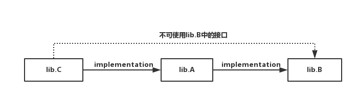

# Android Plugin for Gradle 3.0.0

## 更新插件

需要更新 gradle 到 4.1

```java
distributionUrl=\
  https\://services.gradle.org/distributions/gradle-4.1-all.zip
```

更新插件到 3.0.0

```gradle
buildscript {
    dependencies {
		classpath 'com.android.tools.build:gradle:3.0.0'
    }
}
```

## 如何升级 plugin

#### 升级 buildToolsVersion 为 26.0.3

plugin 3.0.0需要的最低 buildToolsVersion 为 26.0.3


#### 定义flavorDimensions

多渠道打包必须声明 flavorDimendions
```gradle
android {
        // 多渠道打包必须声明 flavorDimendions
        flavorDimensions "default"
    }
```

####  显式声明支持注解

```gradle
android {
    defaultConfig{
		javaCompileOptions {
            // 显式声明支持注解
            annotationProcessorOptions {
                includeCompileClasspath false
            }
        }
    }
}
```

#### 去掉 android-apt依赖

android plugin 3.0.0 不支持 android-apt ，因此、

 - 要去掉  `com.neenbedankt.gradle.plugins:android-apt:1.8`

 - 去掉 `apply plugin: 'com.neenbedankt.android-apt'`

 - 将 `apt "com.google.dagger:dagger-compiler:2.0" `改为  `annotationProcessor "com.google.dagger:dagger-compiler:2.0"`

#### 关闭 aapt2

android plugin 3.0.0 会默认使用aapt2 ， 由于aapt2与aapt相比有很多api变化 （详情参考下文） ，所以需要关闭 aapt2

在 gradle.properties中声明
```gradle
android.enableAapt2=false
```

#### 开启databinding

如果有使用 databinding ，那需要手动开启
```gradle
android {
	dataBinding {
        enabled = true
    }
}
```

#### 升级 sonarqube-gradle-plugin

升级 sonarqube-gradle-plugin 为 2.6

```gradle
    dependencies {
        classpath "org.sonarsource.scanner.gradle:sonarqube-gradle-plugin:2.6"
    }
```

#### 修改依赖配置

dependencies 中的 compile 将在下一个 android gradle plugin版本中废弃 ， 取而代之的是 `implementation`  和`api`

 - implementation ： 引用的 lib 不会对外暴露自己的接口 ， 当`ib.A `implementation `lib.B`，`lib.C` implementation `lib.A` 的时候，如果`lib.B`发生了改变，那么只有`lib.A`会重新编译，`lib.C`将不会编译

    

 - api ： 与 compile 功能相同


## gradle plugin 3.0 新特性

### 使用可感知变体的依赖管理

3.0 及之后的版本包含一个新的依赖机制 -- 当时用一个 library时会自动匹配变体(variants) ，这意味着 一个应用的 debug 变体会自动使用debug的library ， 应用的 `freeDebug` 会使用 freeDebug 类型的库

为了准确地匹配应用的 变体`variants` ， 我们必须要为所有的 产品渠道 指明 渠道维度

#### 声明flavor维度

android plugin 3.0.0 需要所有的flavor 属于一个被命名的 [flavor dimension](https://developer.android.google.cn/studio/build/build-variants.html#flavor-dimensions) 即使你只想使用一种样式 ， 如果没有配置的话会出现这个错误：

```
Error:All flavors must now belong to a named flavor dimension.
The flavor 'flavor_name' is not assigned to a flavor dimension.
```

为了解决这个问题，首先需要使用 `flavorDimensions` 定义一个或者多个样式 ，

```gradle
// Specifies two flavor dimensions.
flavorDimensions "tier", "minApi"

productFlavors {
	// 免费类型
    free {
      // Assigns this product flavor to the "tier" flavor dimension. Specifying
      // this property is optional if you are using only one dimension.
      dimension "tier"
      ...
    }
	// 付费类型
    paid {
      dimension "tier"
      ...
    }
	// 支持最低版本23
    minApi23 {
        dimension "minApi"
        ...
    }
	// 支持最低版本18
    minApi18 {
        dimension "minApi"
        ...
    }
}
```

#### 解决依赖匹配相关的构建错误

假设你的app 配置了一个构建类型为 “staging” ，但是它的依赖库没一个存在的，当插件尝试去编译你的 “staging“ 版本的app时，它不知道使用哪一个库，回报出下面的错误

```
Error:Failed to resolve: Could not resolve project :mylibrary.
Required by:
    project :app
```

下面是一些与变体感知依赖关系匹配相关的一些错误

 - **你的应用包含了一个构建类型， 但是依赖的库并不存在**

 你的应用包含了一个 “staging的构建类型” ，但是依赖中只有 “debug” 和 “release“ 这两种构建类型

 使用 <font color = "green">matchingFallbacks</font> 为已给的编译类型指定可以替代的选择
 ```gradle
 android {
    buildTypes {
        debug {}
        release {}
        staging {
            // 使用 matchingFallbacks 来设置可以替换的库
            matchingFallbacks = ['debug', 'qa', 'release']
        }
    }
 }
```

 - **你的app包含 flavors 但是它的依赖库却没有 **

   对于一种给定的 <font color = "graeen">flavorDimensions </font> 应该存在于app 和它的依赖库中

   比如 ， 你的 app 和 它的依赖库都有一个 flavorDimensions -- “tier” ，dimension “tier” 在app中包括 “free“ 和 ”paid“ 两种flavor，但是对于同一种 dimension 在一个依赖中只包括 ”demo“ 和 ”paid“

  使用 <font color = "green">matchingFallbacks</font> 为 app的 “free” flavor 指定可以替代的选择
```gradle
android {
    defaultConfig{
    // Do not configure matchingFallbacks in the defaultConfig block.
    // Instead, you must specify fallbacks for a given product flavor in the
    // productFlavors block, as shown below.
    }
    flavorDimensions 'tier'
    productFlavors {
        paid {
            dimension 'tier'
            // Because the dependency already includes a "paid" flavor in its
            // "tier" dimension, you don't need to provide a list of fallbacks
            // for the "paid" flavor.
        }
        free {
            dimension 'tier'
            // Specifies a sorted list of fallback flavors that the plugin
            // should try to use when a dependency's matching dimension does
            // not include a "free" flavor. You may specify as many
            // fallbacks as you like, and the plugin selects the first flavor
            // that's available in the dependency's "tier" dimension.
            matchingFallbacks = ['demo', 'trial']
        }
    }
}
```

 - ** 一个依赖库包含的 flavor dimension ，你的app中却没有 **

    比如 ，一个依赖库包含 flavor dimension -- “minApi” ，但是你的app中的 flavor dimension 只有 “tier” ， 因此当你编译 “freeDebug” 版本时 ， gradle插件不知道使用 “minApi23Debug” 还是“minApi18Debug”版本的依赖库

    在 defaultConfig中使用 <font color = "green">missingDimensionStrategy </font> 指定默认的 flavor
```gradle
android {
    defaultConfig{
    // Specifies a sorted list of flavors that the plugin should try to use from
    // a given dimension. The following tells the plugin that, when encountering
    // a dependency that includes a "minApi" dimension, it should select the
    // "minApi18" flavor. You can include additional flavor names to provide a
    // sorted list of fallbacks for the dimension.
    missingDimensionStrategy 'minApi', 'minApi18', 'minApi23'
    // You should specify a missingDimensionStrategy property for each
    // dimension that exists in a local dependency but not in your app.
    missingDimensionStrategy 'abi', 'x86', 'arm64'
    }
    flavorDimensions 'tier'
    productFlavors {
        free {
            dimension 'tier'
            // You can override the default selection at the product flavor
            // level by configuring another missingDimensionStrategy property
            // for the "minApi" dimension.
            missingDimensionStrategy 'minApi', 'minApi23', 'minApi18'
        }
        paid {}
    }
}
```

#### 为本地的module迁移依赖配置

```console
Error:Unable to resolve dependency for ':app@debug/compileClasspath':
  Could not resolve project :library.
Error:Unable to resolve dependency for ':app@release/compileClasspath':
  Could not resolve project :library.
```

应替换你的依赖配置

```gradle
dependencies {
    // 这些老方法不在为本地module工作
    // debugImplementation project(path: ':library', configuration: 'debug')
    // releaseImplementation project(path: ':library', configuration: 'release')

    // 应该使用这种方式
    implementation project(':library')

    // 保留对于外部依赖的使用 ， 只是不再支持本地Module的这种使用方式
    debugImplementation 'com.example.android:app-magic:12.3'
}
```


### 使用新的依赖配置

gradle 3.4 推出了 [ Java Library plugin configurations](https://docs.gradle.org/current/userguide/java_library_plugin.html#sec:java_library_configurations_graph) ，它允许我们控制依赖的库是编译时使用还是运行时使用 ， android plugin 3.0 采用了这个机制，迁移一些大的项目来使用这个机制 发现可以大幅减少构建时间

|New configuration | Deprecated configuration |  Behavior |
| ----|----|----|
|implementation| compile| 当你的模块配置一个`implementation` 依赖项时，它会让Gradle知道这个模块在编译的时候不需要把依赖项泄露给其他模块。也就是说，只有在运行时，依赖才可用于其他模块。使用这种依赖配置代替 api或compile可以显着改进构建时间，因为它减少了构建需要重新编译的项目的数量。例如，如果一个 implementation 依赖关系改变了它的API，Gradle只重新编译这个依赖项以及直接依赖它的模块。大多数应用程序和测试模块应使用此配置。 |
|api| compile|  当一个模块包含api依赖关系时，它会让Gradle知道模块想要将该依赖关系可传递地导出到其他模块，以便在运行时和编译时使用它们。这个配置的行为就像compile（现在已经被弃用了），你通常应该只在库模块中使用它。这是因为，如果api依赖项更改了外部API，Gradle会在编译时重新编译所有有权访问该依赖项的模块。所以，拥有大量的api依赖可以大大增加构建时间。除非你想将一个依赖的API暴露给一个单独的测试模块，implementation 依赖。 |
|compileOnly| provided|Gradle仅将编译类路径添加到编译类路径（它不会被添加到编译输出）。这在创建Android库模块时非常有用，并且在编译期间需要依赖项，但是在运行时存在则是可选的。也就是说，如果你使用这个配置，那么你的库模块必须包含一个运行时条件来检查依赖是否可用，然后适当地改变它的行为，所以如果没有提供，它仍然可以运行。这有助于减少最终APK的大小，而不会增加不重要的瞬态依赖关系。这个配置的行为就像provided（现在已被弃用）。  |
|runtimeOnly| apk| Gradle将依赖关系添加到构建输出中，以便在运行时使用。也就是说，它不会被添加到编译类路径中。这个配置的行为就像 apk（现在已被弃用）。  |

与[以前版本的Android插件的依赖配置类似](https://developer.android.google.cn/studio/build/dependencies.html#library_dependency_configurations) ，以上配置可用于风格或构建类型特定的依赖关系。例如，您可以使用它`implementation`来使所有变体都可用，或者可以`debugImplementation`使其仅用于模块的debug 变体。

> **Note** ： compile 、provided 和 apk 现在依然可以用，但是会在下一个版本中移除

#### 发布依赖


#### 迁移自定义依赖关系解决策略

插件使用下面两种配置来解决一个变体的所有依赖

 - <font color="purpers">variant_name</font>CompileClasspath (_<font color="purpers">variant_name</font>Compile **no longer works**)

 - <font color="purpers">variant_name</font>RuntimeClasspath (_<font color="purpers">variant_name</font>Apk  **no longer works**)

如果你继续使用旧的配置 ， 会出现这样的错误

```
Error:Configuration with old name _debugCompile found.
Use new name debugCompileClasspath instead.
```


```gradle
// Previously, you had to apply a custom resolution strategy during the
// configuration phase, rather than in the execution phase. That's
// because, by the time the variant was created and the Variant API was
// called, the dependencies were already resolved.
// But now these configurations DO NOT WORK with the 3.0.0 Gradle plugin:
// configurations {
//     _debugCompile
//     _debugApk
// }
//
// configurations._debugCompile.resolutionStrategy {
//     ...
// }
//
// configurations.all {
//     resolutionStrategy {
//     ...
//     }
// }

// Instead, because the new build model delays dependency resolution, you
// should query and modify the resolution strategy using the Variant API:
android {
    applicationVariants.all { variant ->
        variant.getCompileConfiguration().resolutionStrategy {
            ...
        }
        variant.runtimeConfiguration.resolutionStrategy {
            ...
        }
        variant.getAnnotationProcessorConfiguration().resolutionStrategy {
            ...
        }
    }
}

```

#### 从测试配置中排除 app的依赖

在以前的版本中，你可以使用 `execlude` 关键字来从tests中排除app中的一些依赖 ， 随着新的依赖配置出现，下面的方法不再被使用
```gradle
dependencies {
    implementation "com.jakewharton.threetenabp:threetenabp:1.0.5"
    // Note: You can still use the exclude keyword to omit certain artifacts of
    // dependencies you add only to your test configurations.
    androidTestImplementation("org.threeten:threetenbp:1.3.3") {
        exclude group: 'com.jakewharton.threetenabp', module: 'threetenabp'
    }
}
```

这是因为 `androidTestImplementation` 和 `androidTestApi` 延伸了 module的 `implementation` 和 `api` 配置，也就是说 ， 当gradle 分析配置时，他们继承了 `implementation` 和 `api` ， 为了排除依赖应该这么做：
```gradle
android.testVariants.all { variant ->
    variant.getCompileConfiguration().exclude group: 'com.jakewharton.threetenabp', module: 'threetenabp'
    variant.getRuntimeConfiguration().exclude group: 'com.jakewharton.threetenabp', module: 'threetenabp'
}
```

## API 变更

#### 修改变体输出 在编译期可能没有效果

使用 Variants API 来操作变体输出被新的插件打破， 他仍旧为一些简单的任务工作，比如在构建时期改变 apk的名称

```gradle
android.applicationVariants.all { variant ->
    variant.outputs.all {
        outputFileName = "${variant.name}-${variant.versionName}.apk"
    }
}
```

更多复杂的任务涉及 `outputFile` 都不在工作，这是因为变体专用的任务不再在配置阶段被创建，配置阶段插件就不会知道所有的输出，也意味着配置阶段会更加快


#### manifestOutputFile 不再可用

`processManifest.manifestOutputFile()` 这个方法不再可用， 当你调用时会出现下面的错误

```
A problem occurred configuring project ':myapp'.
   Could not get unknown property 'manifestOutputFile' for task ':myapp:processDebugManifest'
   of type com.android.build.gradle.tasks.ProcessManifest.
```

替换 `manifestOutputFile()` 去为每个变体获取 manifest文件的是 `processManifest.manifestOutputDirectory()` ， 它会返回 包含所有生成的manifest文件的目录路径

```gradle
android.applicationVariants.all { variant ->
    variant.outputs.all { output ->
        output.processManifest.doLast {
            // Stores the path to the maifest.
            String manifestPath = "$manifestOutputDirectory/AndroidManifest.xml"
            // Stores the contents of the manifest.
            def manifestContent = file(manifestPath).getText()
            // Changes the version code in the stored text.
            manifestContent = manifestContent.replace('android:versionCode="1"',
                    String.format('android:versionCode="%s"', generatedCode))
            // Overwrites the manifest with the new text.
            file(manifestPath).write(manifestContent)
        }
    }
}
```

#### 使用 annotation processor 依赖配置

在以前的版本， 在compile classpath上的依赖会自动被添加到处理器的classpath， 也就是说，你可以给 compile classpath 中添加一个 annotation processor 并且它会如愿的工作， 但是在processor中添加一些大的但不是必要的的依赖是会影响性能的

当我们使用android gradle plugin 3.0.0时，你必须使用`annotation processor`依赖配置 在 processors classpath 中添加 annotation processor
```gradle
dependencies {
    ...
    annotationProcessor 'com.google.dagger:dagger-compiler:<version-number>'
}
```

如果一个依赖的JAR文件包含 `META-INF/services/javax.annotation.processing.Processor` 那么插件会认定这个依赖是一个 annotation processor 。 如果插件在 compile classpath中检测到 annotation processor ， 你的构建会失败并且你会得到一个错误信息显示 compile classpath 中所有的 annotation processor ， 为了解决这个错误，只是使用 `annotationProcessor` 来改变这些依赖的配置 。 如果一个依赖包含的组件需要在 compile classpath ， 使用 `compile`依赖配置 第二次声明这个依赖

> **android-apt plugin：**  plugin3.0.0不支持 android-apt

#### 使 annotation processor 不进行错误检查

如果你有在 compile classpath上的依赖 ，并且这些依赖包含你不需要的 annotation processor ， 你可以通过在 build.gradle这个文件里添加下面的内容来取消错误检查 。记住 ， 你添加到 compile classpath中的 annotation processor 依旧不会添加到 processor classpath
```gradle
android {
    ...
    defaultConfig {
        ...
        javaCompileOptions {
            annotationProcessorOptions {
                includeCompileClasspath false
            }
        }
    }
}

```

#### 使用分开的测试模块

分离test modules 现在是变体可感知的 ， 这意味着确定 `targetVariant` 不再必要

在test module中的每一个变体都会在目标工程中尝试测试一个匹配的变体 ， 默认情况下，test module 仅仅包含一个 debug 变体，但是你可以通过创建新的构建类型和新的风格去创建新的变体来匹配被测试的工程 。 `connectCheck` 任务为每一个变体创建

为了使test modules 只测试一个不同的构建类型，并且不只是 debug 类型， 使用 `VariantFilter` 来使 debug变体在测试工程中不再有用
```gradle
android {
    variantFilter { variant ->
        if (variant.buildType.name.equals('debug')) {
            variant.setIgnore(true);
        }
    }
}
```

如果你想要一个测试module指向一个app确定的风格或者类型 ， 你可以使用 `matchingFallbacks` 属性去指向你想测试的变体

#### 本地JAR是可以传递的

android gradle plugin 3.0.0 及之后版本使用新的gradle API， 允许使用工程区查看本地的JAR作为定期传递的依赖，类似于maven协调基础的依赖 ， 为了适应新的gradle API ， 插件在如何处理本地JAR文件的方面做了改变

**项目内发布 **

 - library module 不再处理本地JAR

 - 在library module 上转换现在仅仅只会影响 PROJECT 范围 ， 使用 `PROJECT_LOCAL_DEPS` 会失败， 因为这个范围已经被废弃

 - 对 本地JAR是 EXTERNAL流一部分的 app module来说， ·PROJECT_LOCAL_DEPS  和SUB_PROJECT_LOCAL_DEPS·流现在总是空的

 - 对本地库开启混淆不再影响库里面的代码， 你应该在使用 library的 app module中使用混淆功能

 - 早先 library module 和 它的本地JAR依赖之间的 java resource冲突已经在library module中被解决 ， 因为 本地JAR不再被library module处理， 你必须在使用这个library的app module中解决这个冲突

**发布到Maven**

关于发布到maven 仓库中的本地JAR没有任何改变 ， 本地JAR被打包并且 他们的 non-class resources 已经被合并到 AAR中主JAR中。 如果module开启了混淆，那么所有的JAR会被合并到主JAR文件中

#### 使用 AAPT2 的行为改变

为了提高增量资源处理 ， android gradle plugin 3.0.0 默认使用 AAPT2 。下面介绍在使用中会感觉到一些改变

 - manifest中的元素层次结构
```xml
<manifest xmlns:android="http://schemas.android.com/apk/res/android"
   package="com.example.myname.myapplication">
   <application
       ...
       <activity android:name=".MainActivity">
           <intent-filter>
               <action android:name="android.intent.action.MAIN" />
               <category android:name="android.intent.category.LAUNCHER" />
           </intent-filter>
           <action android:name="android.intent.action.CUSTOM" />
       </activity>
   </application>
</manifest>
```
在以前的版本是不是报错的，只是一个 warning提示， 但是在 AAPT2 中你会发现下面这个错误

	`AndroidManifest.xml:15: error: unknown element <action> found.`

	为了解决这个错误，请查看 [Manifest file structure](https://developer.android.google.cn/guide/topics/manifest/manifest-intro.html#filestruct)

 - resources 的声明

  你可以不用在 resource的 `name`属性中表明 资源的类型
  ```xml
  <style name="foo" parent="bar">
    <item name="attr/my_attr">@color/pink</item>
  </style>
  ```
这样定义资源的属性会出现这样的错误

	`Error: style attribute 'attr/attr/my_attr (aka my.package:attr/attr/my_attr)' not found.`

	为了解决这个错误， 可以这么做
```xml
    <style name="foo" parent="bar">
      <item type="attr" name="my_attr">@color/pink</item>
    </style>
```
	另外当我们声明一个 style 属性时， 它的parent也必须是这个style的资源类型 ， 否则会出现下面这个错误

	`Error: (...) invalid resource type 'attr' for parent of style`

 - ForegroundLinearLayout 的命名空间

    `ForegroundLinearLayout` 包含三个属性： `foregroundInsidePadding`， `android:foreground`， ` android:foregroundGravity` ， foregroundInsidePadding 已经不再被包含了

    在以前的版本当你定义这个属性时，编辑器会忽略它 ， 当使用 AAPT2 ， 编辑器会报错

    `Error: (...) resource android:attr/foregroundInsidePadding is private`

	使用  ` android:foregroundInsidePadding` 来替换 ` foregroundInsidePadding` 就可以解决这个问题

 - 不正确使用 资源引用符号 @

	当你省略 @ 或者将 @放在错误的未知 ，  AAPT2 现在会抛出编译错误
    ```xml
    <style name="AppTheme" parent="Theme.AppCompat.Light.DarkActionBar">
      ...
      <!-- Note the missing '@' symbol when specifying the resource type. -->
      <item name="colorPrimary">color/colorPrimary</item>
    </style>
    ```
    AAPT2 会抛出如下错误 ：

    `ERROR: expected color but got (raw string) color/colorPrimary`

	另外，当你从android的 namespace 获取一个资源时， 如果错误的包含了这个符号 @ ，那么会出现这个错误：
    ```xml
        ...
    <!-- When referencing resources from the 'android' namespace, omit the '@' symbol. -->
    <item name="@android:windowEnterAnimation"/>
    ```
	AAPT2 会抛出如下错误：

	`Error: style attribute '@android:attr/windowEnterAnimation' not found`

