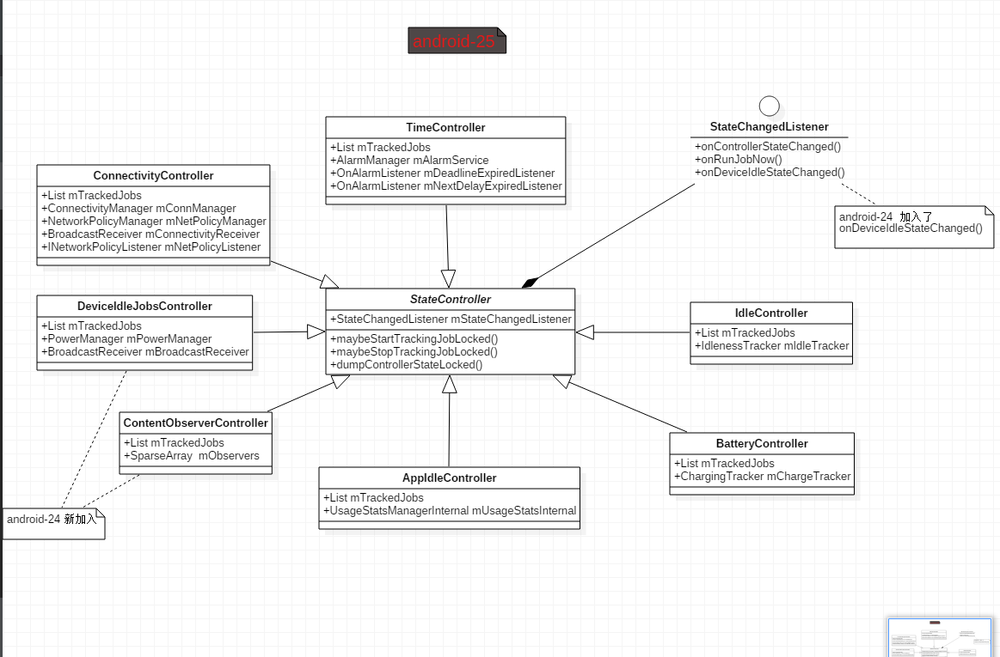
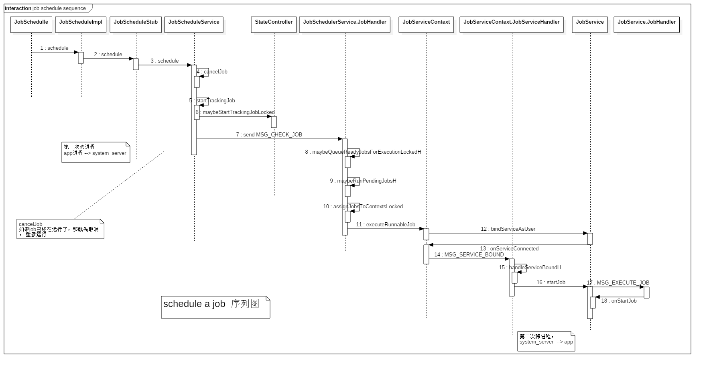

# JobScheduler

##  api 介绍

#### 使用场景

<code>Job Scheduling API 允许您通过将作业推迟到稍后或指定条件下（如设备充电或连入 WLAN 时）运行来优化电池寿命</code>

这时官方给出的解释，JobSchedule能在指定条件下进行作业从而达到优化电池寿命的目的

#### 相关 API

 - [JobService](https://developer.android.com/reference/android/app/job/JobService.html) , 抽象类，

 - [JobScheduler](https://developer.android.com/reference/android/app/job/JobScheduler.html)， 抽象类

 - [JobParameters](https://developer.android.com/reference/android/app/job/JobParameters.html) ， 包含了用来识别、配置Job的参数，由系统返回，不由我们创建

 - [JobInfo](https://developer.android.com/reference/android/app/job/JobInfo.html)， 传递到 JobScheduler 的数据的容器，由我们自己创建

 - JobSchedulerService , 实现 JobScheduler 的系统服务

#### sdk版本

由于 JobSchedule 是 API21 才引入的， 因此最低版本就是 API 21


#### 权限

在 Manifest中声明 JobService时，需加入权限 <code>android:permission="android.permission.BIND_JOB_SERVICE"</code>

```xml
<service android:name=".MyJobService"
            android:permission="android.permission.BIND_JOB_SERVICE" />
```


## 如何使用

##### 创建Job -- JobInfo对象

JobInfo ， job 何时应该运行的限制， 例如只在wifi情况下， 设备在被插入的情况下

使用 <code>JobInfo.Builder</code> 来创建 <code>JobInfo</code>

```java
JobInfo job = new JobInfo.Builder(JOB_ID, new ComponentName(this, MyJobService.class))
   .setRequiredNetworkType(JobInfo.NETWORK_TYPE_UNMETERED) // 设置需要的网络类型， 非计费网络（wifi网络下）
   .setRequiresCharging(true)
   .setOverrideDeadline(3600000) //一小时之后无论如何会被执行
   .build();
```
 - <code>JOB_ID</code> ， JobInfo 需要一个 Id(integer)

 - <code>service component</code> ， new ComponentName(this, MyJobService.class);

 - 设置一些限制
 	-  <code>setRequiredNetworkType(JobInfo.NETWORK_TYPE_UNMETERED)</code> ， JobInfo.NETWORK_TYPE_ANY ，有网络连接时触发
 	-  <code>setRequiresDeviceIdle(true/*false*/);</code>       空闲状态触发
 	-  <code>setRequiresCharging(true/*false*/);</code>       手机是否处于充电状态
 	-  <code>setMinimumLatency(time); </code>  满足触发条件也要延时time 豪秒之后再触发 , 不可与setPeriodic(long time)同时使用
 	-  <code>setOverrideDeadline(time)</code>  设置time豪秒之后，如果没有任何触发也执行
 	-  <code>setPeriodic(time)</code>          设置循环触发，否则触发一次就结束了，这样可以间隔time豪秒之后，还是可以触发
 	-  <code>setPersisted(true/*false*/);</code>  设置触发条件是否重启手机后仍有效
 	-  <code>setRequiresCharging(true);</code>    设置在设备充电时执行
 	-  <code>setExtras(PersistableBundle extra)</code>    设置startJob时，带有Bundle

##### 调度作业 -- Scheduling a job

```java
JobScheduler jobScheduler = (JobScheduler) getSystemService(Context.JOB_SCHEDULER_SERVICE);
jobScheduler.schedule(job);
```

##### 创建JobService

需要在 Manifest.xml 中声明
```xml
<application ...>
...
 <service
 android:name="com.catinean.jobschedulerexample.MyJobService"
 android:permission="android.permission.BIND_JOB_SERVICE"
 android:exported="true" />
...
</application>
```

JobService是一个抽象类，需要我们实现的只有两个方法 onStartJob()， onStopJob() ，都是 JobScheduler 的回调

```java
public class MyJobService extends JobService {
    @Override
    public boolean onStartJob(JobParameters params) {
        return false;
    }

    @Override
    public boolean onStopJob(JobParameters params) {
        return false;
    }
}
```

 - onStartJob() ， job开始时调用 ， 如果返回false则表示这个Job已经被执行完毕。如果true则表示这个Job正在被执行。
 	- 对于一个瞬间能够完成的任务，此处可以 return false.
 	- 如果是耗时任务，则需要在异步线程中执行,并且 return true，执行完之后需要手动执行 jobFinished

 - onStopJob()  ， Job执行停止调用，当接收到任务取消时，如果该任务没有被结束，则执行该方法，否则不执行

## 源码分析

### JobScheduleService 启动过程

<code>SystemServer.java</code>
```java
private void startOtherServices() {
	mSystemServiceManager.startService(JobSchedulerService.class);
}
```

#### JobSchedulerService

```java
    public JobSchedulerService(Context context) {
        super(context);
        // 创建主线程的Looper
        mHandler = new JobHandler(context.getMainLooper());
        // 创建一个content observer
        mConstants = new Constants(mHandler);
        // 创建 服务
        mJobSchedulerStub = new JobSchedulerStub();
        // JobStore 初始化
        mJobs = JobStore.initAndGet(this);

        // Create the controllers.
        mControllers = new ArrayList<StateController>();
        mControllers.add(ConnectivityController.get(this));
        mControllers.add(TimeController.get(this));
        mControllers.add(IdleController.get(this));
        mControllers.add(BatteryController.get(this));
        mControllers.add(AppIdleController.get(this));
        mControllers.add(ContentObserverController.get(this));
        mControllers.add(DeviceIdleJobsController.get(this));
    }
	@Override
    public void onStart() {
        publishLocalService(JobSchedulerInternal.class, new LocalService());
        publishBinderService(Context.JOB_SCHEDULER_SERVICE, mJobSchedulerStub);
    }
```
这里创建了 7个不同的 <code>StateController</code>

|  type    |    describle      |
|--|--|
|   ConnectivityController   |   注册监听网络连接状态的广播         |
|TimeController|注册监听job时间到期的广播 |
|IdleController|注册监听屏幕亮/灭,dream进入/退出,状态改变的广播 |
|BatteryController|注册监听电池是否充电,电量状态的广播  |
|AppIdleController|   监听app是否空闲   |
|ContentObserverController| 监听 URI内容的变化    |
|DeviceIdleJobsController |   监听设备是否空闲     |



以 **ConnectivityController** 为例 ，看看 StateController 的创建

#### ConnectivityController
<code> com.android.server.job.controllers.ConnectivityController</code>
```java
  public static ConnectivityController get(JobSchedulerService jms) {
        synchronized (sCreationLock) {
            if (mSingleton == null) {
                mSingleton = new ConnectivityController(jms, jms.getContext(), jms.getLock());
            }
            return mSingleton;
        }
    }

    private ConnectivityController(StateChangedListener stateChangedListener, Context context,
            Object lock) {
        super(stateChangedListener, context, lock);
		// 获取 ConnectivityManager
        mConnManager = mContext.getSystemService(ConnectivityManager.class);
        // 获取 NetworkPolicyManager
        mNetPolicyManager = mContext.getSystemService(NetworkPolicyManager.class);
		// 注册网络连接广播
        final IntentFilter intentFilter = new IntentFilter(ConnectivityManager.CONNECTIVITY_ACTION);
        mContext.registerReceiverAsUser(
                mConnectivityReceiver, UserHandle.SYSTEM, intentFilter, null, null);
		// 注册 网络策略管理监听
        mNetPolicyManager.registerListener(mNetPolicyListener);
    }
```
在 android-23 ，没有 <code>mNetPolicyManager.registerListener(mNetPolicyListener)</code> 监听器 ，只有注册了一个网络连接的广播接收器

#### JobHandler


```java
private class JobHandler extends Handler {
    public JobHandler(Looper looper) {
        super(looper);
    }
    @Override
    public void handleMessage(Message message) {
        synchronized (mLock) {
            //当系统启动到phase 600，则mReadyToRock=true.
            if (!mReadyToRock) {
                return;
            }
        }
        switch (message.what) {
            case MSG_JOB_EXPIRED:
            case MSG_CHECK_JOB:
            case MSG_CHECK_JOB_GREEDY:
            case MSG_STOP_JOB:
        }
        maybeRunPendingJobsH();
        // Don't remove JOB_EXPIRED in case one came along while processing the queue.
        removeMessages(MSG_CHECK_JOB);
    }
}
```
JobHandler 采用的是 system_server 进程的主线程 Looper，也就是该过程运行在主线程

#### Constants

保存一些全局设置 ， 实现 ContentObserver ， 监听 Uri 的变化
```java
private final class Constants extends ContentObserver {
	public Constants(Handler handler) {
        super(handler);
    }
}
```

#### JobSchedulerStub
JobSchedulerStub 为实现 IJobScheduler 接口的服务端
```java
final class JobSchedulerStub extends IJobScheduler.Stub {

	@Override
	public int schedule(JobInfo job) throws RemoteException {
    	return JobSchedulerService.this.schedule(job, uid);
    }

    @Override
    public int scheduleAsPackage(JobInfo job, String packageName, int userId, String tag)
           throws RemoteException {
    	return JobSchedulerService.this.scheduleAsPackage(job, callerUid,
                        packageName, userId, tag);
    }

    @Override
    public List<JobInfo> getAllPendingJobs() throws RemoteException {
    	return JobSchedulerService.this.getPendingJobs(uid);
    }

    @Override
	public JobInfo getPendingJob(int jobId) throws RemoteException {
    	return JobSchedulerService.this.getPendingJob(uid, jobId);
    }

    @Override
	public void cancelAll() throws RemoteException {
    	JobSchedulerService.this.cancelJobsForUid(uid, true);
	}

    @Override
    public void cancel(int jobId) throws RemoteException {
    	JobSchedulerService.this.cancelJob(uid, jobId);
    }

    @Override
    public void dump(FileDescriptor fd, PrintWriter pw, String[] args) {
    	JobSchedulerService.this.dumpInternal(pw, args);
    }
}
```

#### JobStore.initAndGet

```java
static JobStore initAndGet(JobSchedulerService jobManagerService) {
    synchronized (sSingletonLock) {
        if (sSingleton == null) {
            sSingleton = new JobStore(jobManagerService.getContext(),
            jobManagerService.getLock(), Environment.getDataDirectory());
        }
        return sSingleton;
    }
}
```


#### 创建 JobStore

该方法会创建 job目录 以及 jobs.xml 文件, 以及从文件中读取所有的 JobStatus
```java
public class JobStore {
	/** Handler backed by IoThread for writing to disk. */
    private final Handler mIoHandler = IoThread.getHandler();
	private JobStore(Context context, Object lock, File dataDir) {
        mLock = lock;
        mContext = context;
        mDirtyOperations = 0;

        File systemDir = new File(dataDir, "system");
        File jobDir = new File(systemDir, "job");
        jobDir.mkdirs();
        // 创建/data/system/job/jobs.xml
        mJobsFile = new AtomicFile(new File(jobDir, "jobs.xml"));
        mJobSet = new JobSet();
        readJobMapFromDisk(mJobSet);
    }
}
```

 - readJobMapFromDisk -- ReadJobMapFromDiskRunnable ，<code>JobStore.java</code> ， 从  /data/system/job/jobs.xml 中读取 Job
```java
    private class ReadJobMapFromDiskRunnable implements Runnable {
        private final JobSet jobSet;
        ReadJobMapFromDiskRunnable(JobSet jobSet) {
            this.jobSet = jobSet;
        }
        @Override
        public void run() {
            try {
                List<JobStatus> jobs;
                FileInputStream fis = mJobsFile.openRead();
                synchronized (mLock) {
                    // 创建 JobStatus ， 并 加入 ReadJobMapFromDiskRunnable.jobSet
                    jobs = readJobMapImpl(fis);
                    if (jobs != null) {
                        for (int i = 0; i < jobs.size(); i++) {
                            this.jobSet.add(jobs.get(i));
                        }
                    }
                }
                fis.close();
            } catch (FileNotFoundException e) {
            ...
        }
    }
```

 - readJobMapImpl ， <code>JobStore.java</code> ，创建 JobStatus ， 并 加入 ReadJobMapFromDiskRunnable.jobSet
```java
	private List<JobStatus> readJobMapImpl(FileInputStream fis)
            throws XmlPullParserException, IOException {
        XmlPullParser parser = Xml.newPullParser();
        parser.setInput(fis, StandardCharsets.UTF_8.name());

        int eventType = parser.getEventType();
        String tagName = parser.getName();
        ... 
		 eventType = parser.next();
         do {
            // Read each <job/>
            if (eventType == XmlPullParser.START_TAG) {
                tagName = parser.getName();
                // 开始读取 Job信息
                if ("job".equals(tagName)) {
                    // 创建 JobStatus
                    JobStatus persistedJob = restoreJobFromXml(parser);
                    if (persistedJob != null) {
                        jobs.add(persistedJob);
                    } else {
                        Slog.d(TAG, "Error reading job from file.");
                    }
                }
            }
            eventType = parser.next();
        } while (eventType != XmlPullParser.END_DOCUMENT);
            return jobs;
        }
        return null;
    }
```

 - restoreJobFromXml ， 根据xml中的信息  创建JobStatus ， JobStatus对象记录着任务的jobId, ComponentName, uid以及标签和失败次数信息
```java
private JobStatus restoreJobFromXml(XmlPullParser parser) throws XmlPullParserException,
            IOException {
        JobInfo.Builder jobBuilder;
        int uid, sourceUserId;
        // 读取 Job的属性
        jobBuilder = buildBuilderFromXml(parser);
        jobBuilder.setPersisted(true);
		...
        // 正式生成 JobStatus
        JobStatus js = new JobStatus(
                jobBuilder.build(), uid, sourcePackageName, sourceUserId, sourceTag,
                elapsedRuntimes.first, elapsedRuntimes.second);
        return js;
    }
```

 - buildBuilderFromXml ， 创建 JobInfo
```java
	private JobInfo.Builder buildBuilderFromXml(XmlPullParser parser) throws NumberFormatException {
            // Pull out required fields from <job> attributes.
            int jobId = Integer.parseInt(parser.getAttributeValue(null, "jobid"));
            String packageName = parser.getAttributeValue(null, "package");
            String className = parser.getAttributeValue(null, "class");
            ComponentName cname = new ComponentName(packageName, className);
            // 创建JobInfo
            return new JobInfo.Builder(jobId, cname);
        }
```

JobStore 主要做了这么几件事
1、创建job目录， <code>/data/system/job/jobs.xml</code>
2、从Job目录中读取所有的Job信息，包括 创建 JobInfo ， 创建 JobStatus ， 将读取到的 JobStatus 加入到 JobSet中

回到 JobSchedulerService 继续看 JSS 的启动过程

#### JSS.onBootPhase

```java
	public void onBootPhase(int phase) {
        if (PHASE_SYSTEM_SERVICES_READY == phase) {
            // 注册ContentResolver监听
            mConstants.start(getContext().getContentResolver());
            // 注册广播和user移除的广播监听
            final IntentFilter filter = new IntentFilter();
            filter.addAction(Intent.ACTION_PACKAGE_REMOVED);
            filter.addAction(Intent.ACTION_PACKAGE_CHANGED);
            filter.addAction(Intent.ACTION_PACKAGE_RESTARTED);
            filter.addAction(Intent.ACTION_QUERY_PACKAGE_RESTART);
            filter.addDataScheme("package");
            getContext().registerReceiverAsUser(
                    mBroadcastReceiver, UserHandle.ALL, filter, null, null);
            final IntentFilter userFilter = new IntentFilter(Intent.ACTION_USER_REMOVED);
            getContext().registerReceiverAsUser(
                    mBroadcastReceiver, UserHandle.ALL, userFilter, null, null);
            mPowerManager = (PowerManager)getContext().getSystemService(Context.POWER_SERVICE);
            try {
                ActivityManagerNative.getDefault().registerUidObserver(mUidObserver,
                        ActivityManager.UID_OBSERVER_PROCSTATE | ActivityManager.UID_OBSERVER_GONE
                                | ActivityManager.UID_OBSERVER_IDLE);
            } catch (RemoteException e) {
                // ignored; both services live in system_server
            }
        } else if (phase == PHASE_THIRD_PARTY_APPS_CAN_START) {
            synchronized (mLock) {
                // Let's go!
                mReadyToRock = true;
                // 获取电源服务
                mBatteryStats = IBatteryStats.Stub.asInterface(ServiceManager.getService(
                        BatteryStats.SERVICE_NAME));
                // 获取 设备空闲服务
                mLocalDeviceIdleController
                        = LocalServices.getService(DeviceIdleController.LocalService.class);
                //创建 JobServiceContext
                for (int i = 0; i < MAX_JOB_CONTEXTS_COUNT; i++) {
                    mActiveServices.add(
                            new JobServiceContext(this, mBatteryStats, mJobPackageTracker,
                                    getContext().getMainLooper()));
                   // getContext().getMainLooper() --- > 可以得出 JobServiceContext 使用的是 系统system_server进程的主线程
                }
                // 将 JobStore.JobSet中的每一个 JobStatus 连接到他们对应的 StatusController
                mJobs.forEachJob(new JobStatusFunctor() {
                    @Override
                    public void process(JobStatus job) {
                        for (int controller = 0; controller < mControllers.size(); controller++) {
                            final StateController sc = mControllers.get(controller);
                            sc.maybeStartTrackingJobLocked(job, null);
                        }
                    }
                });
                // 发送检查Job信息
                mHandler.obtainMessage(MSG_CHECK_JOB).sendToTarget();
            }
        }
    }
```

方法 onBootPhase(int phase) 是SystemService 中的一个回调 ，systemserver在启动的时候会多次调用， 代表当前启动到了什么阶段 ， 用户可以根据各个阶段做出相应的处理

JSS在启动两个阶段阶段做了一些事

 - PHASE_SYSTEM_SERVICES_READY
	 - 注册 ContentResolver监听
     - 注册广播
     - 获取电源管理服务
 - PHASE_THIRD_PARTY_APPS_CAN_START
	 - 获取电源状态
     - 获取设备空闲服务
     - 创建JobServiceContext
     - 将每一个JobStatus 连接到 StatusController
     - 发送 MSG_CHECK_JOB 消息

###### 创建 JobServiceContext对象
```java
    JobServiceContext(JobSchedulerService service, IBatteryStats batteryStats,
            JobPackageTracker tracker, Looper looper) {
        this(service.getContext(), service.getLock(), batteryStats, tracker, service, looper);
    }

    @VisibleForTesting
    JobServiceContext(Context context, Object lock, IBatteryStats batteryStats,
            JobPackageTracker tracker, JobCompletedListener completedListener, Looper looper) {
        mContext = context;
        mLock = lock;
        mBatteryStats = batteryStats;
        mJobPackageTracker = tracker;
        mCallbackHandler = new JobServiceHandler(looper);
        mCompletedListener = completedListener;
        mAvailable = true;
        mVerb = VERB_FINISHED;
        mPreferredUid = NO_PREFERRED_UID;
    }
```
此处的JobServiceHandler采用的是system_server进程的主线程


###  Schedule

#### JobSchedule

使用JobSchedule时，我们要先获取系统服务
```java
JobScheduler tm = (JobScheduler) getSystemService(Context.JOB_SCHEDULER_SERVICE);
```

###### getSystemService(Context.JOB_SCHEDULER_SERVICE)
```java
	class ContextImpl extends Context {
        @Override
        public Object getSystemService(String name) {
            return SystemServiceRegistry.getSystemService(this, name);
        }
    }

    final class SystemServiceRegistry {
        static abstract class StaticServiceFetcher<T> implements ServiceFetcher<T> {
            private T mCachedInstance;
            @Override
            public final T getService(ContextImpl unused) {
                synchronized (StaticServiceFetcher.this) {
                    if (mCachedInstance == null) {
                        mCachedInstance = createService();
                    }
                    return mCachedInstance;
                }
            }
            public abstract T createService();
        }

    	static {
        	// 注册 JOB_SCHEDULER_SERVICE 服务--- JobScheduler.class
            registerService(Context.JOB_SCHEDULER_SERVICE, JobScheduler.class,
                    new StaticServiceFetcher<JobScheduler>() {
                @Override
                public JobScheduler createService() {
                    IBinder b = ServiceManager.getService(Context.JOB_SCHEDULER_SERVICE);
                    // 创建 JobSchedulerImpl
                    return new JobSchedulerImpl(IJobScheduler.Stub.asInterface(b));
                }});
            }
        }
        public static Object getSystemService(ContextImpl ctx, String name) {
            ServiceFetcher<?> fetcher = SYSTEM_SERVICE_FETCHERS.get(name);
            return fetcher != null ? fetcher.getService(ctx) : null;
        }
    }
```

#### JobService

抽象类 ， 有两个抽象方法 <code>onStartJob</code> , <code>onStopJob</code>

```java
public abstract class JobService extends Service {
    static final class JobInterface extends IJobService.Stub {
        final WeakReference<JobService> mService;
        JobInterface(JobService service) {
            mService = new WeakReference<>(service);
        }
        @Override
        public void startJob(JobParameters jobParams) throws RemoteException {
            JobService service = mService.get();
            if (service != null) {
                service.ensureHandler();
                // 向主线程的Handler发送执行任务的消息
                Message m = Message.obtain(service.mHandler, MSG_EXECUTE_JOB, jobParams);
                m.sendToTarget();
            }
        }

        @Override
        public void stopJob(JobParameters jobParams) throws RemoteException {
            JobService service = mService.get();
            if (service != null) {
                service.ensureHandler();
                // 向主线程的Handler发送停止任务的消息
                Message m = Message.obtain(service.mHandler, MSG_STOP_JOB, jobParams);
                m.sendToTarget();
            }
        }
    }
    public final IBinder onBind(Intent intent) {
        if (mBinder == null) {
            mBinder = new JobInterface(this);
        }
        return mBinder.asBinder();
    }
	public abstract boolean onStopJob(JobParameters params);
    public abstract boolean onStartJob(JobParameters params);

    public final void jobFinished(JobParameters params, boolean needsReschedule) {
        ensureHandler();
        Message m = Message.obtain(mHandler, MSG_JOB_FINISHED, params);
        m.arg2 = needsReschedule ? 1 : 0;
        m.sendToTarget();
    }

    void ensureHandler() {
       synchronized (mHandlerLock) {
           if (mHandler == null) {
               mHandler = new JobHandler(getMainLooper());
           }
       }
   }
}
```

##### JobHandler ， JobService 内部类

<code>JobService.java::JobHandler</code>
```java
class JobHandler extends Handler {
        JobHandler(Looper looper) {
            super(looper);
        }

        @Override
        public void handleMessage(Message msg) {
            final JobParameters params = (JobParameters) msg.obj;
            switch (msg.what) {
                case MSG_EXECUTE_JOB: // 执行Job
                    try {
                        boolean workOngoing = JobService.this.onStartJob(params);
                        ackStartMessage(params, workOngoing);
                    } catch (Exception e) {
                        Log.e(TAG, "Error while executing job: " + params.getJobId());
                        throw new RuntimeException(e);
                    }
                    break;
                case MSG_STOP_JOB:  // 停止Job
                    try {
                        boolean ret = JobService.this.onStopJob(params);
                        ackStopMessage(params, ret);
                    } catch (Exception e) {
                        Log.e(TAG, "Application unable to handle onStopJob.", e);
                        throw new RuntimeException(e);
                    }
                    break;
                case MSG_JOB_FINISHED:  // 结束Job
                    final boolean needsReschedule = (msg.arg2 == 1);
                    IJobCallback callback = params.getCallback();
                    if (callback != null) {
                        try {
                            callback.jobFinished(params.getJobId(), needsReschedule);
                        } catch (RemoteException e) {
                            Log.e(TAG, "Error reporting job finish to system: binder has gone" +"away.");
                        }
                    } else {
                        Log.e(TAG, "finishJob() called for a nonexistent job id.");
                    }
                    break;
                default:
                    Log.e(TAG, "Unrecognised message received.");
                    break;
            }
        }

        private void ackStartMessage(JobParameters params, boolean workOngoing) {
            final IJobCallback callback = params.getCallback();
            final int jobId = params.getJobId();
            if (callback != null) {
                try {
                     callback.acknowledgeStartMessage(jobId, workOngoing);
                } catch(RemoteException e) {
                    Log.e(TAG, "System unreachable for starting job.");
                }
            }
        }

        private void ackStopMessage(JobParameters params, boolean reschedule) {
            final IJobCallback callback = params.getCallback();
            final int jobId = params.getJobId();
            if (callback != null) {
                try {
                    callback.acknowledgeStopMessage(jobId, reschedule);
                } catch(RemoteException e) {
                    Log.e(TAG, "System unreachable for stopping job.");
                }
            }
        }
    }
```

#### JobSchedulerImpl.schedule()

```java
public class JobSchedulerImpl extends JobScheduler {
	IJobScheduler mBinder;

    /* package */ JobSchedulerImpl(IJobScheduler binder) {
        mBinder = binder;
    }

	@Override
    public int schedule(JobInfo job) {
        try {
            return mBinder.schedule(job);
        } catch (RemoteException e) {
            return JobScheduler.RESULT_FAILURE;
        }
    }
}
```
这里调用 JobSchedulerImpl.schedule() 实则是调用了远程服务 JobSchedulerService.JobSchedulerStub.schedule()

#### JobSchedulerStub.schedule() ， 远程服务 -- IJobScheduler

```java
final class JobSchedulerStub extends IJobScheduler.Stub {
        @Override
        public int schedule(JobInfo job) throws RemoteException {
            if (DEBUG) {
                Slog.d(TAG, "Scheduling job: " + job.toString());
            }
            final int pid = Binder.getCallingPid();
            final int uid = Binder.getCallingUid();

            enforceValidJobRequest(uid, job);
            if (job.isPersisted()) {
                if (!canPersistJobs(pid, uid)) {
                    throw new IllegalArgumentException("Error: requested job be persisted without holding RECEIVE_BOOT_COMPLETED permission.");
                }
            }

            if ((job.getFlags() & JobInfo.FLAG_WILL_BE_FOREGROUND) != 0) {
                getContext().enforceCallingOrSelfPermission(
                        android.Manifest.permission.CONNECTIVITY_INTERNAL, TAG);
            }

            long ident = Binder.clearCallingIdentity();
            try {
                return JobSchedulerService.this.schedule(job, uid);
            } finally {
                Binder.restoreCallingIdentity(ident);
            }
        }
}
```
这里又调用了 JobSchedulerService.schedule()

#### JobSchedulerService.schedule()

```java
 public int schedule(JobInfo job, int uId) {
        return scheduleAsPackage(job, uId, null, -1, null);
 }
```

#### JobSchedulerService.scheduleAsPackage()

```java
 public int scheduleAsPackage(JobInfo job, int uId, String packageName, int userId, String tag) {
 		// 创建 根据Jobinfo 创建 JobStatus
        JobStatus jobStatus = JobStatus.createFromJobInfo(job, uId, packageName, userId, tag);
        try {
            if (ActivityManagerNative.getDefault().getAppStartMode(uId,
                    job.getService().getPackageName()) == ActivityManager.APP_START_MODE_DISABLED) {
                return JobScheduler.RESULT_FAILURE;
            }
        } catch (RemoteException e) {
        }
        JobStatus toCancel;
        synchronized (mLock) {
            // Jobs on behalf of others don't apply to the per-app job cap
            if (ENFORCE_MAX_JOBS && packageName == null) {
            	// 一个 UID 最多只能有100个Job
                if (mJobs.countJobsForUid(uId) > MAX_JOBS_PER_APP) {
                    throw new IllegalStateException("Apps may not schedule more than "
                                + MAX_JOBS_PER_APP + " distinct jobs");
                }
            }
            //根据 jobId 查找到相应的JobStatus
            toCancel = mJobs.getJobByUidAndJobId(uId, job.getId());
            if (toCancel != null) {
            	// 说明 这个Job不是新的Job 原来就存在  先取消Job 在执行Job
                cancelJobImpl(toCancel, jobStatus);
            }
            // 执行Job
            startTrackingJob(jobStatus, toCancel);
        }
        mHandler.obtainMessage(MSG_CHECK_JOB).sendToTarget();
        return JobScheduler.RESULT_SUCCESS;
    }
```

这里主要  在追踪监听器中添加JobStatus ， 然后发送消息 -- MSG_CHECK_JOB

#### JobSchedulerService.startTrackingJob()

```java
    private void startTrackingJob(JobStatus jobStatus, JobStatus lastJob) {
        synchronized (mLock) {
        	// 添加 JobStatus到 JonStore
            final boolean update = mJobs.add(jobStatus);
            if (mReadyToRock) {
            	// 通知 controller
                for (int i = 0; i < mControllers.size(); i++) {
                    StateController controller = mControllers.get(i);
                    if (update) { // update == true  表示这个是一个更新的Job 需要先停止追踪Job 在开始追踪
                        controller.maybeStopTrackingJobLocked(jobStatus, null, true);
                    }
                    // 开始追踪Job
                    controller.maybeStartTrackingJobLocked(jobStatus, lastJob);
                }
            }
        }
    }
```
遍历7个controller ， 在追踪监听器中添加该 JobStatus

#### JobHandler

```java
private class JobHandler extends Handler {

    public JobHandler(Looper looper) {
        super(looper);
    }

    @Override
    public void handleMessage(Message message) {
        synchronized (mLock) {
            if (!mReadyToRock) {
                return;
            }
        }
        switch (message.what) {
            case MSG_JOB_EXPIRED:
                synchronized (mLock) {
                    JobStatus runNow = (JobStatus) message.obj; 
                    if (runNow != null && !mPendingJobs.contains(runNow)
                            && mJobs.containsJob(runNow)) {
                        mJobPackageTracker.notePending(runNow);
                        mPendingJobs.add(runNow);
                    }
                    queueReadyJobsForExecutionLockedH();
                }
                break;
            case MSG_CHECK_JOB:
                synchronized (mLock) {
                    if (mReportedActive) {
                        // 如果已经在执行Job了 那么去执行队列中所有准备好了的Job
                        queueReadyJobsForExecutionLockedH();
                    } else {
                        // 只执行 符合条件的 job
                        maybeQueueReadyJobsForExecutionLockedH();
                    }
                }
                break;
            case MSG_CHECK_JOB_GREEDY:
                synchronized (mLock) {
                    queueReadyJobsForExecutionLockedH();
                }
                break;
            case MSG_STOP_JOB:
                cancelJobImpl((JobStatus)message.obj, null);
                break;
        }
        maybeRunPendingJobsH();
        // Don't remove JOB_EXPIRED in case one came along while processing the queue.
        removeMessages(MSG_CHECK_JOB);
    }
}
```

 - maybeQueueReadyJobsForExecutionLockedH() ， 将 job 加入 mPendingJobs
```java
	private void maybeQueueReadyJobsForExecutionLockedH() {
            noteJobsNonpending(mPendingJobs);
            mPendingJobs.clear();
            mJobs.forEachJob(mMaybeQueueFunctor);
            mMaybeQueueFunctor.postProcess();
        }
    
    void noteJobsNonpending(List<JobStatus> jobs) {
        for (int i = jobs.size() - 1; i >= 0; i--) {
            JobStatus job = jobs.get(i);
            mJobPackageTracker.noteNonpending(job);
        }
    }
    class MaybeReadyJobQueueFunctor implements JobStatusFunctor {
        @Override
        public void process(JobStatus job) {
            if (isReadyToBeExecutedLocked(job)) {
                        ...
                if (job.getNumFailures() > 0) {  // 失败次数
                    backoffCount++;
                }
                if (job.hasIdleConstraint()) { // 是否空闲约束
                    idleCount++;
                }
                if (job.hasConnectivityConstraint() || job.hasUnmeteredConstraint() // 是否网络约束  未计量网络约束
                        || job.hasNotRoamingConstraint()) { // 漫游网络
                    connectivityCount++;
                }
                if (job.hasChargingConstraint()) {  // 充电
                    chargingCount++;
                }
                if (job.hasContentTriggerConstraint()) { // 内容触发
                    contentCount++;
                }
                if (runnableJobs == null) {
                    runnableJobs = new ArrayList<>();
                }
                runnableJobs.add(job); // 符合条件的Job 加入 runnableJobs
            }
                    ...
        }
        public void postProcess() {
            if (backoffCount > 0 ||
                    idleCount >= mConstants.MIN_IDLE_COUNT ||  // 设备空闲 jobs  >= 1
                    connectivityCount >= mConstants.MIN_CONNECTIVITY_COUNT ||  网络连接 jobs >=1
                    chargingCount >= mConstants.MIN_CHARGING_COUNT ||  充电 jobs >=1
                    contentCount >= mConstants.MIN_CONTENT_COUNT ||  内容触发 jobs >=1
                    (runnableJobs != null
                            && runnableJobs.size() >= mConstants.MIN_READY_JOBS_COUNT)) {
                // 将所有的 runnableJobs 加入 mPendingJobs
                noteJobsPending(runnableJobs);
                mPendingJobs.addAll(runnableJobs);
            }
            // Be ready for next time
            reset();
        }
    }
```
1、将符合条件的Job加入 mRunnableJobs
2、将 mRunnableJobs 中的所有加入 mPendingJobs

 - maybeRunPendingJobsH() , 处理mPendingJobs列队中所有的Job.
```java
    private void maybeRunPendingJobsH() {
        synchronized (mLock) {
            assignJobsToContextsLocked();
            reportActive();
        }
    }
```

 - assignJobsToContextsLocked() ， 为 mPendingJobs 中的每个Job分配 JobServiceContext ， 执行Job
```java
private void assignJobsToContextsLocked() {
        ...
        // 根据内存状态来确定  mMaxActiveJobs 最大活动job数量

        for (int i=0; i<mPendingJobs.size(); i++) {
            JobStatus nextPending = mPendingJobs.get(i);

            // findJobContextIdFromMap   判断 nextPending 是否已经有绑定的 JobServiceContext
            int jobRunningContext = findJobContextIdFromMap(nextPending, contextIdToJobMap);
            if (jobRunningContext != -1) {
                continue; //  nextPending 这个job已经在 running了  跳过本次循环
            }
            // 设置 job的 lastEvaluatedPriority
            final int priority = evaluateJobPriorityLocked(nextPending);
            nextPending.lastEvaluatedPriority = priority;
            // 为 job设置 JobServiceContext
            int minPriority = Integer.MAX_VALUE;
            int minPriorityContextId = -1;
            for (int j=0; j<MAX_JOB_CONTEXTS_COUNT; j++) {  // JobServiceContext 最大实例数
                JobStatus job = contextIdToJobMap[j]; // 这个数组最大为16
                int preferredUid = preferredUidForContext[j];
                if (job == null) {
                    if ((numActive < mMaxActiveJobs ||
                            (priority >= JobInfo.PRIORITY_TOP_APP &&
                                    numForeground < mConstants.FG_JOB_COUNT)) &&
                            (preferredUid == nextPending.getUid() ||
                                    preferredUid == JobServiceContext.NO_PREFERRED_UID)) {
                        //  1、已经运行的job数量 <  mMaxActiveJobs -- mMaxActiveJobs 根据内存状态分配 默认是 6  ||
                        //     priority >= PRIORITY_TOP_APP(40) && numForeground < 后台工作数量 4
                        // 2、 preferredUid ==  nextPending.getUid() || preferredUid == 首选的UID
                        minPriorityContextId = j;
                        break;
                    }
                    // 没有job在这个JobServiceContext ， 但是 nextPending 不能在这里执行
                    // 因为这个 JobServiceContext 有一个首选的Uid ，或者 我们不能接触到同步的工作
                    continue;
                }
                if (job.getUid() != nextPending.getUid()) {
                    continue;
                }
                if (evaluateJobPriorityLocked(job) >= nextPending.lastEvaluatedPriority) {
                    continue;
                }
                minPriority = nextPending.lastEvaluatedPriority;
                minPriorityContextId = j;
            }
            if (minPriorityContextId != -1) {
                // 将 nextPending 加入 JobStatus数组 ， 并分配了一个JobServiceContext
                contextIdToJobMap[minPriorityContextId] = nextPending;
                act[minPriorityContextId] = true;
                numActive++;
                if (priority >= JobInfo.PRIORITY_TOP_APP) {
                    numForeground++;
                }
            }
        }
        mJobPackageTracker.noteConcurrency(numActive, numForeground);
        // 前面将 mPendingJobs 中的 jobs都加入了
        for (int i=0; i<MAX_JOB_CONTEXTS_COUNT; i++) {
            boolean preservePreferredUid = false;
            if (act[i]) {
                JobStatus js = mActiveServices.get(i).getRunningJob();
                if (js != null) {
                    // preferredUid will be set to uid of currently running job.
                    mActiveServices.get(i).preemptExecutingJob();
                    preservePreferredUid = true;
                } else {
                    final JobStatus pendingJob = contextIdToJobMap[i];
                    for (int ic=0; ic<mControllers.size(); ic++) {
                        mControllers.get(ic).prepareForExecutionLocked(pendingJob);
                    }
                    if (!mActiveServices.get(i).executeRunnableJob(pendingJob)) {
                        Slog.d(TAG, "Error executing " + pendingJob);
                    }
                    if (mPendingJobs.remove(pendingJob)) {
                        mJobPackageTracker.noteNonpending(pendingJob);
                    }
                }
            }
            if (!preservePreferredUid) {
                mActiveServices.get(i).clearPreferredUid();
            }
        }
    }
```

 - JobServiceContext.executeRunnableJob ，执行工作

	```java
	boolean executeRunnableJob(JobStatus job) {
        synchronized (mLock) {
            if (!mAvailable) {
                Slog.e(TAG, "Starting new runnable but context is unavailable > Error.");
                return false;
            }
            mPreferredUid = NO_PREFERRED_UID;
            mRunningJob = job;
            final boolean isDeadlineExpired =
                    job.hasDeadlineConstraint() &&
                            (job.getLatestRunTimeElapsed() < SystemClock.elapsedRealtime());
            Uri[] triggeredUris = null;
            if (job.changedUris != null) {
                triggeredUris = new Uri[job.changedUris.size()];
                job.changedUris.toArray(triggeredUris);
            }
            String[] triggeredAuthorities = null;
            if (job.changedAuthorities != null) {
                triggeredAuthorities = new String[job.changedAuthorities.size()];
                job.changedAuthorities.toArray(triggeredAuthorities);
            }
            mParams = new JobParameters(this, job.getJobId(), job.getExtras(), isDeadlineExpired,
                    triggeredUris, triggeredAuthorities);
            mExecutionStartTimeElapsed = SystemClock.elapsedRealtime();

            mVerb = VERB_BINDING;
            scheduleOpTimeOut();
            // job.getServiceComponent()  就是 我们自定义的 MyService.class
            final Intent intent = new Intent().setComponent(job.getServiceComponent());
            // mContext 是 系统system_server进程的主线程  ,   绑定的就是 Myservice.class --》 JobService 中的 IJobService.stub
            boolean binding = mContext.bindServiceAsUser(intent, this,
                    Context.BIND_AUTO_CREATE | Context.BIND_NOT_FOREGROUND,
                    new UserHandle(job.getUserId()));
            if (!binding) {
                mRunningJob = null;
                mParams = null;
                mExecutionStartTimeElapsed = 0L;
                mVerb = VERB_FINISHED;
                removeOpTimeOut();
                return false;
            }
            try {
                mBatteryStats.noteJobStart(job.getBatteryName(), job.getSourceUid());
            } catch (RemoteException e) {
                // Whatever.
            }
            mJobPackageTracker.noteActive(job);
            mAvailable = false;
            return true;
        }
    }
```
由system_server进程的主线程来执行bind Service的方式来拉起的进程，当服务启动后回调到发起端的 onServiceConnected

 	- JobServiceContext.onServiceConnected ， executeRunnableJob 中绑定服务 IJobService ， 绑定成功时， 这里接收回调

    ```java
	public void onServiceConnected(ComponentName name, IBinder service) {
        JobStatus runningJob;
        synchronized (mLock) {
            runningJob = mRunningJob;
        }
        if (runningJob == null || !name.equals(runningJob.getServiceComponent())) {
            mCallbackHandler.obtainMessage(MSG_SHUTDOWN_EXECUTION).sendToTarget();
            return;
        }
        // this.service 代表 JobService中的远程服务 -- IJobService
        this.service = IJobService.Stub.asInterface(service);
        // 获取电源管理服务
        final PowerManager pm = (PowerManager) mContext.getSystemService(Context.POWER_SERVICE);
        PowerManager.WakeLock wl = pm.newWakeLock(PowerManager.PARTIAL_WAKE_LOCK, runningJob.getTag()); // 获取休眠唤醒锁
        wl.setWorkSource(new WorkSource(runningJob.getSourceUid()));
        wl.setReferenceCounted(false);
        wl.acquire();
        synchronized (mLock) {
            if (mWakeLock != null) {
                mWakeLock.release();
            }
            mWakeLock = wl;
        }
        mCallbackHandler.obtainMessage(MSG_SERVICE_BOUND).sendToTarget();
    }
```
最后会发送一个消息 MSG_SERVICE_BOUND

   - MSG_SERVICE_BOUND ，服务绑定
   ```java
   	@Override
        public void handleMessage(Message message) {
            switch (message.what) {
                case MSG_SERVICE_BOUND:
                    removeOpTimeOut();  // 移除 MSG_TIMEOUT 消息
                    handleServiceBoundH();
                    break;
   ```

   - handleServiceBoundH

	JobServiceContext.JobServiceHandler
   ```java
    private void handleServiceBoundH() {
        if (mVerb != VERB_BINDING) {
            Slog.e(TAG, "Sending onStartJob for a job that isn't pending. " + VERB_STRINGS[mVerb]);
            closeAndCleanupJobH(false /* reschedule */);
            return;
        }
        if (mCancelled.get()) {
            closeAndCleanupJobH(true /* reschedule */);
            return;
        }
        try {
            mVerb = VERB_STARTING;
            scheduleOpTimeOut();
            // 这里 回调到 IJobService中的 startJob方法 ， 回到 APP进程
            service.startJob(mParams);
        } catch (RemoteException e) {
            Slog.e(TAG, "Error sending onStart message to '" +
                    mRunningJob.getServiceComponent().getShortClassName() + "' ", e);
        }
    }
   ```
   这里 调用到 IJobService中的 startJob方法 最终回到APP进程

  -  JobService.JonInterface.startJob
  ```java
    static final class JobInterface extends IJobService.Stub {
        final WeakReference<JobService> mService;

        JobInterface(JobService service) {
            mService = new WeakReference<>(service);
        }

        @Override
        public void startJob(JobParameters jobParams) throws RemoteException {
            JobService service = mService.get();
            if (service != null) {
                service.ensureHandler();
                Message m = Message.obtain(service.mHandler, MSG_EXECUTE_JOB, jobParams);
                m.sendToTarget();
            }
        }
    }
  ```
  发送 MSG_EXECUTE_JOB 消息

  - JobService.JobHandler -- MSG_EXECUTE_JOB
  ```java
    class JobHandler extends Handler {
        JobHandler(Looper looper) {
            super(looper);
        }

        @Override
        public void handleMessage(Message msg) {
            final JobParameters params = (JobParameters) msg.obj;
            switch (msg.what) {
                case MSG_EXECUTE_JOB:
                    try {
                    	//  onStartJob 回到 APP主线程
                        // workOngoing 这个表示是否在被执行 ， false 表示 已被执行完 ，true 表示继续在执行
                        boolean workOngoing = JobService.this.onStartJob(params);
                        ackStartMessage(params, workOngoing);
                    } catch (Exception e) {
                        Log.e(TAG, "Error while executing job: " + params.getJobId());
                        throw new RuntimeException(e);
                    }
                    break;
  ```

   - JobService.ackStartMessage  ， JobService.this.onStartJob(params) 执行完成之后 ， 执行 ackStartMessage ， 这个是startJob执行完成 ， 通知 JobServiceContext
   ```java
     private void ackStartMessage(JobParameters params, boolean workOngoing) {
        //  IJobCallback --> JobServiceContext  因为 JobServiceContext extends IJobCallback.Stub
        final IJobCallback callback = params.getCallback();
        final int jobId = params.getJobId();
        if (callback != null) {
            try {
                callback.acknowledgeStartMessage(jobId, workOngoing);
            } catch(RemoteException e) {
                Log.e(TAG, "System unreachable for starting job.");
            }
        }
    }
   ```

   - JobServiceContext.acknowledgeStartMessage ， callback.acknowledgeStartMessage
   ```java
    @Override
    public void acknowledgeStartMessage(int jobId, boolean ongoing) {
        if (!verifyCallingUid()) {
            return;
        }
        mCallbackHandler.obtainMessage(MSG_CALLBACK, jobId, ongoing ? 1 : 0).sendToTarget();
    }
    ```
    发送 MSG_CALLBACK 消息

   - MSG_CALLBACK ， JobServiceContext.JobServiceHandler ， workOnGoing
  ```java
    private class JobServiceHandler extends Handler {
        @Override
        public void handleMessage(Message message) {
            switch (message.what) {
                case MSG_CALLBACK:
                    removeOpTimeOut();

                    if (mVerb == VERB_STARTING) {
                        final boolean workOngoing = message.arg2 == 1;
                        handleStartedH(workOngoing);
                    } else if (mVerb == VERB_EXECUTING ||
                            mVerb == VERB_STOPPING) {
                        final boolean reschedule = message.arg2 == 1;
                        handleFinishedH(reschedule);
                    }
                    break;
  ```

   - JobServiceContext.handleStartedH ， workOngoing 这个表示是否在被执行 ， false 表示 已被执行完 ，true 表示继续在执行
  ```java
    private void handleStartedH(boolean workOngoing) {
        switch (mVerb) {
            case VERB_STARTING:
                mVerb = VERB_EXECUTING;
                if (!workOngoing) {
                    // 工作已结束 ， 关闭Job， 回收资源
                    handleFinishedH(false);
                    return;
                }
                if (mCancelled.get()) {
                    // Cancelled *while* waiting for acknowledgeStartMessage from client.
                    handleCancelH();
                    return;
                }
                // 工作未结束 ， 设置延时 600*1000ms
                scheduleOpTimeOut();
                break;
        }
    }
  ```

  - JobServiceContext.scheduleOpTimeOut ， 延时 10分钟 ， 发送 MSG_TIMEOUT 消息
  ```java
    private void scheduleOpTimeOut() {
        removeOpTimeOut();
        final long timeoutMillis = (mVerb == VERB_EXECUTING) ?
                EXECUTING_TIMESLICE_MILLIS : OP_TIMEOUT_MILLIS;
        Message m = mCallbackHandler.obtainMessage(MSG_TIMEOUT);
        mCallbackHandler.sendMessageDelayed(m, timeoutMillis);
        mTimeoutElapsed = SystemClock.elapsedRealtime() + timeoutMillis;
    }
    /** Process MSG_TIMEOUT here. */
    private void handleOpTimeoutH() {
        switch (mVerb) {
            case VERB_EXECUTING:  // Job 是执行状态
                // Not an error - client ran out of time.
                mParams.setStopReason(JobParameters.REASON_TIMEOUT);
                sendStopMessageH();
                break;
            case VERB_STOPPING:  // job 是停止状态
                    closeAndCleanupJobH(true /* needsReschedule */);
                    break;
        }
    }
    private void sendStopMessageH() {
        removeOpTimeOut();
        if (mVerb == VERB_EXECUTING) {
            try {
                mVerb = VERB_STOPPING;  // 设置为停止状态
                scheduleOpTimeOut();   // 8*1000ms 之后，会发一个 MSG_TIMEOUT 事件 ， 但此时  mVerb 已是 STOPPING ， 接着closeAndCleanupJobH 关闭Job回收资源
                service.stopJob(mParams);  // 通知APP进程的主线程 job stop
            } catch (RemoteException e) {
                Slog.e(TAG, "Error sending onStopJob to client.", e);
                closeAndCleanupJobH(false /* reschedule */);
            }
        }
    }
  ```

### Cancel

#### JobSchedulerImpl.cancel

```java
   @Override
    public void cancel(int jobId) {
        try {
            mBinder.cancel(jobId);
        } catch (RemoteException e) {}

    }

    @Override
    public void cancelAll() {
        try {
            mBinder.cancelAll();
        } catch (RemoteException e) {}

    }
```

#### JobSchedulerService.JobSchedulerStub.cancel

```java
    @Override
    public void cancelAll() throws RemoteException {
        final int uid = Binder.getCallingUid();

        long ident = Binder.clearCallingIdentity();
        try {
            JobSchedulerService.this.cancelJobsForUid(uid, true);
        } finally {
            Binder.restoreCallingIdentity(ident);
        }
    }

    @Override
    public void cancel(int jobId) throws RemoteException {
        final int uid = Binder.getCallingUid();

        long ident = Binder.clearCallingIdentity();
        try {
            JobSchedulerService.this.cancelJob(uid, jobId);
        } finally {
            Binder.restoreCallingIdentity(ident);
        }
    }
```

#### JobScheduleService.cancelJob()
  JobSchedulerStub.cancelAll() --> cancelJobsForUid
  JobSchedulerStub.cancel()  --> cancelJob
```java
    public void cancelJobsForUid(int uid, boolean forceAll) {
        List<JobStatus> jobsForUid;
        synchronized (mLock) {
            jobsForUid = mJobs.getJobsByUid(uid); // 找出UID中所有的Job
        }
        for (int i=0; i<jobsForUid.size(); i++) { // 逐个移除
            JobStatus toRemove = jobsForUid.get(i);
            if (!forceAll) {
                String packageName = toRemove.getServiceComponent().getPackageName();
                try {
                    if (ActivityManagerNative.getDefault().getAppStartMode(uid, packageName)
                            != ActivityManager.APP_START_MODE_DISABLED) {
                        continue;
                    }
                } catch (RemoteException e) {
                }
            }
            cancelJobImpl(toRemove, null);
        }
    }

    public void cancelJob(int uid, int jobId) {
        JobStatus toCancel;
        synchronized (mLock) {
            toCancel = mJobs.getJobByUidAndJobId(uid, jobId);
        }
        if (toCancel != null) {
            cancelJobImpl(toCancel, null);
        }
    }
```

可以发现 这两个方法最终的是调用的同一个方法 cancelJobImpl

#### JobSchedulerService.cancelJobImpl()

```java
    private void cancelJobImpl(JobStatus cancelled, JobStatus incomingJob) {
    	//在StateController 中移除 JobStatus
        stopTrackingJob(cancelled, incomingJob, true /* writeBack */);
        synchronized (mLock) {
            // 从 pendings队列中移除 JobStatus
            if (mPendingJobs.remove(cancelled)) {
                mJobPackageTracker.noteNonpending(cancelled);
            }
            // Cancel if running.
            stopJobOnServiceContextLocked(cancelled, JobParameters.REASON_CANCELED);
            reportActive();
        }
    }
```

 - JobSchedulerService.stopTrackingJob() 在StateController 中移除 JobStatus
 ```java
    private boolean stopTrackingJob(JobStatus jobStatus, JobStatus incomingJob, boolean writeBack) {
        synchronized (mLock) {
            // Remove from store as well as controllers.
            final boolean removed = mJobs.remove(jobStatus, writeBack);
            if (removed && mReadyToRock) {
                for (int i=0; i<mControllers.size(); i++) {
                    StateController controller = mControllers.get(i);
                    // 这里实际上 是在 StateController中删除了JobStatus
                    controller.maybeStopTrackingJobLocked(jobStatus, incomingJob, false);
                }
            }
            return removed;
        }
    }
 ```

 - JobSchedulerService.stopJobOnServiceContextLocked() ，在JobServiceContext的实例数组中，移除对应的JobStatus
```java
    private boolean stopJobOnServiceContextLocked(JobStatus job, int reason) {
        for (int i=0; i<mActiveServices.size(); i++) {
            JobServiceContext jsc = mActiveServices.get(i);
            final JobStatus executing = jsc.getRunningJob();
            if (executing != null && executing.matches(job.getUid(), job.getJobId())) {
                jsc.cancelExecutingJob(reason);
                return true;
            }
        }
        return false;
    }
```

 - JobServiceContext.cancelExecutingJob() ， 取消JobStatus
 ```java
    void cancelExecutingJob(int reason) {
        mCallbackHandler.obtainMessage(MSG_CANCEL, reason, 0 /* unused */).sendToTarget();
    }
```
 向运行在system_server主线程的JobServiceHandler发送MSG_CANCEL消息，接收到该消息，则执行handleCancelH();

 - JobServiceContext.JobServiceHandler
```java
    // JobServiceContext.JobServiceHandler
    public void handleMessage(Message message) {
        switch (message.what) {
            case MSG_CANCEL:
                if (mVerb == VERB_FINISHED) {
                	return;
                }
                mParams.setStopReason(message.arg1);
                if (message.arg1 == JobParameters.REASON_PREEMPT) {
                    mPreferredUid = mRunningJob != null ? mRunningJob.getUid() : NO_PREFERRED_UID;
                }
                handleCancelH();
                break;
        }
    }
 ```

 - JobServiceContext.JobServiceHandler.handleCancelH
```java
    private void handleCancelH() {
            switch (mVerb) {
                case VERB_BINDING:
                case VERB_STARTING:
                    mCancelled.set(true);
                    break;
                case VERB_EXECUTING:
                    if (hasMessages(MSG_CALLBACK)) {
                        // 当client已调用jobFinished，则忽略本次取消操作
            //因为 如果Job已经被停止 MSG_CALLBACK MSG_SERVICE_BOUND MSG_CANCEL MSG_SHUTDOWN_EXECUTION  这些消息都会被移除
                        return;
                    }
                    sendStopMessageH();
                    break;
                case VERB_STOPPING:
                    // Nada.
                    break;
                default:
                    Slog.e(TAG, "Cancelling a job without a valid verb: " + mVerb);
                    break;
            }
        }
```

 - JobServiceContext.JobServicehandler.sendStopMessageH() ， 8*1000ms 之后，发送 MSG_TIMEOUT消息， 并通知客户端 stopJob
```java
    private void sendStopMessageH() {
        removeOpTimeOut();
        if (mVerb != VERB_EXECUTING) {
            Slog.e(TAG, "Sending onStopJob for a job that isn't started. " + mRunningJob);
            closeAndCleanupJobH(false /* reschedule */);
            return;
        }
        try {
            mVerb = VERB_STOPPING;
            scheduleOpTimeOut();  //  8*1000ms 之后，发送 MSG_TIMEOUT消息
            service.stopJob(mParams); // 通知客户端 stopJob
        } catch (RemoteException e) {
            Slog.e(TAG, "Error sending onStopJob to client.", e);
            closeAndCleanupJobH(false /* reschedule */);
        }
    }
```
MSG_TIMEOUT消息 会执行 closeAndCleanupJobH() 方法

 - closeAndCleanupJobH()
```java
 private void closeAndCleanupJobH(boolean reschedule) {
        final JobStatus completedJob;
        synchronized (mLock) {
            if (mVerb == VERB_FINISHED) {
                return;
            }
            completedJob = mRunningJob;
            mJobPackageTracker.noteInactive(completedJob);
            try {
                mBatteryStats.noteJobFinish(mRunningJob.getBatteryName(),
                        mRunningJob.getSourceUid());
            } catch (RemoteException e) {
                // Whatever.
            }
            if (mWakeLock != null) {
                mWakeLock.release();
            }
            mContext.unbindService(JobServiceContext.this);
            mWakeLock = null;
            mRunningJob = null;
            mParams = null;
            mVerb = VERB_FINISHED;
            mCancelled.set(false);
            service = null;
            mAvailable = true;
        }
        removeOpTimeOut();
        removeMessages(MSG_CALLBACK);
        removeMessages(MSG_SERVICE_BOUND);
        removeMessages(MSG_CANCEL);
        removeMessages(MSG_SHUTDOWN_EXECUTION);
        mCompletedListener.onJobCompleted(completedJob, reschedule);
    }
```
每个JobStatus 都会对应一个 JobServiceContext实例

#### JobService.JobHandler

JobService 接收由服务端返回的 stopJob
```java
    static final class JobInterface extends IJobService.Stub {
        final WeakReference<JobService> mService;
        JobInterface(JobService service) {
            mService = new WeakReference<>(service);
        }

        @Override
        public void stopJob(JobParameters jobParams) throws RemoteException {
            JobService service = mService.get();
            if (service != null) {
                service.ensureHandler();
                Message m = Message.obtain(service.mHandler, MSG_STOP_JOB, jobParams);
                m.sendToTarget();
            }

        }
    }
```
执行事件 MSG_STOP_JOB ， 由 system_server进程的主线程回到app进程的主线程
  ```java
    class JobHandler extends Handler {
        JobHandler(Looper looper) {
            super(looper);
        }

        @Override
        public void handleMessage(Message msg) {
            final JobParameters params = (JobParameters) msg.obj;
            switch (msg.what) {
                case MSG_STOP_JOB:
                    try {
                    	//  onStartJob 回到 APP主线程
                        // workOngoing 这个表示是否在被执行 ， false 表示 已被执行完 ，true 表示继续在执行
                        boolean ret = JobService.this.onStopJob(params);
                        ackStopMessage(params, workOngoing);
                    } catch (Exception e) {
                        Log.e(TAG, "Application unable to handle onStopJob "  );
                        throw new RuntimeException(e);
                    }
                    break;
  ```


## 源码分析

根据上面的源码，我们分析一下， schedule a job 的流程



这里涉及到了两个服务

 - IJobService ， 在 JobService中 ， App进程的主线程

 - IJobScheduler ， 在 JobSchedulerService中 ， system_server进程的主线程

上图中进行了两次跨进程调用

 - 第一次：App进程 到 system_server进程的 JobSchedulerStub ， 通过 IJobScheduler接口

 - 第二次：从 system_server进程 回到 App进程的 JobServiceStub ， 通过 IJobService接口 ， 这里JobServiceContext 通过 bindService连接 IJobService服务 ， 再通过IJobService 的 onStartJob 来回到App进程
