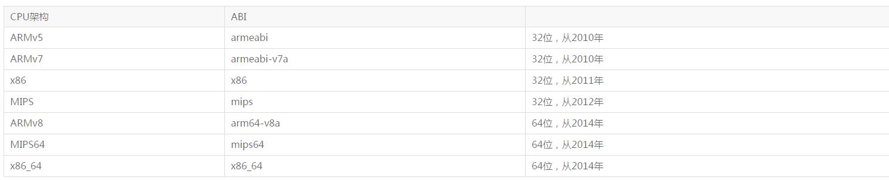
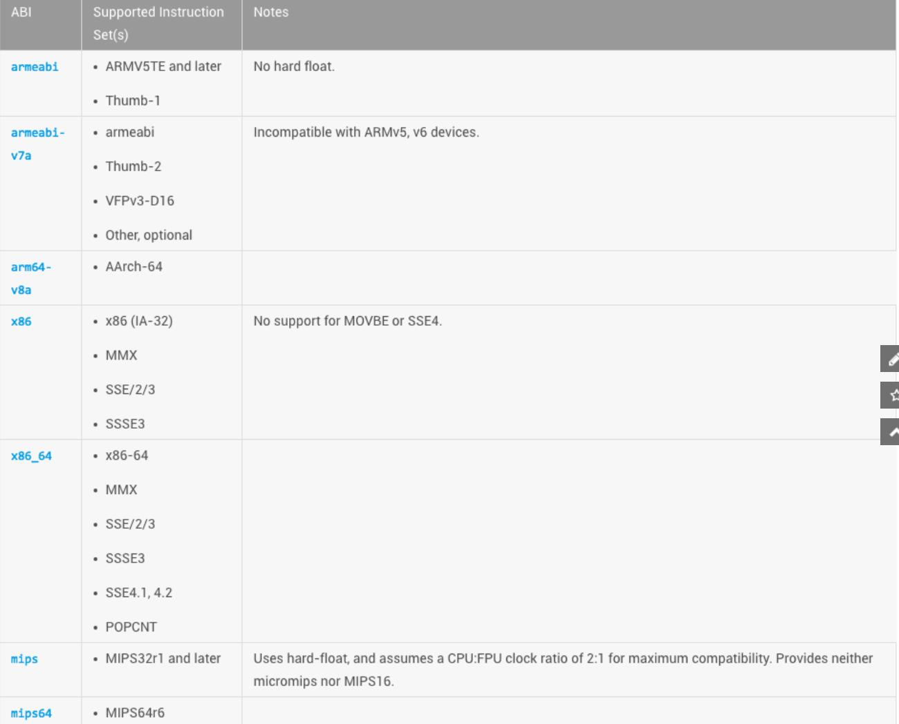

# Android CPU 架构与 so 文件

## Android CPU 架构

Android系统目前支持以下七种不同的CPU架构

 - ARMv5，32 位， 使用软件浮点运算，兼容所有ARM设备，通用性强，速度慢

 - ARMv7， 第 7 代，32 位，使用硬件浮点运算，具有高级扩展功能， 开始于 2010 年起

 - ARMv8， 第 8 代，64 位，包含AArch32、AArch64两个执行状态对应32、64bit

 - x86，intel 32位，一般用于平板 支持基于硬件的浮点运算的 IA-32 指令集 x86 是可以兼容 armeabi 平台运行的，无论是armeabi-v7a 还是 armeabi，同时带来的也是性能上的损耗，另外需要指出的是，打包出的 x86 的 so，总会比armeabi平台的体积更小

 - x86_64 ，  intel 64位，一般用于平板

 - MIPS (从2012年起)， RISC处理器(无内部互锁流水级的微处理器)

 - MIPS64，64位

## Android .so 文件

Android 七种 CPU 架构，每种都关联着一个相应的ABI。

#### .so 文件位置

 - Android Studio 工程放在 jniLibs/ABI 目录中（也可以通过在 build.gradle 文件中的设置 jniLibs.srcDir 属性自己指定）

 - AAR 压缩包中位于 jni/ABI 目录中（.so 文件会自动包含到引用 AAR 压缩包的 APK 中）

 - APK 文件位于 lib/ABI 目录中

 - 通过PackageManager安装后

  - 在小于Android 5.0 的系统中，.so 文件位于 app 的 nativeLibraryPath 目录中

  - 在大于等于 Android 5.0 的系统中，.so 文件位于app 的 nativeLibraryRootDir/CPU_ARCH 目录中

#### so (cpu)的兼容

根据当前的七种架构，其兼容特点如下：

 - armeabi 设备只兼容 armeabi

 - armeabi-v7a 设备兼容 armeabi-v7a、armeabi

 - X86 设备兼容 X86、armeabi

 - X86_64 设备兼容 X86_64、X86、armeabi

 - mips64 设备兼容 mips64、mips

 - mips 只兼容 mips

根据上述特点总结以下内容：

 - armeabi 的 so 文件兼容性很强，它能运行在除了 mips 和 mips64 的设备上，但在非 armeabi 设备上运行性能还是有所损耗

 - 64 位的 CPU 架构总能向下兼容其对应的 32 位指令集，如：x86_64 兼容 X86，arm64-v8a 兼容 rmeabi-v7a，mips64 兼容 mips

#### 使用 .so 文件需要注意的地方

 - 尽可能为每个 CPU 架构对应的 ABI 提供 .so 文件

 - 使用 android-21 平台版本编译的 .so 文件运行在 android-15 的设备上， 因为 NDK 平台不是后向兼容的，而是前向兼容的。推荐使用app的  minSdkVersion 对应的编译平台

 - 只提供 armeabi 架构的 .so 文件而忽略其他 ABIs 的
所有的 x86/x86_64/armeabi-v7a/arm64-v8a 设备都支持 armeabi 架构的 .so 文件，因此有时候只提供了 armeabi 架构的 .so 文件，这样做会影响到函数库的性能和兼容性

